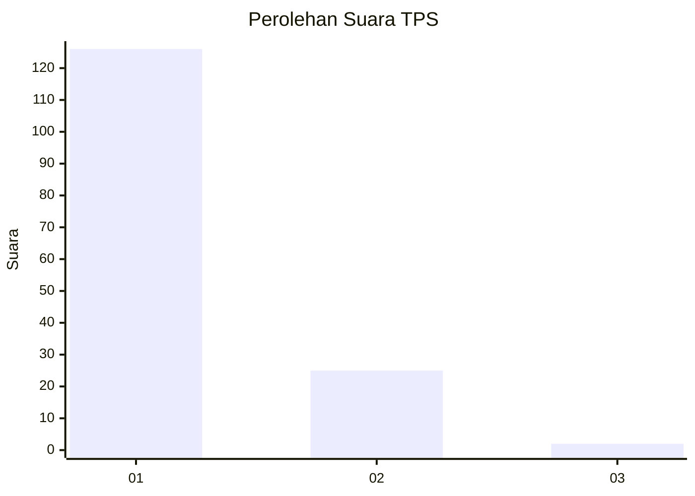
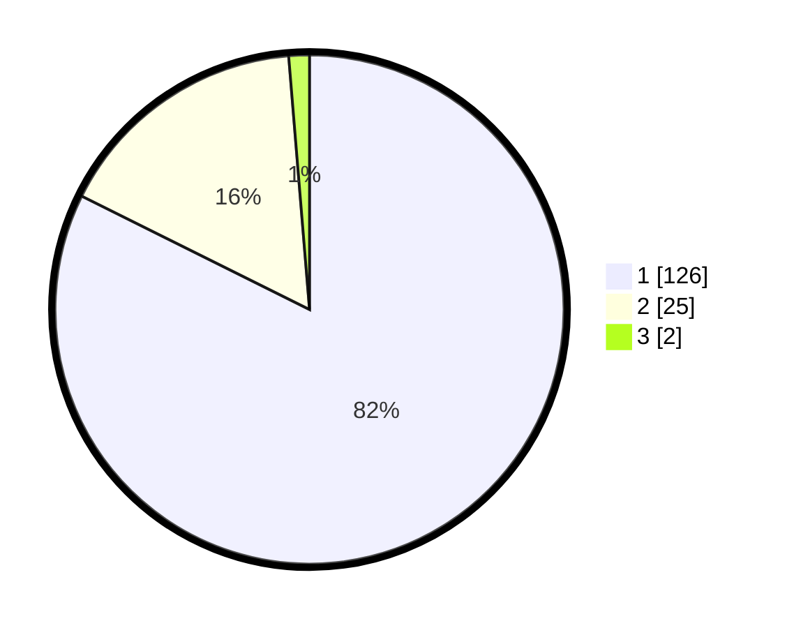

# Hasil

## Grafik

## Tabel

| No. | Nama Paslon    | Suara | Suara (raw) | Persentase |
|:--- |:-------------- | -----:| -----------:| ----------:|
| 1   | ANIES MUHAIMIN | 126   | [126][p-1]  | 82,35      |
| 2   | PRABOWO GIBRAN | 25    | [25][p-2]   | 16,34      |
| 3   | GANJAR MAHFUD  | 2     | [2][p-3]    | 1,31       |

[p-1]: https://github.com/gigit-pemilu/pemilu-2024-11-aceh/blob/main/pilpres/hitung-suara/sub/11-aceh/sub/06-aceh-besar/sub/19-darul-kamal/sub/2007-turam/sub/002-tps/sub/paslon-1.txt
[p-2]: https://github.com/gigit-pemilu/pemilu-2024-11-aceh/blob/main/pilpres/hitung-suara/sub/11-aceh/sub/06-aceh-besar/sub/19-darul-kamal/sub/2007-turam/sub/002-tps/sub/paslon-2.txt
[p-3]: https://github.com/gigit-pemilu/pemilu-2024-11-aceh/blob/main/pilpres/hitung-suara/sub/11-aceh/sub/06-aceh-besar/sub/19-darul-kamal/sub/2007-turam/sub/002-tps/sub/paslon-3.txt

## Foto C Plano

https://sirekap-obj-formc.kpu.go.id/1d9f/pemilu/ppwp/11/06/19/20/07/1106192007002-20240214-232515--8f54c5fe-0c2f-42dd-8d45-c2819412ea62.jpg

https://sirekap-obj-formc.kpu.go.id/1d9f/pemilu/ppwp/11/06/19/20/07/1106192007002-20240214-232931--5e2b772c-7ba0-4838-adbf-aa4815fd26b6.jpg

https://sirekap-obj-formc.kpu.go.id/1d9f/pemilu/ppwp/11/06/19/20/07/1106192007002-20240214-233329--49417950-d8fc-465b-8b80-2aa644237c6e.jpg

## Metadata

| Key        | Value               |
| ---------- | ------------------- |
| Time Stamp | 2024-02-15 15:00:29 |

