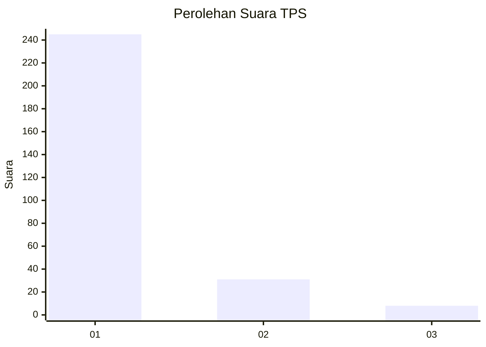
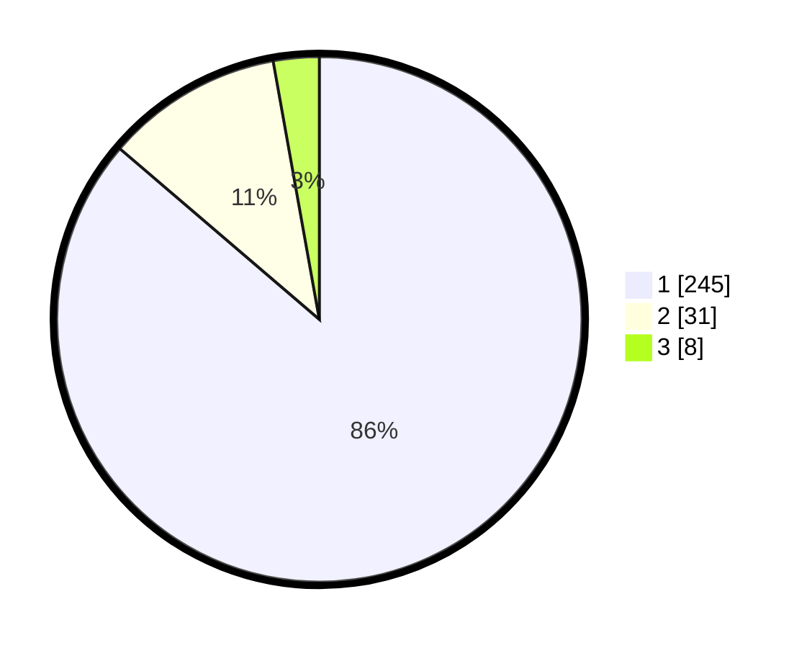

# Hasil

## Grafik

## Tabel

| No. | Nama Paslon    | Suara | Suara (raw) | Persentase |
|:--- |:-------------- | -----:| -----------:| ----------:|
| 1   | ANIES MUHAIMIN | 245   | [245][p-1]  | 86,27      |
| 2   | PRABOWO GIBRAN | 31    | [31][p-2]   | 10,92      |
| 3   | GANJAR MAHFUD  | 8     | [8][p-3]    | 2,82       |

[p-1]: https://github.com/gigit-pemilu/pemilu-2024-11-aceh/blob/main/pilpres/hitung-suara/sub/11-aceh/sub/06-aceh-besar/sub/19-darul-kamal/sub/2011-lamsod/sub/001-tps/sub/paslon-1.txt
[p-2]: https://github.com/gigit-pemilu/pemilu-2024-11-aceh/blob/main/pilpres/hitung-suara/sub/11-aceh/sub/06-aceh-besar/sub/19-darul-kamal/sub/2011-lamsod/sub/001-tps/sub/paslon-2.txt
[p-3]: https://github.com/gigit-pemilu/pemilu-2024-11-aceh/blob/main/pilpres/hitung-suara/sub/11-aceh/sub/06-aceh-besar/sub/19-darul-kamal/sub/2011-lamsod/sub/001-tps/sub/paslon-3.txt

## Foto C Plano

https://sirekap-obj-formc.kpu.go.id/9766/pemilu/ppwp/11/06/19/20/11/1106192011001-20240214-234304--f36d8d73-a6b2-49f7-abd8-27bacdae3860.jpg

https://sirekap-obj-formc.kpu.go.id/9766/pemilu/ppwp/11/06/19/20/11/1106192011001-20240214-234410--7da30ae3-086d-49e9-9648-ef7bc0a1c8e9.jpg

https://sirekap-obj-formc.kpu.go.id/9766/pemilu/ppwp/11/06/19/20/11/1106192011001-20240214-234513--6ee1bc8d-538c-4eb9-b226-e5ce57643319.jpg

## Metadata

| Key        | Value               |
| ---------- | ------------------- |
| Time Stamp | 2024-02-16 00:30:27 |

