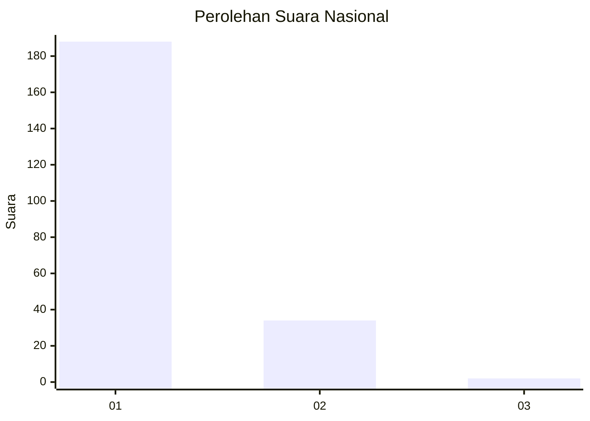
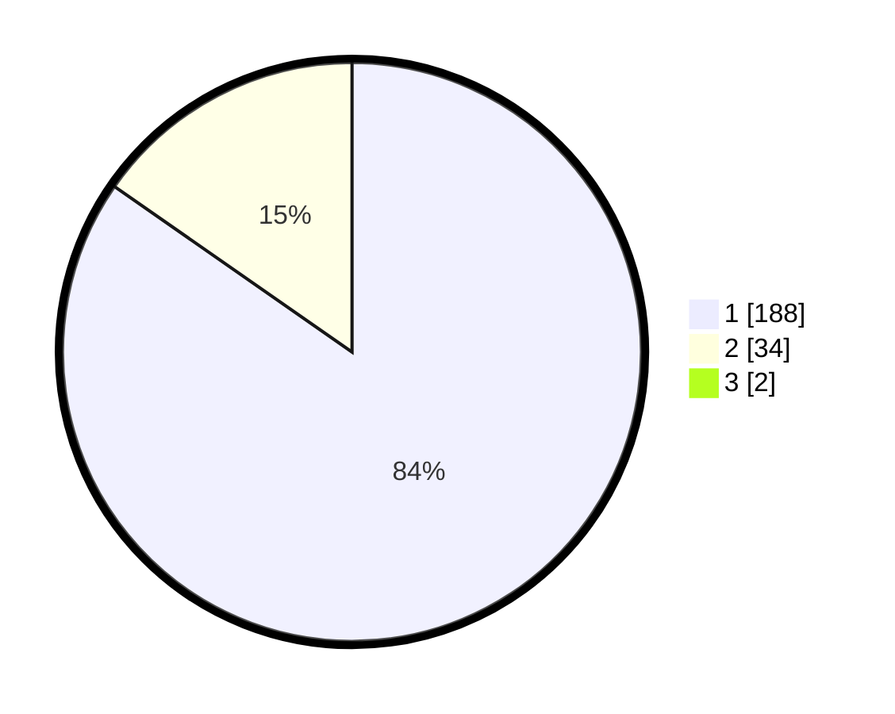

# Hasil

## Grafik

## Tabel

| No. | Nama Paslon    | Suara | Suara (raw) | Persentase |
|:--- |:-------------- | -----:| -----------:| ----------:|
| 1   | ANIES MUHAIMIN | 188   | [188][p-1]  | 83,93      |
| 2   | PRABOWO GIBRAN | 34    | [34][p-2]   | 15,18      |
| 3   | GANJAR MAHFUD  | 2     | [2][p-3]    | 0,89       |

[p-1]: https://github.com/gigit-pemilu/pemilu-2024/blob/main/pilpres/hitung-suara/sub/11-aceh/sub/06-aceh-besar/sub/20-baitussalam/sub/2001-cadek/sub/001-tps/sub/paslon-1.txt
[p-2]: https://github.com/gigit-pemilu/pemilu-2024/blob/main/pilpres/hitung-suara/sub/11-aceh/sub/06-aceh-besar/sub/20-baitussalam/sub/2001-cadek/sub/001-tps/sub/paslon-2.txt
[p-3]: https://github.com/gigit-pemilu/pemilu-2024/blob/main/pilpres/hitung-suara/sub/11-aceh/sub/06-aceh-besar/sub/20-baitussalam/sub/2001-cadek/sub/001-tps/sub/paslon-3.txt

## Foto C Plano

https://sirekap-obj-formc.kpu.go.id/a490/pemilu/ppwp/11/06/20/20/01/1106202001001-20240215-211050--838af29f-81e7-4700-a0ee-8bc6bb98da92.jpg

https://sirekap-obj-formc.kpu.go.id/a490/pemilu/ppwp/11/06/20/20/01/1106202001001-20240215-211052--30878635-2ad7-435b-9fae-ef429023e165.jpg

https://sirekap-obj-formc.kpu.go.id/a490/pemilu/ppwp/11/06/20/20/01/1106202001001-20240215-211051--2271d6ea-bfa5-4cd8-b9be-b385926d9d1e.jpg

## Metadata

| Key        | Value               |
| ---------- | ------------------- |
| Time Stamp | 2024-02-16 01:00:27 |

## DATA PEMILIH TETAP

Jumlah pemilih dalam DPT: **246**.
 * L: **119**.
 * P: **127**.

## DATA PENGGUNA HAK PILIH

Jumlah pengguna hak pilih dalam DPT: **246**.
 * L: **119**.
 * P: **127**.

Jumlah pengguna hak pilih dalam DPTb: **4**.
 * L: **2**.
 * P: **2**.

Jumlah pengguna hak pilih dalam DPK: **1**.
 * L: **1**.
 * P: **0**.

Jumlah pengguna hak pilih: **251**.
 * L: **122**.
 * P: **129**.

## JUMLAH SUARA SAH DAN TIDAK SAH

JUMLAH SELURUH SUARA SAH: **224**.

JUMLAH SUARA TIDAK SAH: **27**.

JUMLAH SELURUH SUARA SAH DAN SUARA TIDAK SAH: **251**.

