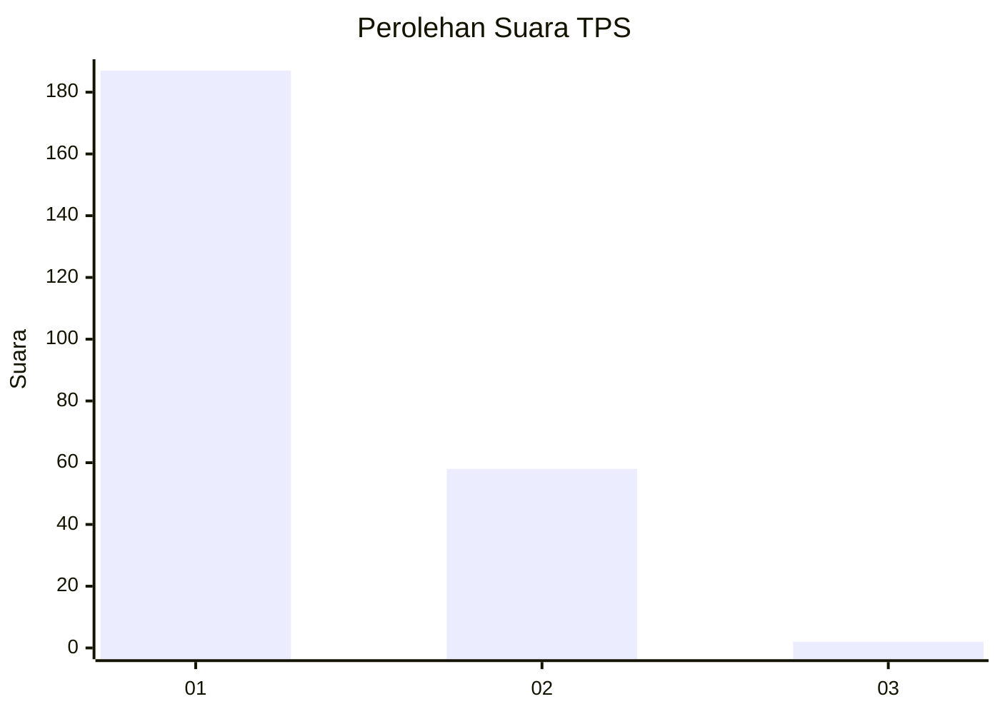
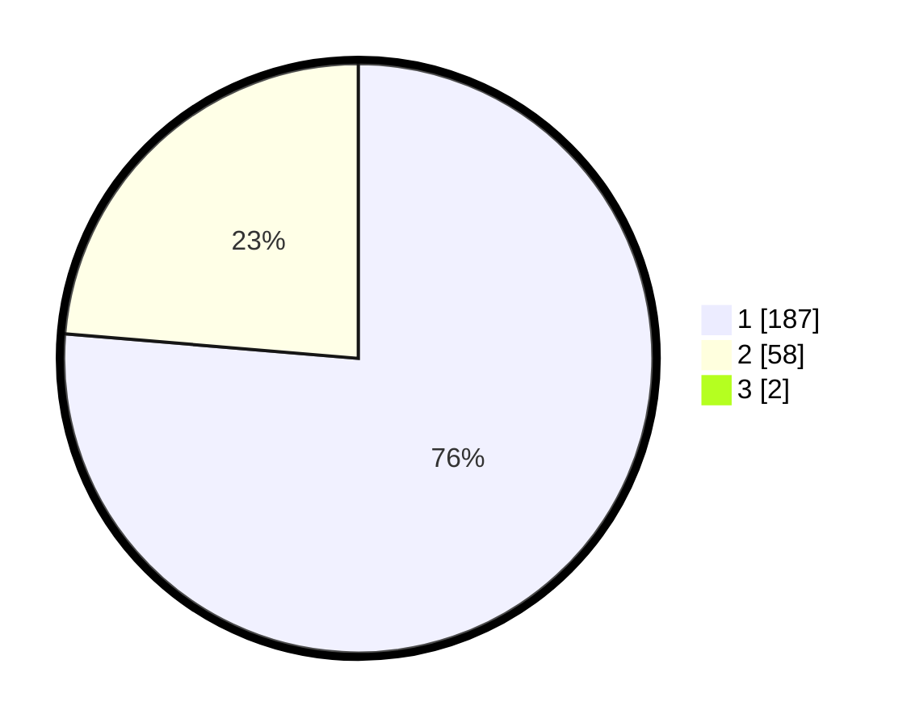

# Hasil

## Grafik

## Tabel

| No. | Nama Paslon    | Suara | Suara (raw) | Persentase |
|:--- |:-------------- | -----:| -----------:| ----------:|
| 1   | ANIES MUHAIMIN | 187   | [187][p-1]  | 75,71      |
| 2   | PRABOWO GIBRAN | 58    | [58][p-2]   | 23,48      |
| 3   | GANJAR MAHFUD  | 2     | [2][p-3]    | 0,81       |

[p-1]: https://github.com/gigit-pemilu/pemilu-2024-11-aceh/blob/main/pilpres/hitung-suara/sub/11-aceh/sub/06-aceh-besar/sub/20-baitussalam/sub/2002-kajhu/sub/001-tps/sub/paslon-1.txt
[p-2]: https://github.com/gigit-pemilu/pemilu-2024-11-aceh/blob/main/pilpres/hitung-suara/sub/11-aceh/sub/06-aceh-besar/sub/20-baitussalam/sub/2002-kajhu/sub/001-tps/sub/paslon-2.txt
[p-3]: https://github.com/gigit-pemilu/pemilu-2024-11-aceh/blob/main/pilpres/hitung-suara/sub/11-aceh/sub/06-aceh-besar/sub/20-baitussalam/sub/2002-kajhu/sub/001-tps/sub/paslon-3.txt

## Foto C Plano

https://sirekap-obj-formc.kpu.go.id/32e7/pemilu/ppwp/11/06/20/20/02/1106202002001-20240215-063944--4e5f8d89-4664-4d08-8f1e-0c1da767b8cc.jpg

https://sirekap-obj-formc.kpu.go.id/32e7/pemilu/ppwp/11/06/20/20/02/1106202002001-20240215-064107--94fbecd7-c3b8-4b84-be70-4a4265fffa3c.jpg

https://sirekap-obj-formc.kpu.go.id/32e7/pemilu/ppwp/11/06/20/20/02/1106202002001-20240215-064417--2aae1dd2-6bbc-4d34-93bd-78e83bd05f13.jpg

## Metadata

| Key        | Value               |
| ---------- | ------------------- |
| Time Stamp | 2024-02-15 16:00:26 |

