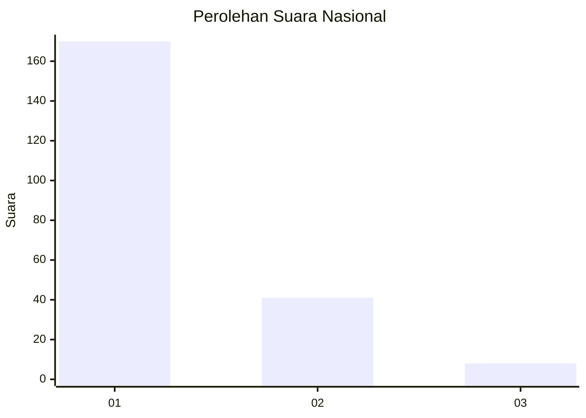
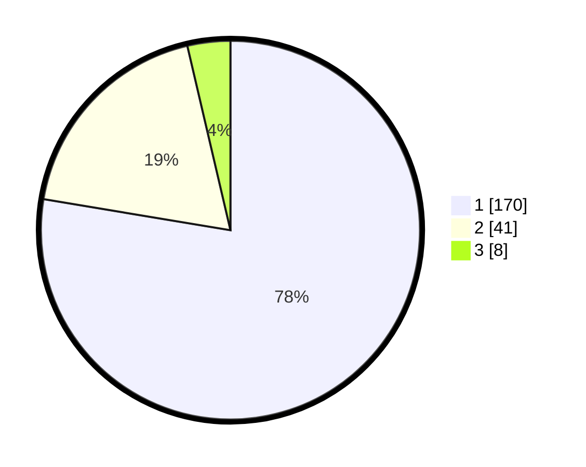

# Hasil

## Grafik

## Tabel

| No. | Nama Paslon    | Suara | Suara (raw) | Persentase |
|:--- |:-------------- | -----:| -----------:| ----------:|
| 1   | ANIES MUHAIMIN | 170   | [170][p-1]  | 77,63      |
| 2   | PRABOWO GIBRAN | 41    | [41][p-2]   | 18,72      |
| 3   | GANJAR MAHFUD  | 8     | [8][p-3]    | 3,65       |

[p-1]: https://github.com/gigit-pemilu/pemilu-2024/blob/main/pilpres/hitung-suara/sub/11-aceh/sub/06-aceh-besar/sub/20-baitussalam/sub/2002-kajhu/sub/002-tps/sub/paslon-1.txt
[p-2]: https://github.com/gigit-pemilu/pemilu-2024/blob/main/pilpres/hitung-suara/sub/11-aceh/sub/06-aceh-besar/sub/20-baitussalam/sub/2002-kajhu/sub/002-tps/sub/paslon-2.txt
[p-3]: https://github.com/gigit-pemilu/pemilu-2024/blob/main/pilpres/hitung-suara/sub/11-aceh/sub/06-aceh-besar/sub/20-baitussalam/sub/2002-kajhu/sub/002-tps/sub/paslon-3.txt

## Foto C Plano

https://sirekap-obj-formc.kpu.go.id/4ff2/pemilu/ppwp/11/06/20/20/02/1106202002002-20240214-220154--e7d75d0c-2258-45a2-9576-f54565966dda.jpg

https://sirekap-obj-formc.kpu.go.id/4ff2/pemilu/ppwp/11/06/20/20/02/1106202002002-20240214-220331--d07438df-b91f-45e3-a502-00280777b20f.jpg

https://sirekap-obj-formc.kpu.go.id/4ff2/pemilu/ppwp/11/06/20/20/02/1106202002002-20240214-220457--ef325dc8-459e-4932-aae0-2c22d8722c23.jpg

## Metadata

| Key        | Value               |
| ---------- | ------------------- |
| Time Stamp | 2024-02-16 21:01:00 |

## DATA PEMILIH TETAP

Jumlah pemilih dalam DPT: **219**.
 * L: **99**.
 * P: **120**.

## DATA PENGGUNA HAK PILIH

Jumlah pengguna hak pilih dalam DPT: **300**.
 * L: **142**.
 * P: **158**.

Jumlah pengguna hak pilih dalam DPTb: **1**.
 * L: **0**.
 * P: **1**.

Jumlah pengguna hak pilih dalam DPK: **0**.
 * L: **0**.
 * P: **0**.

Jumlah pengguna hak pilih: **301**.
 * L: **142**.
 * P: **159**.

## JUMLAH SUARA SAH DAN TIDAK SAH

JUMLAH SELURUH SUARA SAH: **219**.

JUMLAH SUARA TIDAK SAH: **0**.

JUMLAH SELURUH SUARA SAH DAN SUARA TIDAK SAH: **219**.

