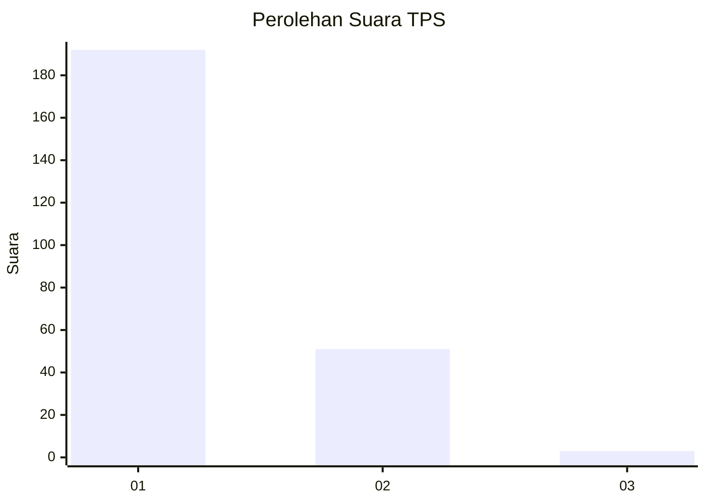
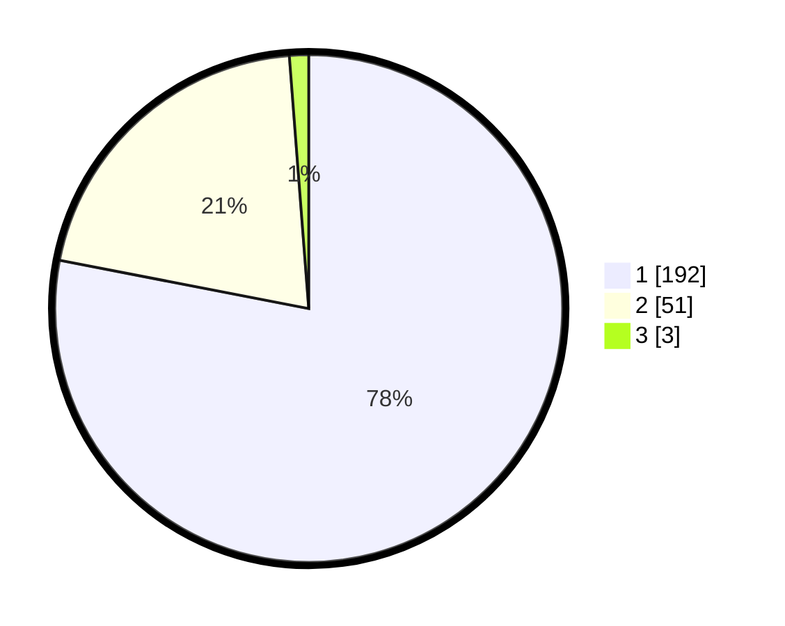

# Hasil

## Grafik

## Tabel

| No. | Nama Paslon    | Suara | Suara (raw) | Persentase |
|:--- |:-------------- | -----:| -----------:| ----------:|
| 1   | ANIES MUHAIMIN | 192   | [192][p-1]  | 78,05      |
| 2   | PRABOWO GIBRAN | 51    | [51][p-2]   | 20,73      |
| 3   | GANJAR MAHFUD  | 3     | [3][p-3]    | 1,22       |

[p-1]: https://github.com/gigit-pemilu/pemilu-2024-11-aceh/blob/main/pilpres/hitung-suara/sub/11-aceh/sub/06-aceh-besar/sub/20-baitussalam/sub/2002-kajhu/sub/008-tps/sub/paslon-1.txt
[p-2]: https://github.com/gigit-pemilu/pemilu-2024-11-aceh/blob/main/pilpres/hitung-suara/sub/11-aceh/sub/06-aceh-besar/sub/20-baitussalam/sub/2002-kajhu/sub/008-tps/sub/paslon-2.txt
[p-3]: https://github.com/gigit-pemilu/pemilu-2024-11-aceh/blob/main/pilpres/hitung-suara/sub/11-aceh/sub/06-aceh-besar/sub/20-baitussalam/sub/2002-kajhu/sub/008-tps/sub/paslon-3.txt

## Foto C Plano

https://sirekap-obj-formc.kpu.go.id/65dc/pemilu/ppwp/11/06/20/20/02/1106202002008-20240215-011153--5fea62ec-1ff0-4cdc-b579-1b1e548e8137.jpg

https://sirekap-obj-formc.kpu.go.id/65dc/pemilu/ppwp/11/06/20/20/02/1106202002008-20240215-031533--5b686b13-5017-44bf-ba9c-16e809271f01.jpg

https://sirekap-obj-formc.kpu.go.id/65dc/pemilu/ppwp/11/06/20/20/02/1106202002008-20240215-010908--af272369-e7be-43a0-a521-d9952a67e5fa.jpg

## Metadata

| Key        | Value               |
| ---------- | ------------------- |
| Time Stamp | 2024-02-15 15:00:29 |

