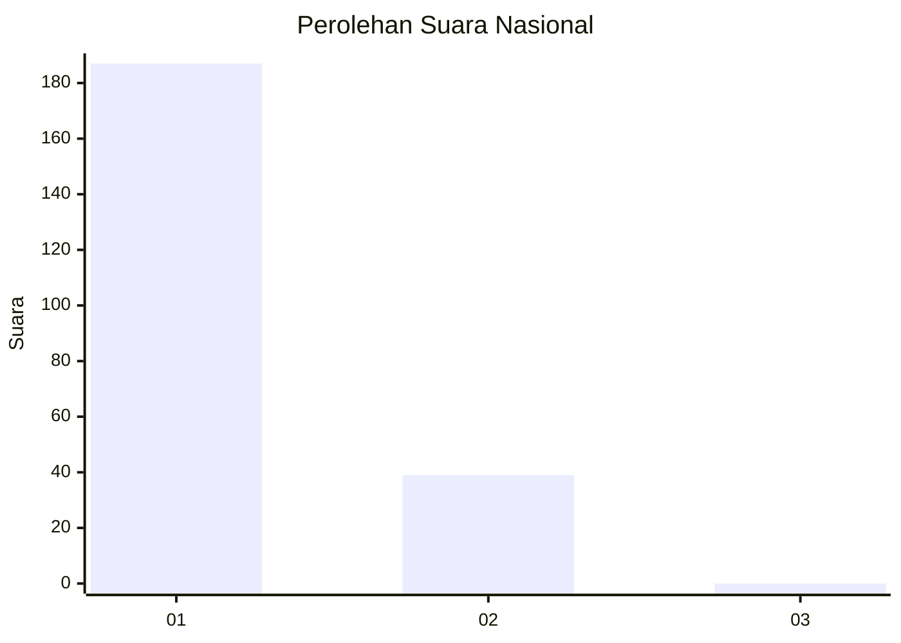
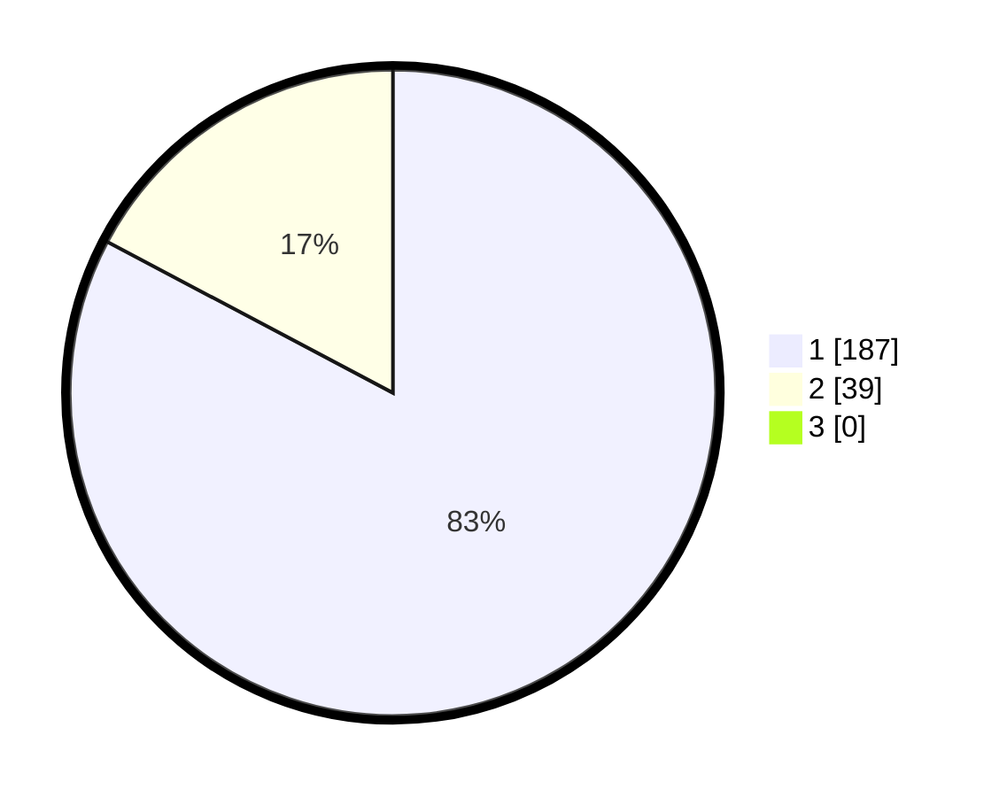

# Hasil

## Grafik

## Tabel

| No. | Nama Paslon    | Suara | Suara (raw) | Persentase |
|:--- |:-------------- | -----:| -----------:| ----------:|
| 1   | ANIES MUHAIMIN | 187   | [187][p-1]  | 82,74      |
| 2   | PRABOWO GIBRAN | 39    | [39][p-2]   | 17,26      |
| 3   | GANJAR MAHFUD  | 0     | [0][p-3]    | 0,00       |

[p-1]: https://github.com/gigit-pemilu/pemilu-2024/blob/main/pilpres/hitung-suara/sub/11-aceh/sub/06-aceh-besar/sub/20-baitussalam/sub/2002-kajhu/sub/012-tps/sub/paslon-1.txt
[p-2]: https://github.com/gigit-pemilu/pemilu-2024/blob/main/pilpres/hitung-suara/sub/11-aceh/sub/06-aceh-besar/sub/20-baitussalam/sub/2002-kajhu/sub/012-tps/sub/paslon-2.txt
[p-3]: https://github.com/gigit-pemilu/pemilu-2024/blob/main/pilpres/hitung-suara/sub/11-aceh/sub/06-aceh-besar/sub/20-baitussalam/sub/2002-kajhu/sub/012-tps/sub/paslon-3.txt

## Foto C Plano

https://sirekap-obj-formc.kpu.go.id/7ff3/pemilu/ppwp/11/06/20/20/02/1106202002012-20240214-224836--eb027450-f3ba-4ab0-88bd-cfd0b03c71fd.jpg

https://sirekap-obj-formc.kpu.go.id/7ff3/pemilu/ppwp/11/06/20/20/02/1106202002012-20240214-211027--233b626e-042e-4991-8812-e0e347886848.jpg

https://sirekap-obj-formc.kpu.go.id/7ff3/pemilu/ppwp/11/06/20/20/02/1106202002012-20240214-211049--884acbbe-5ca2-4bfc-a485-be0cdfeddf97.jpg

## Metadata

| Key        | Value               |
| ---------- | ------------------- |
| Time Stamp | 2024-02-15 15:00:29 |

