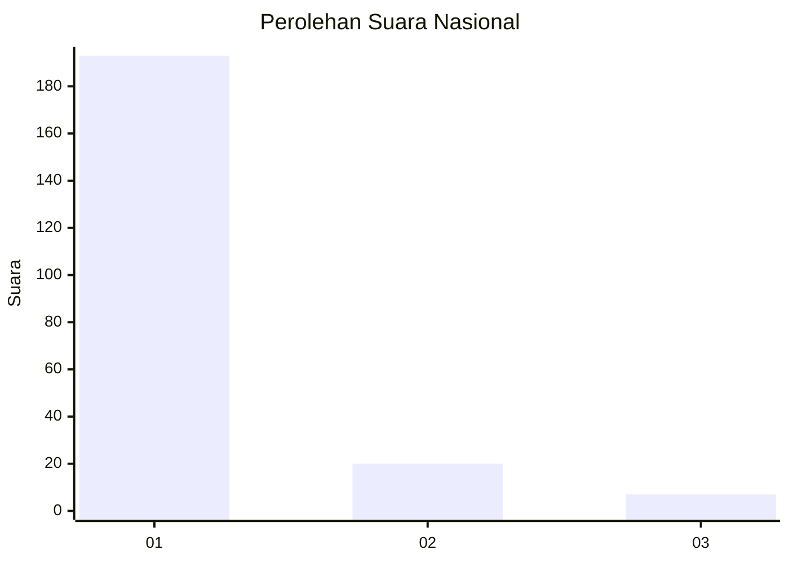
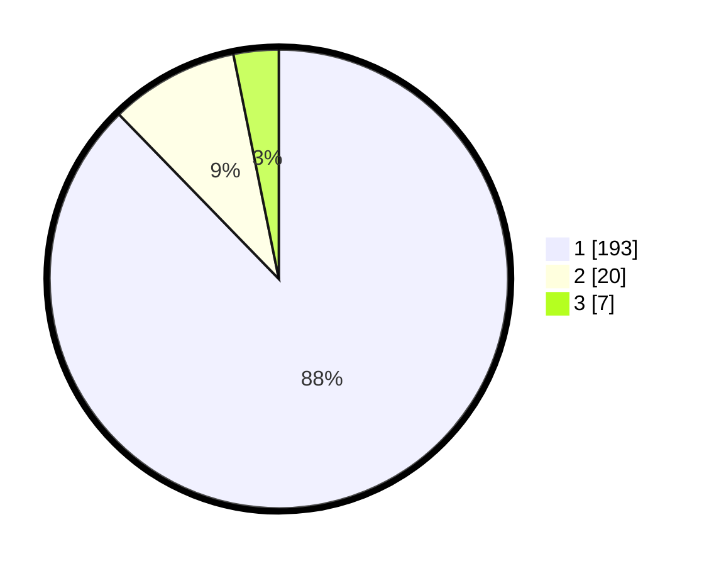

# Hasil

## Grafik

## Tabel

| No. | Nama Paslon    | Suara | Suara (raw) | Persentase |
|:--- |:-------------- | -----:| -----------:| ----------:|
| 1   | ANIES MUHAIMIN | 193   | [193][p-1]  | 87,73      |
| 2   | PRABOWO GIBRAN | 20    | [20][p-2]   | 9,09       |
| 3   | GANJAR MAHFUD  | 7     | [7][p-3]    | 3,18       |

[p-1]: https://github.com/gigit-pemilu/pemilu-2024/blob/main/pilpres/hitung-suara/sub/11-aceh/sub/06-aceh-besar/sub/20-baitussalam/sub/2002-kajhu/sub/014-tps/sub/paslon-1.txt
[p-2]: https://github.com/gigit-pemilu/pemilu-2024/blob/main/pilpres/hitung-suara/sub/11-aceh/sub/06-aceh-besar/sub/20-baitussalam/sub/2002-kajhu/sub/014-tps/sub/paslon-2.txt
[p-3]: https://github.com/gigit-pemilu/pemilu-2024/blob/main/pilpres/hitung-suara/sub/11-aceh/sub/06-aceh-besar/sub/20-baitussalam/sub/2002-kajhu/sub/014-tps/sub/paslon-3.txt

## Foto C Plano

https://sirekap-obj-formc.kpu.go.id/56e3/pemilu/ppwp/11/06/20/20/02/1106202002014-20240214-155625--b50a98c1-dfe3-4247-9941-44001e00a0da.jpg

https://sirekap-obj-formc.kpu.go.id/56e3/pemilu/ppwp/11/06/20/20/02/1106202002014-20240214-155739--d96285e2-b172-4031-8870-5338137f0a49.jpg

https://sirekap-obj-formc.kpu.go.id/56e3/pemilu/ppwp/11/06/20/20/02/1106202002014-20240214-155835--1cc9e512-998f-4152-8605-0d04bc05bba3.jpg

## Metadata

| Key        | Value               |
| ---------- | ------------------- |
| Time Stamp | 2024-02-16 00:30:27 |

