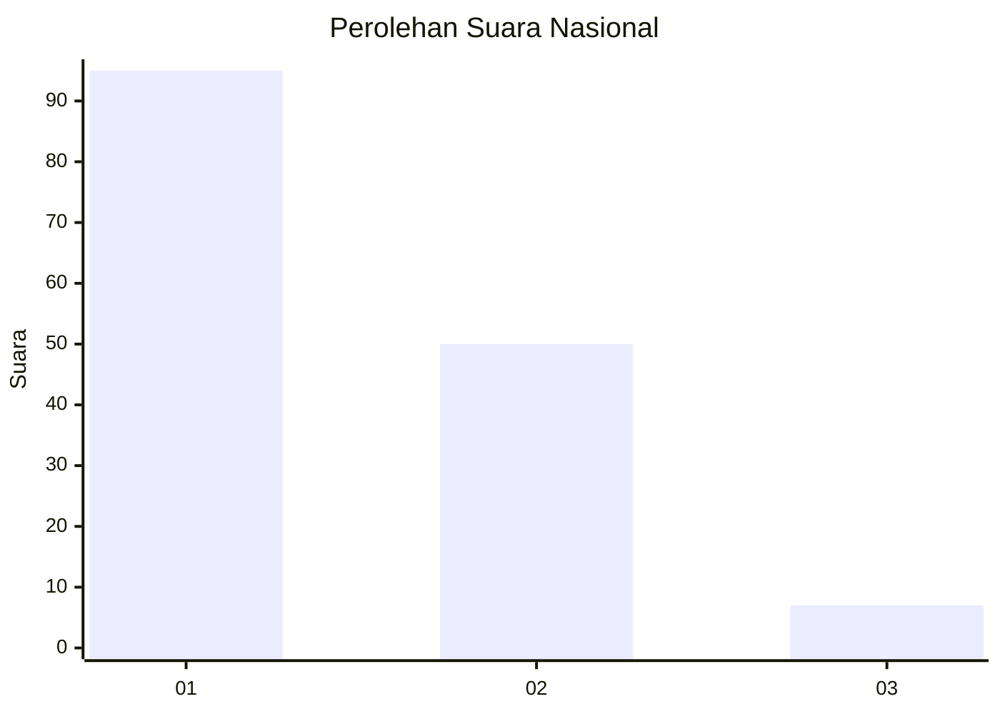
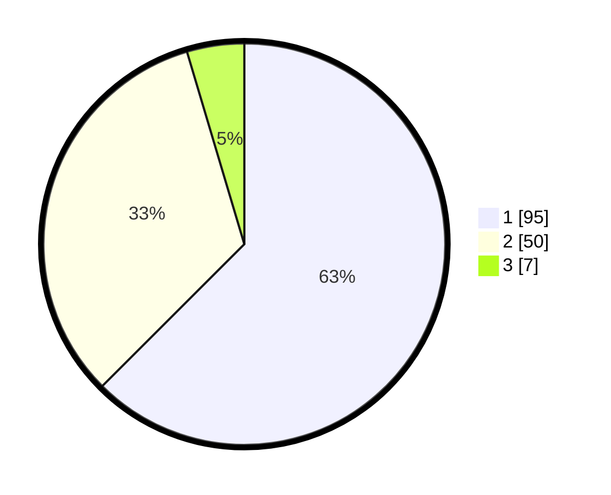

# Hasil

## Grafik

## Tabel

| No. | Nama Paslon    | Suara | Suara (raw) | Persentase |
|:--- |:-------------- | -----:| -----------:| ----------:|
| 1   | ANIES MUHAIMIN | 95    | [95][p-1]   | 62,50      |
| 2   | PRABOWO GIBRAN | 50    | [50][p-2]   | 32,89      |
| 3   | GANJAR MAHFUD  | 7     | [7][p-3]    | 4,61       |

[p-1]: https://github.com/gigit-pemilu/pemilu-2024/blob/main/pilpres/hitung-suara/sub/11-aceh/sub/06-aceh-besar/sub/20-baitussalam/sub/2002-kajhu/sub/901-tps/sub/paslon-1.txt
[p-2]: https://github.com/gigit-pemilu/pemilu-2024/blob/main/pilpres/hitung-suara/sub/11-aceh/sub/06-aceh-besar/sub/20-baitussalam/sub/2002-kajhu/sub/901-tps/sub/paslon-2.txt
[p-3]: https://github.com/gigit-pemilu/pemilu-2024/blob/main/pilpres/hitung-suara/sub/11-aceh/sub/06-aceh-besar/sub/20-baitussalam/sub/2002-kajhu/sub/901-tps/sub/paslon-3.txt

## Foto C Plano

https://sirekap-obj-formc.kpu.go.id/2387/pemilu/ppwp/11/06/20/20/02/1106202002901-20240214-230123--beac1aac-5fca-429b-9db7-19b2763eb5fb.jpg

https://sirekap-obj-formc.kpu.go.id/2387/pemilu/ppwp/11/06/20/20/02/1106202002901-20240214-230405--6c51ef51-768f-4bf4-b17f-dba3b167f60a.jpg

https://sirekap-obj-formc.kpu.go.id/2387/pemilu/ppwp/11/06/20/20/02/1106202002901-20240214-230504--d7c5abe6-2bd8-44ac-a070-e290236687b5.jpg

## Metadata

| Key        | Value               |
| ---------- | ------------------- |
| Time Stamp | 2024-02-16 00:30:27 |

