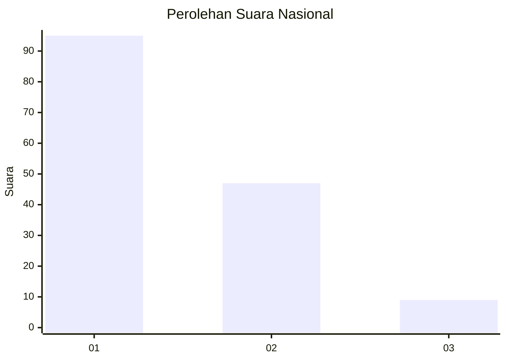
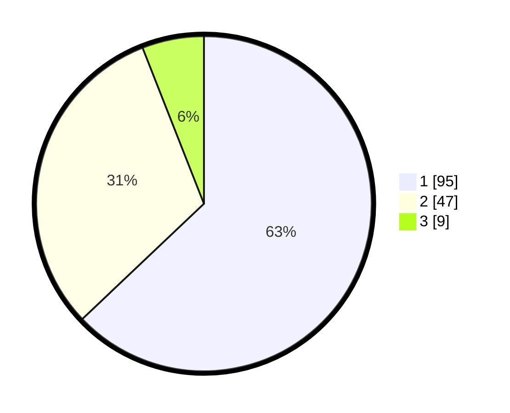

# Hasil

## Grafik

## Tabel

| No. | Nama Paslon    | Suara | Suara (raw) | Persentase |
|:--- |:-------------- | -----:| -----------:| ----------:|
| 1   | ANIES MUHAIMIN | 95    | [95][p-1]   | 62,91      |
| 2   | PRABOWO GIBRAN | 47    | [47][p-2]   | 31,13      |
| 3   | GANJAR MAHFUD  | 9     | [9][p-3]    | 5,96       |

[p-1]: https://github.com/gigit-pemilu/pemilu-2024/blob/main/pilpres/hitung-suara/sub/11-aceh/sub/06-aceh-besar/sub/20-baitussalam/sub/2002-kajhu/sub/902-tps/sub/paslon-1.txt
[p-2]: https://github.com/gigit-pemilu/pemilu-2024/blob/main/pilpres/hitung-suara/sub/11-aceh/sub/06-aceh-besar/sub/20-baitussalam/sub/2002-kajhu/sub/902-tps/sub/paslon-2.txt
[p-3]: https://github.com/gigit-pemilu/pemilu-2024/blob/main/pilpres/hitung-suara/sub/11-aceh/sub/06-aceh-besar/sub/20-baitussalam/sub/2002-kajhu/sub/902-tps/sub/paslon-3.txt

## Foto C Plano

https://sirekap-obj-formc.kpu.go.id/8ba3/pemilu/ppwp/11/06/20/20/02/1106202002902-20240216-123542--0d364a6c-ae4b-47c3-9ea3-5d8cdf960305.jpg

https://sirekap-obj-formc.kpu.go.id/8ba3/pemilu/ppwp/11/06/20/20/02/1106202002902-20240216-123543--f41708cc-bf6c-4c85-98b4-56499147c916.jpg

https://sirekap-obj-formc.kpu.go.id/8ba3/pemilu/ppwp/11/06/20/20/02/1106202002902-20240216-123543--beee2dd0-d7a3-46a9-97f1-4bd8f8e7c7f1.jpg

## Metadata

| Key        | Value               |
| ---------- | ------------------- |
| Time Stamp | 2024-02-19 21:00:00 |

## DATA PEMILIH TETAP

Jumlah pemilih dalam DPT: **156**.
 * L: **156**.
 * P: **0**.

## DATA PENGGUNA HAK PILIH

Jumlah pengguna hak pilih dalam DPT: **98**.
 * L: **98**.
 * P: **0**.

Jumlah pengguna hak pilih dalam DPTb: **61**.
 * L: **60**.
 * P: **1**.

Jumlah pengguna hak pilih dalam DPK: **0**.
 * L: **0**.
 * P: **0**.

Jumlah pengguna hak pilih: **159**.
 * L: **158**.
 * P: **1**.

## JUMLAH SUARA SAH DAN TIDAK SAH

JUMLAH SELURUH SUARA SAH: **151**.

JUMLAH SUARA TIDAK SAH: **8**.

JUMLAH SELURUH SUARA SAH DAN SUARA TIDAK SAH: **159**.

