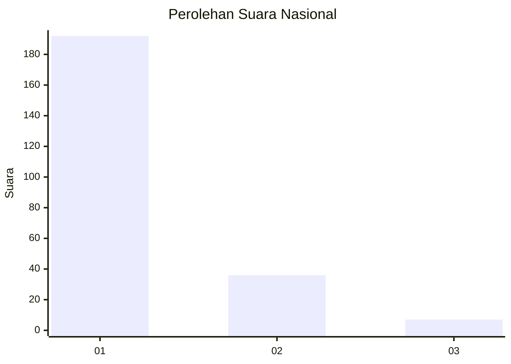
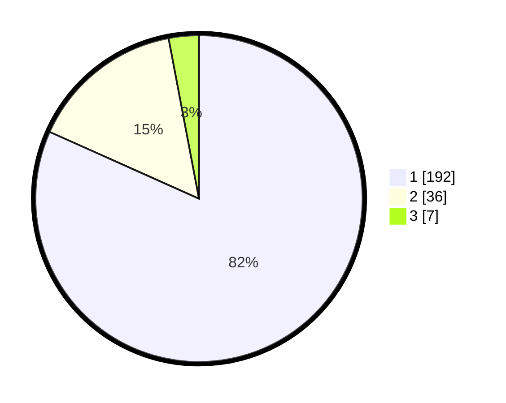

# Hasil

## Grafik

## Tabel

| No. | Nama Paslon    | Suara | Suara (raw) | Persentase |
|:--- |:-------------- | -----:| -----------:| ----------:|
| 1   | ANIES MUHAIMIN | 192   | [192][p-1]  | 81,70      |
| 2   | PRABOWO GIBRAN | 36    | [36][p-2]   | 15,32      |
| 3   | GANJAR MAHFUD  | 7     | [7][p-3]    | 2,98       |

[p-1]: https://github.com/gigit-pemilu/pemilu-2024/blob/main/pilpres/hitung-suara/sub/11-aceh/sub/06-aceh-besar/sub/20-baitussalam/sub/2003-baet/sub/001-tps/sub/paslon-1.txt
[p-2]: https://github.com/gigit-pemilu/pemilu-2024/blob/main/pilpres/hitung-suara/sub/11-aceh/sub/06-aceh-besar/sub/20-baitussalam/sub/2003-baet/sub/001-tps/sub/paslon-2.txt
[p-3]: https://github.com/gigit-pemilu/pemilu-2024/blob/main/pilpres/hitung-suara/sub/11-aceh/sub/06-aceh-besar/sub/20-baitussalam/sub/2003-baet/sub/001-tps/sub/paslon-3.txt

## Foto C Plano

https://sirekap-obj-formc.kpu.go.id/c25d/pemilu/ppwp/11/06/20/20/03/1106202003001-20240215-140027--e4b20686-d964-471b-b49e-77643bfdae1e.jpg

https://sirekap-obj-formc.kpu.go.id/c25d/pemilu/ppwp/11/06/20/20/03/1106202003001-20240215-140338--7433210a-7587-46ac-9aaf-176155190607.jpg

https://sirekap-obj-formc.kpu.go.id/c25d/pemilu/ppwp/11/06/20/20/03/1106202003001-20240215-140609--8e9ff59b-628e-492d-bd15-644175fe788d.jpg

## Metadata

| Key        | Value               |
| ---------- | ------------------- |
| Time Stamp | 2024-02-16 00:30:27 |

