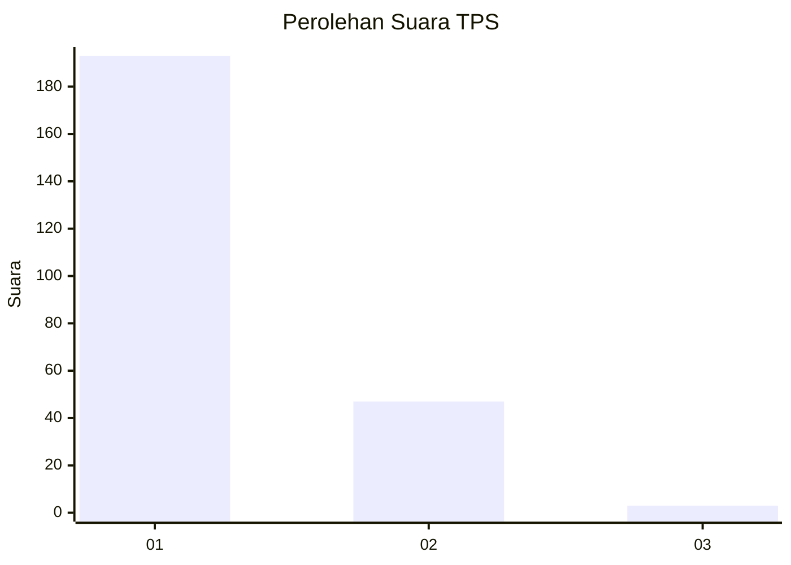
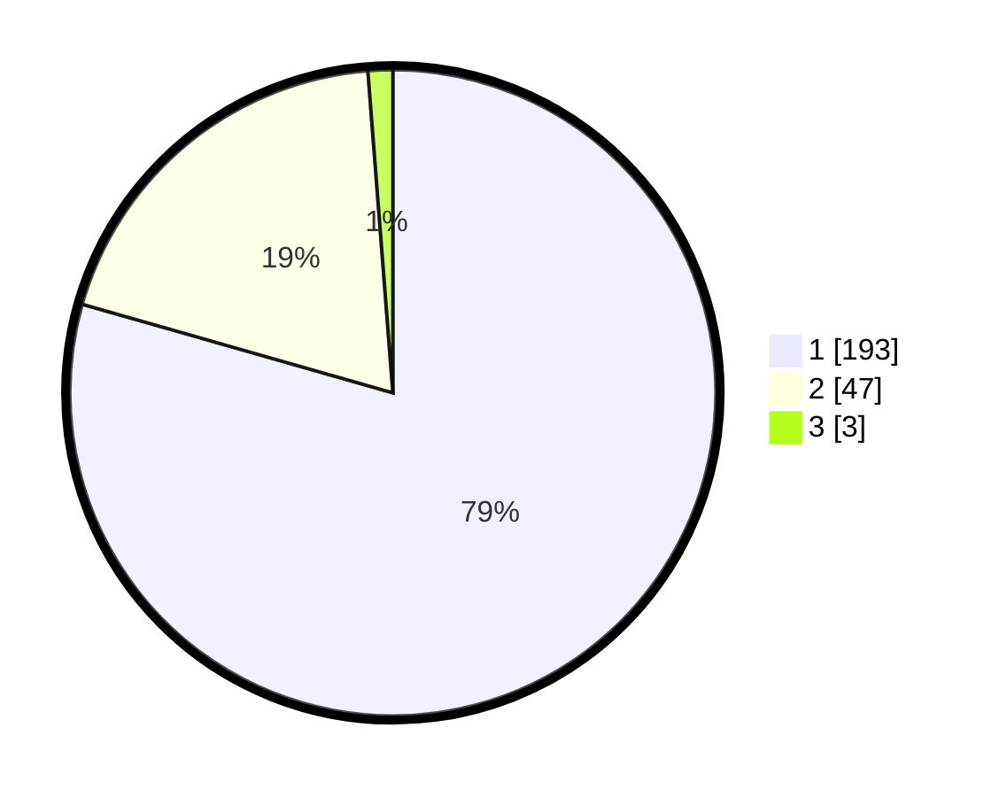

# Hasil

## Grafik

## Tabel

| No. | Nama Paslon    | Suara | Suara (raw) | Persentase |
|:--- |:-------------- | -----:| -----------:| ----------:|
| 1   | ANIES MUHAIMIN | 193   | [193][p-1]  | 79,42      |
| 2   | PRABOWO GIBRAN | 47    | [47][p-2]   | 19,34      |
| 3   | GANJAR MAHFUD  | 3     | [3][p-3]    | 1,23       |

[p-1]: https://github.com/gigit-pemilu/pemilu-2024-11-aceh/blob/main/pilpres/hitung-suara/sub/11-aceh/sub/06-aceh-besar/sub/20-baitussalam/sub/2003-baet/sub/003-tps/sub/paslon-1.txt
[p-2]: https://github.com/gigit-pemilu/pemilu-2024-11-aceh/blob/main/pilpres/hitung-suara/sub/11-aceh/sub/06-aceh-besar/sub/20-baitussalam/sub/2003-baet/sub/003-tps/sub/paslon-2.txt
[p-3]: https://github.com/gigit-pemilu/pemilu-2024-11-aceh/blob/main/pilpres/hitung-suara/sub/11-aceh/sub/06-aceh-besar/sub/20-baitussalam/sub/2003-baet/sub/003-tps/sub/paslon-3.txt

## Foto C Plano

https://sirekap-obj-formc.kpu.go.id/87e2/pemilu/ppwp/11/06/20/20/03/1106202003003-20240215-071359--0d65a52b-d994-4b2f-af3f-4df6c2116652.jpg

https://sirekap-obj-formc.kpu.go.id/87e2/pemilu/ppwp/11/06/20/20/03/1106202003003-20240215-001334--dbc12868-17e4-4dea-a5e5-52b48fca6f80.jpg

https://sirekap-obj-formc.kpu.go.id/87e2/pemilu/ppwp/11/06/20/20/03/1106202003003-20240215-002111--c7a88324-ad4f-4e78-9c65-21268696f2dc.jpg

## Metadata

| Key        | Value               |
| ---------- | ------------------- |
| Time Stamp | 2024-02-15 16:00:26 |

