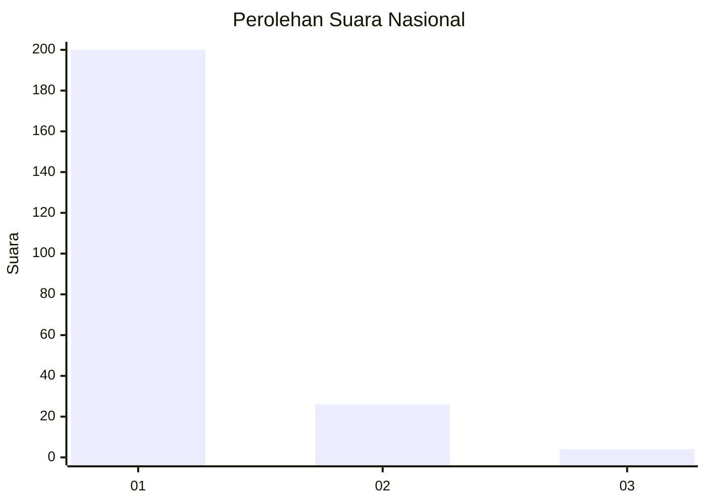
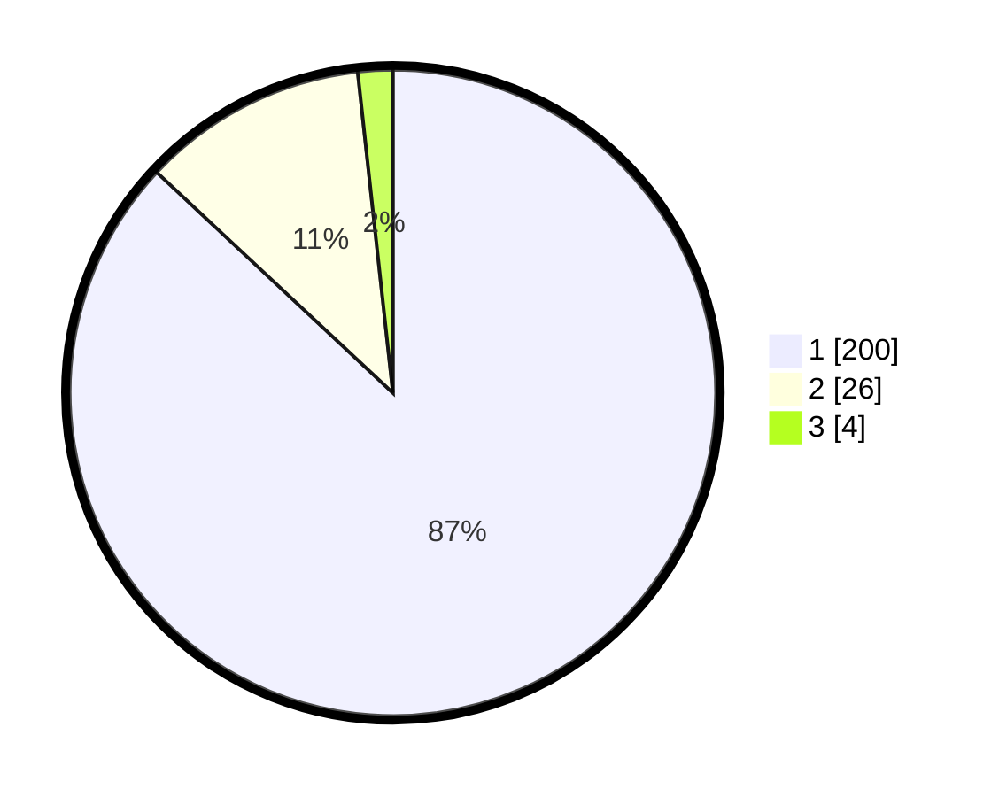

# Hasil

## Grafik

## Tabel

| No. | Nama Paslon    | Suara | Suara (raw) | Persentase |
|:--- |:-------------- | -----:| -----------:| ----------:|
| 1   | ANIES MUHAIMIN | 200   | [200][p-1]  | 86,96      |
| 2   | PRABOWO GIBRAN | 26    | [26][p-2]   | 11,30      |
| 3   | GANJAR MAHFUD  | 4     | [4][p-3]    | 1,74       |

[p-1]: https://github.com/gigit-pemilu/pemilu-2024/blob/main/pilpres/hitung-suara/sub/11-aceh/sub/06-aceh-besar/sub/20-baitussalam/sub/2003-baet/sub/004-tps/sub/paslon-1.txt
[p-2]: https://github.com/gigit-pemilu/pemilu-2024/blob/main/pilpres/hitung-suara/sub/11-aceh/sub/06-aceh-besar/sub/20-baitussalam/sub/2003-baet/sub/004-tps/sub/paslon-2.txt
[p-3]: https://github.com/gigit-pemilu/pemilu-2024/blob/main/pilpres/hitung-suara/sub/11-aceh/sub/06-aceh-besar/sub/20-baitussalam/sub/2003-baet/sub/004-tps/sub/paslon-3.txt

## Foto C Plano

https://sirekap-obj-formc.kpu.go.id/2fb0/pemilu/ppwp/11/06/20/20/03/1106202003004-20240215-102941--5d46ba5b-c24d-4827-ba6d-70f46e470737.jpg

https://sirekap-obj-formc.kpu.go.id/2fb0/pemilu/ppwp/11/06/20/20/03/1106202003004-20240215-005626--e83510e5-3cc2-4068-a41e-8f82233769b8.jpg

https://sirekap-obj-formc.kpu.go.id/2fb0/pemilu/ppwp/11/06/20/20/03/1106202003004-20240215-005730--e039b4e5-6496-47f3-9d68-b4eba2edbd67.jpg

## Metadata

| Key        | Value               |
| ---------- | ------------------- |
| Time Stamp | 2024-02-15 12:00:28 |

