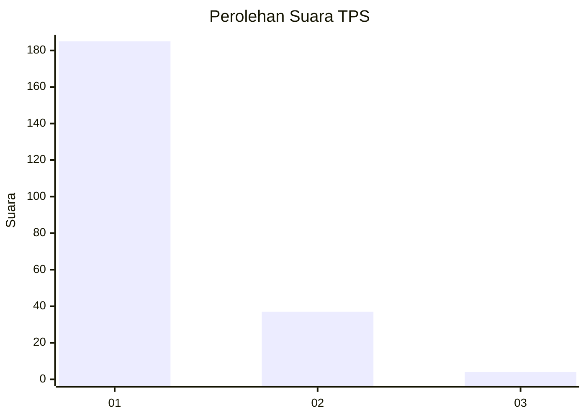
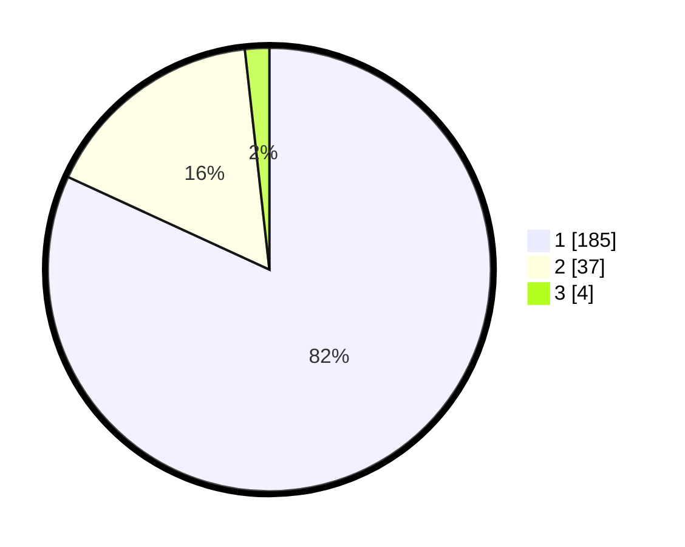

# Hasil

## Grafik

## Tabel

| No. | Nama Paslon    | Suara | Suara (raw) | Persentase |
|:--- |:-------------- | -----:| -----------:| ----------:|
| 1   | ANIES MUHAIMIN | 185   | [185][p-1]  | 81,86      |
| 2   | PRABOWO GIBRAN | 37    | [37][p-2]   | 16,37      |
| 3   | GANJAR MAHFUD  | 4     | [4][p-3]    | 1,77       |

[p-1]: https://github.com/gigit-pemilu/pemilu-2024-11-aceh/blob/main/pilpres/hitung-suara/sub/11-aceh/sub/06-aceh-besar/sub/20-baitussalam/sub/2006-lam-bada-lhok/sub/002-tps/sub/paslon-1.txt
[p-2]: https://github.com/gigit-pemilu/pemilu-2024-11-aceh/blob/main/pilpres/hitung-suara/sub/11-aceh/sub/06-aceh-besar/sub/20-baitussalam/sub/2006-lam-bada-lhok/sub/002-tps/sub/paslon-2.txt
[p-3]: https://github.com/gigit-pemilu/pemilu-2024-11-aceh/blob/main/pilpres/hitung-suara/sub/11-aceh/sub/06-aceh-besar/sub/20-baitussalam/sub/2006-lam-bada-lhok/sub/002-tps/sub/paslon-3.txt

## Foto C Plano

https://sirekap-obj-formc.kpu.go.id/3de5/pemilu/ppwp/11/06/20/20/06/1106202006002-20240215-051344--03ef881e-ae5e-43c8-97fa-29b2b0d213cf.jpg

https://sirekap-obj-formc.kpu.go.id/3de5/pemilu/ppwp/11/06/20/20/06/1106202006002-20240215-051555--ef60b31f-9182-47f2-aa7c-9c09c4993724.jpg

https://sirekap-obj-formc.kpu.go.id/3de5/pemilu/ppwp/11/06/20/20/06/1106202006002-20240215-103821--0af72b89-e5b5-4696-98a1-2a01c034fff6.jpg

## Metadata

| Key        | Value               |
| ---------- | ------------------- |
| Time Stamp | 2024-02-16 00:30:27 |

