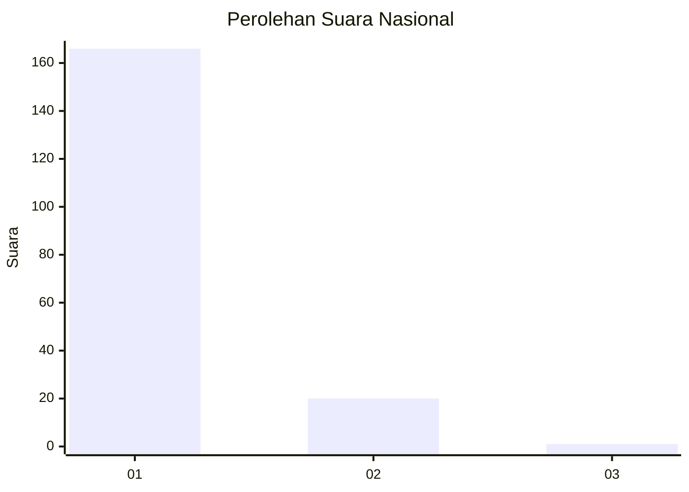
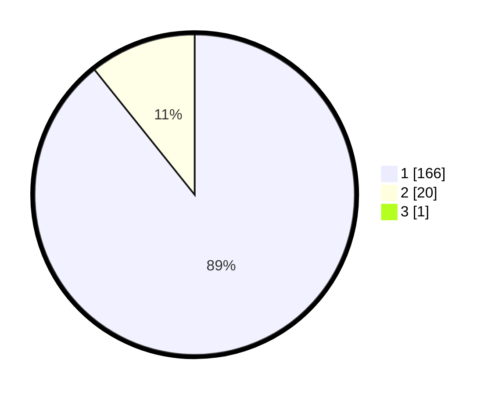

# Hasil

## Grafik

## Tabel

| No. | Nama Paslon    | Suara | Suara (raw) | Persentase |
|:--- |:-------------- | -----:| -----------:| ----------:|
| 1   | ANIES MUHAIMIN | 166   | [166][p-1]  | 88,77      |
| 2   | PRABOWO GIBRAN | 20    | [20][p-2]   | 10,70      |
| 3   | GANJAR MAHFUD  | 1     | [1][p-3]    | 0,53       |

[p-1]: https://github.com/gigit-pemilu/pemilu-2024/blob/main/pilpres/hitung-suara/sub/11-aceh/sub/06-aceh-besar/sub/20-baitussalam/sub/2007-lampineung/sub/002-tps/sub/paslon-1.txt
[p-2]: https://github.com/gigit-pemilu/pemilu-2024/blob/main/pilpres/hitung-suara/sub/11-aceh/sub/06-aceh-besar/sub/20-baitussalam/sub/2007-lampineung/sub/002-tps/sub/paslon-2.txt
[p-3]: https://github.com/gigit-pemilu/pemilu-2024/blob/main/pilpres/hitung-suara/sub/11-aceh/sub/06-aceh-besar/sub/20-baitussalam/sub/2007-lampineung/sub/002-tps/sub/paslon-3.txt

## Foto C Plano

https://sirekap-obj-formc.kpu.go.id/d914/pemilu/ppwp/11/06/20/20/07/1106202007002-20240215-111806--545694df-6355-4e3a-a7c0-28036b0b230c.jpg

https://sirekap-obj-formc.kpu.go.id/d914/pemilu/ppwp/11/06/20/20/07/1106202007002-20240215-112137--1fcc1dc7-c9a8-431b-9703-52ba620e2f4f.jpg

https://sirekap-obj-formc.kpu.go.id/d914/pemilu/ppwp/11/06/20/20/07/1106202007002-20240214-201216--588b08c2-4f17-4e04-8402-2248dbfd888c.jpg

## Metadata

| Key        | Value               |
| ---------- | ------------------- |
| Time Stamp | 2024-02-15 15:00:29 |

