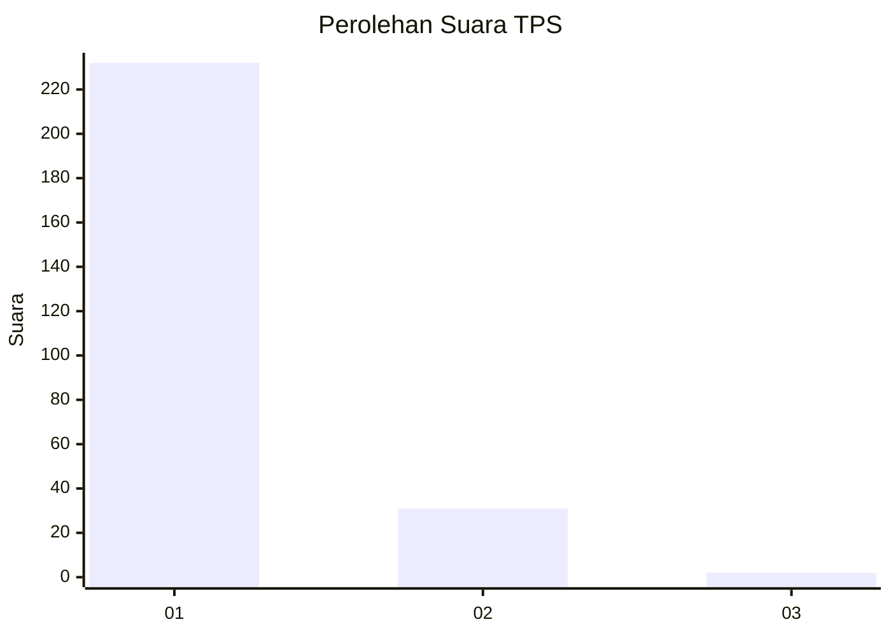
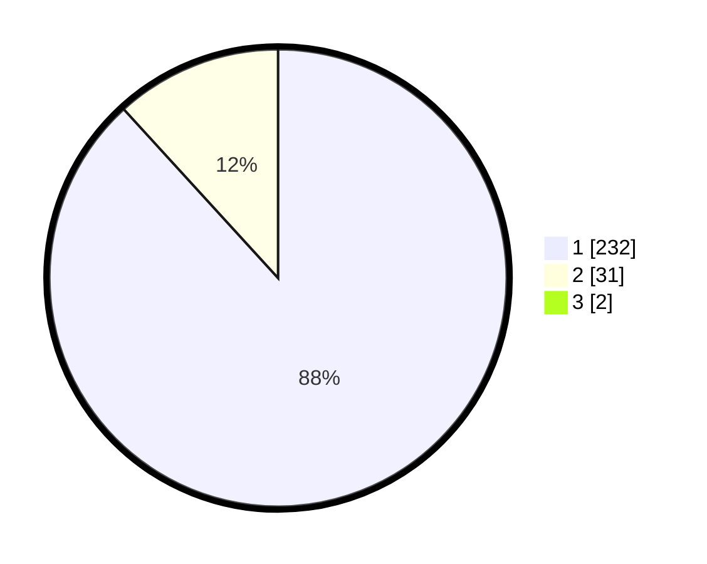

# Hasil

## Grafik

## Tabel

| No. | Nama Paslon    | Suara | Suara (raw) | Persentase |
|:--- |:-------------- | -----:| -----------:| ----------:|
| 1   | ANIES MUHAIMIN | 232   | [232][p-1]  | 87,55      |
| 2   | PRABOWO GIBRAN | 31    | [31][p-2]   | 11,70      |
| 3   | GANJAR MAHFUD  | 2     | [2][p-3]    | 0,75       |

[p-1]: https://github.com/gigit-pemilu/pemilu-2024-11-aceh/blob/main/pilpres/hitung-suara/sub/11-aceh/sub/06-aceh-besar/sub/20-baitussalam/sub/2013-miruk-lam-reudep/sub/002-tps/sub/paslon-1.txt
[p-2]: https://github.com/gigit-pemilu/pemilu-2024-11-aceh/blob/main/pilpres/hitung-suara/sub/11-aceh/sub/06-aceh-besar/sub/20-baitussalam/sub/2013-miruk-lam-reudep/sub/002-tps/sub/paslon-2.txt
[p-3]: https://github.com/gigit-pemilu/pemilu-2024-11-aceh/blob/main/pilpres/hitung-suara/sub/11-aceh/sub/06-aceh-besar/sub/20-baitussalam/sub/2013-miruk-lam-reudep/sub/002-tps/sub/paslon-3.txt

## Foto C Plano

https://sirekap-obj-formc.kpu.go.id/9bd5/pemilu/ppwp/11/06/20/20/13/1106202013002-20240215-214818--f917cc71-ec4f-4829-b74c-65e5b7a89619.jpg

https://sirekap-obj-formc.kpu.go.id/9bd5/pemilu/ppwp/11/06/20/20/13/1106202013002-20240215-214820--3723c3b8-f08c-4f05-973f-0e8e01ad9a22.jpg

https://sirekap-obj-formc.kpu.go.id/9bd5/pemilu/ppwp/11/06/20/20/13/1106202013002-20240215-214819--4424628d-793f-40fa-bf46-fb78fbd60256.jpg

## Metadata

| Key        | Value               |
| ---------- | ------------------- |
| Time Stamp | 2024-02-16 01:00:27 |

## DATA PEMILIH TETAP

Jumlah pemilih dalam DPT: **293**.
 * L: **148**.
 * P: **145**.

## DATA PENGGUNA HAK PILIH

Jumlah pengguna hak pilih dalam DPT: **267**.
 * L: **134**.
 * P: **133**.

Jumlah pengguna hak pilih dalam DPTb: **2**.
 * L: **1**.
 * P: **1**.

Jumlah pengguna hak pilih dalam DPK: **1**.
 * L: **1**.
 * P: **0**.

Jumlah pengguna hak pilih: **270**.
 * L: **136**.
 * P: **134**.

## JUMLAH SUARA SAH DAN TIDAK SAH

JUMLAH SELURUH SUARA SAH: **265**.

JUMLAH SUARA TIDAK SAH: **5**.

JUMLAH SELURUH SUARA SAH DAN SUARA TIDAK SAH: **270**.

