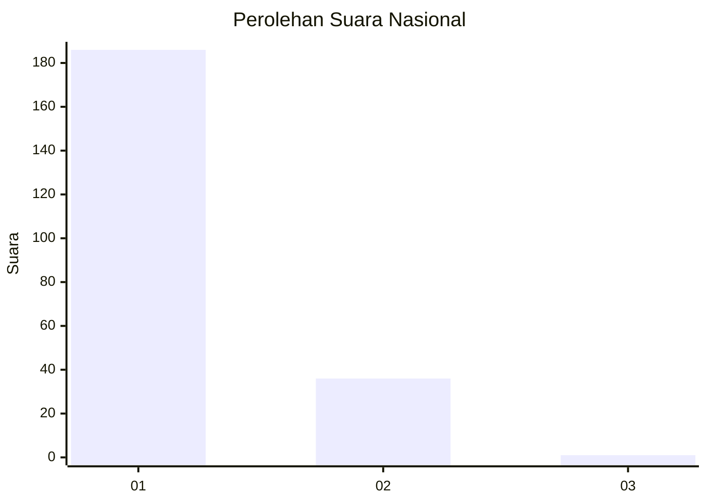
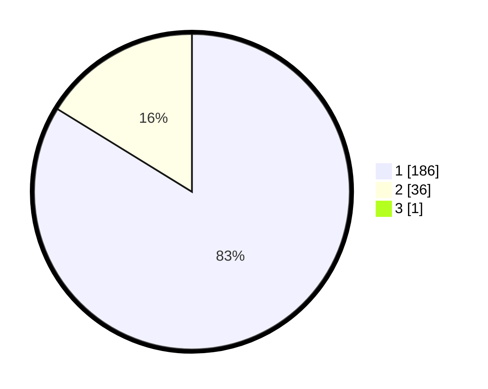

# Hasil

## Grafik

## Tabel

| No. | Nama Paslon    | Suara | Suara (raw) | Persentase |
|:--- |:-------------- | -----:| -----------:| ----------:|
| 1   | ANIES MUHAIMIN | 186   | [186][p-1]  | 83,41      |
| 2   | PRABOWO GIBRAN | 36    | [36][p-2]   | 16,14      |
| 3   | GANJAR MAHFUD  | 1     | [1][p-3]    | 0,45       |

[p-1]: https://github.com/gigit-pemilu/pemilu-2024/blob/main/pilpres/hitung-suara/sub/11-aceh/sub/06-aceh-besar/sub/20-baitussalam/sub/2013-miruk-lam-reudep/sub/007-tps/sub/paslon-1.txt
[p-2]: https://github.com/gigit-pemilu/pemilu-2024/blob/main/pilpres/hitung-suara/sub/11-aceh/sub/06-aceh-besar/sub/20-baitussalam/sub/2013-miruk-lam-reudep/sub/007-tps/sub/paslon-2.txt
[p-3]: https://github.com/gigit-pemilu/pemilu-2024/blob/main/pilpres/hitung-suara/sub/11-aceh/sub/06-aceh-besar/sub/20-baitussalam/sub/2013-miruk-lam-reudep/sub/007-tps/sub/paslon-3.txt

## Foto C Plano

https://sirekap-obj-formc.kpu.go.id/c588/pemilu/ppwp/11/06/20/20/13/1106202013007-20240215-061905--c7cab41e-96fc-4caa-8e86-ff3af177b16e.jpg

https://sirekap-obj-formc.kpu.go.id/c588/pemilu/ppwp/11/06/20/20/13/1106202013007-20240215-061911--c89655ec-688f-4791-876d-46c6f6ccde8a.jpg

https://sirekap-obj-formc.kpu.go.id/c588/pemilu/ppwp/11/06/20/20/13/1106202013007-20240215-061917--76421964-359c-48c8-abf6-aa6cd99904e8.jpg

## Metadata

| Key        | Value               |
| ---------- | ------------------- |
| Time Stamp | 2024-02-16 13:30:32 |

