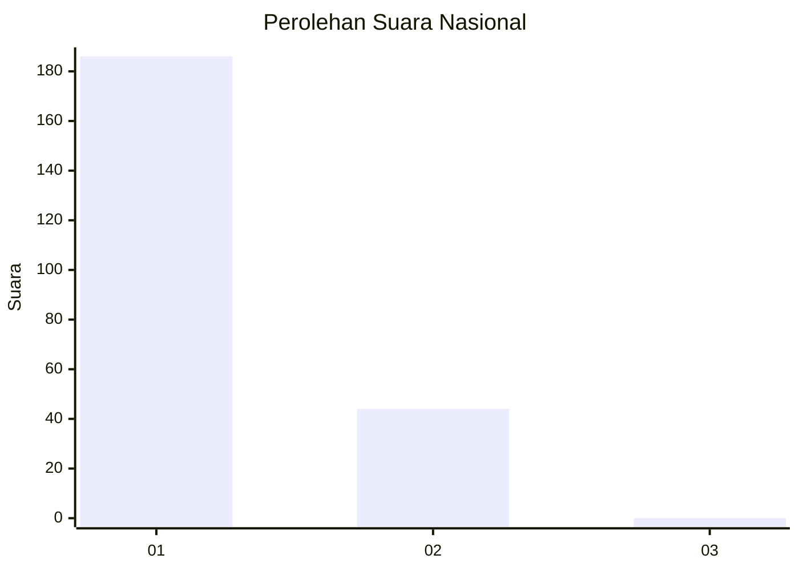
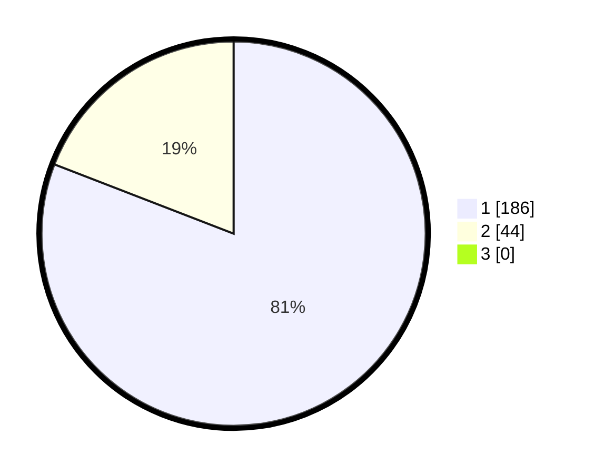

# Hasil

## Grafik

## Tabel

| No. | Nama Paslon    | Suara | Suara (raw) | Persentase |
|:--- |:-------------- | -----:| -----------:| ----------:|
| 1   | ANIES MUHAIMIN | 186   | [186][p-1]  | 80,87      |
| 2   | PRABOWO GIBRAN | 44    | [44][p-2]   | 19,13      |
| 3   | GANJAR MAHFUD  | 0     | [0][p-3]    | 0,00       |

[p-1]: https://github.com/gigit-pemilu/pemilu-2024/blob/main/pilpres/hitung-suara/sub/11-aceh/sub/06-aceh-besar/sub/21-krueng-barona-jaya/sub/2001-meunasah-papeun/sub/001-tps/sub/paslon-1.txt
[p-2]: https://github.com/gigit-pemilu/pemilu-2024/blob/main/pilpres/hitung-suara/sub/11-aceh/sub/06-aceh-besar/sub/21-krueng-barona-jaya/sub/2001-meunasah-papeun/sub/001-tps/sub/paslon-2.txt
[p-3]: https://github.com/gigit-pemilu/pemilu-2024/blob/main/pilpres/hitung-suara/sub/11-aceh/sub/06-aceh-besar/sub/21-krueng-barona-jaya/sub/2001-meunasah-papeun/sub/001-tps/sub/paslon-3.txt

## Foto C Plano

https://sirekap-obj-formc.kpu.go.id/a3fc/pemilu/ppwp/11/06/21/20/01/1106212001001-20240215-024112--4d1c27ca-7697-4e28-a8c8-b7449b68ee45.jpg

https://sirekap-obj-formc.kpu.go.id/a3fc/pemilu/ppwp/11/06/21/20/01/1106212001001-20240215-024245--409badcd-15f5-404e-8d77-15d9a1702473.jpg

https://sirekap-obj-formc.kpu.go.id/a3fc/pemilu/ppwp/11/06/21/20/01/1106212001001-20240214-213238--aa5d0142-2925-4613-bc47-37b894943143.jpg

## Metadata

| Key        | Value               |
| ---------- | ------------------- |
| Time Stamp | 2024-02-16 00:30:27 |

