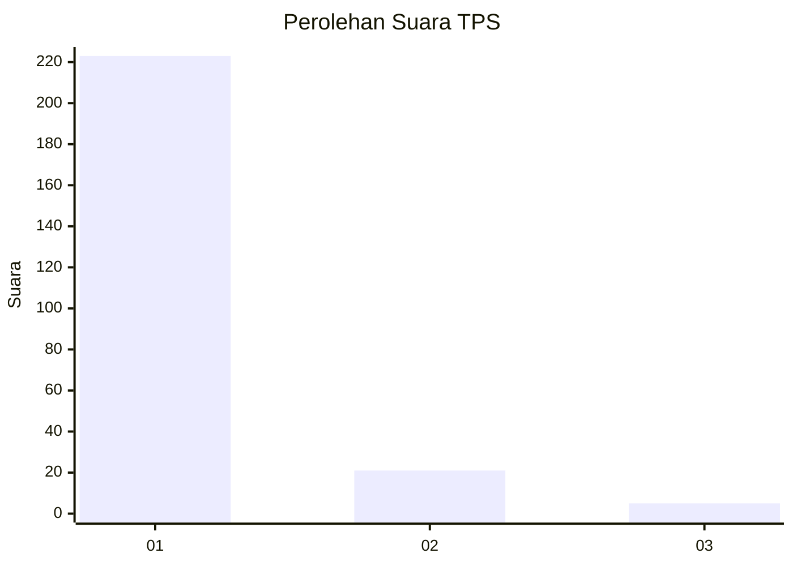
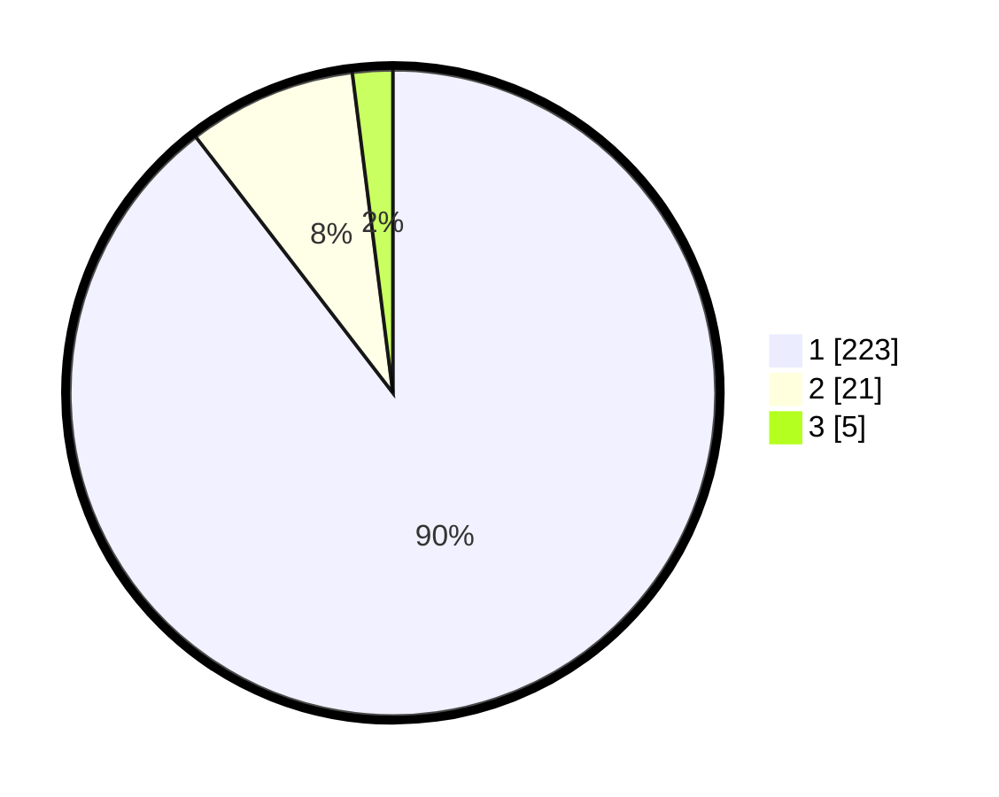

# Hasil

## Grafik

## Tabel

| No. | Nama Paslon    | Suara | Suara (raw) | Persentase |
|:--- |:-------------- | -----:| -----------:| ----------:|
| 1   | ANIES MUHAIMIN | 223   | [223][p-1]  | 89,56      |
| 2   | PRABOWO GIBRAN | 21    | [21][p-2]   | 8,43       |
| 3   | GANJAR MAHFUD  | 5     | [5][p-3]    | 2,01       |

[p-1]: https://github.com/gigit-pemilu/pemilu-2024-11-aceh/blob/main/pilpres/hitung-suara/sub/11-aceh/sub/06-aceh-besar/sub/21-krueng-barona-jaya/sub/2001-meunasah-papeun/sub/002-tps/sub/paslon-1.txt
[p-2]: https://github.com/gigit-pemilu/pemilu-2024-11-aceh/blob/main/pilpres/hitung-suara/sub/11-aceh/sub/06-aceh-besar/sub/21-krueng-barona-jaya/sub/2001-meunasah-papeun/sub/002-tps/sub/paslon-2.txt
[p-3]: https://github.com/gigit-pemilu/pemilu-2024-11-aceh/blob/main/pilpres/hitung-suara/sub/11-aceh/sub/06-aceh-besar/sub/21-krueng-barona-jaya/sub/2001-meunasah-papeun/sub/002-tps/sub/paslon-3.txt

## Foto C Plano

https://sirekap-obj-formc.kpu.go.id/03c5/pemilu/ppwp/11/06/21/20/01/1106212001002-20240215-225205--5fb97c3b-14d0-4a68-a203-f559e2cb4941.jpg

https://sirekap-obj-formc.kpu.go.id/03c5/pemilu/ppwp/11/06/21/20/01/1106212001002-20240215-225208--9b12a39b-7846-44b2-aa45-fe5d5fd52cc5.jpg

https://sirekap-obj-formc.kpu.go.id/03c5/pemilu/ppwp/11/06/21/20/01/1106212001002-20240215-225207--49b0c976-55bc-413f-bb4f-a237f8db7aed.jpg

## Metadata

| Key        | Value               |
| ---------- | ------------------- |
| Time Stamp | 2024-02-16 01:00:27 |

## DATA PEMILIH TETAP

Jumlah pemilih dalam DPT: **295**.
 * L: **149**.
 * P: **146**.

## DATA PENGGUNA HAK PILIH

Jumlah pengguna hak pilih dalam DPT: **247**.
 * L: **121**.
 * P: **126**.

Jumlah pengguna hak pilih dalam DPTb: **2**.
 * L: **1**.
 * P: **1**.

Jumlah pengguna hak pilih dalam DPK: **0**.
 * L: **0**.
 * P: **0**.

Jumlah pengguna hak pilih: **249**.
 * L: **122**.
 * P: **127**.

## JUMLAH SUARA SAH DAN TIDAK SAH

JUMLAH SELURUH SUARA SAH: **249**.

JUMLAH SUARA TIDAK SAH: **3**.

JUMLAH SELURUH SUARA SAH DAN SUARA TIDAK SAH: **252**.

