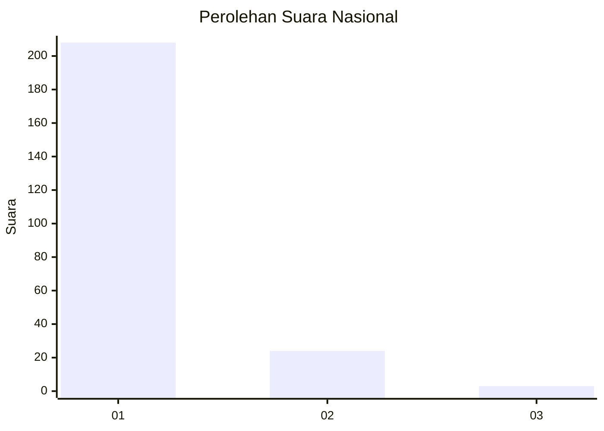
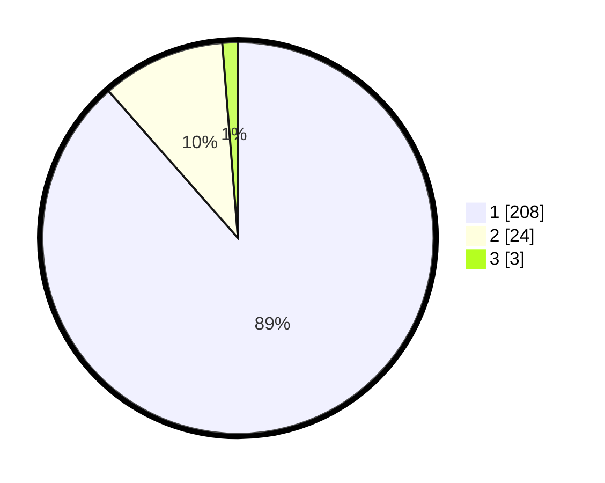

# Hasil

## Grafik

## Tabel

| No. | Nama Paslon    | Suara | Suara (raw) | Persentase |
|:--- |:-------------- | -----:| -----------:| ----------:|
| 1   | ANIES MUHAIMIN | 208   | [208][p-1]  | 88,51      |
| 2   | PRABOWO GIBRAN | 24    | [24][p-2]   | 10,21      |
| 3   | GANJAR MAHFUD  | 3     | [3][p-3]    | 1,28       |

[p-1]: https://github.com/gigit-pemilu/pemilu-2024/blob/main/pilpres/hitung-suara/sub/11-aceh/sub/06-aceh-besar/sub/21-krueng-barona-jaya/sub/2001-meunasah-papeun/sub/003-tps/sub/paslon-1.txt
[p-2]: https://github.com/gigit-pemilu/pemilu-2024/blob/main/pilpres/hitung-suara/sub/11-aceh/sub/06-aceh-besar/sub/21-krueng-barona-jaya/sub/2001-meunasah-papeun/sub/003-tps/sub/paslon-2.txt
[p-3]: https://github.com/gigit-pemilu/pemilu-2024/blob/main/pilpres/hitung-suara/sub/11-aceh/sub/06-aceh-besar/sub/21-krueng-barona-jaya/sub/2001-meunasah-papeun/sub/003-tps/sub/paslon-3.txt

## Foto C Plano

https://sirekap-obj-formc.kpu.go.id/7ce0/pemilu/ppwp/11/06/21/20/01/1106212001003-20240215-011011--da9ccea4-63ec-4f0c-9cf6-ac63b21eadfa.jpg

https://sirekap-obj-formc.kpu.go.id/7ce0/pemilu/ppwp/11/06/21/20/01/1106212001003-20240215-011106--d38b557c-ab1c-4c80-bcb3-3222adc74ed6.jpg

https://sirekap-obj-formc.kpu.go.id/7ce0/pemilu/ppwp/11/06/21/20/01/1106212001003-20240215-011212--8e09cd87-7d30-4f53-aa47-f2e56760ea9e.jpg

## Metadata

| Key        | Value               |
| ---------- | ------------------- |
| Time Stamp | 2024-02-16 00:30:27 |

## DATA PEMILIH TETAP

Jumlah pemilih dalam DPT: **289**.
 * L: **135**.
 * P: **154**.

## DATA PENGGUNA HAK PILIH

Jumlah pengguna hak pilih dalam DPT: **229**.
 * L: **87**.
 * P: **142**.

Jumlah pengguna hak pilih dalam DPTb: **7**.
 * L: **0**.
 * P: **7**.

Jumlah pengguna hak pilih dalam DPK: **2**.
 * L: **1**.
 * P: **1**.

Jumlah pengguna hak pilih: **237**.
 * L: **87**.
 * P: **150**.

## JUMLAH SUARA SAH DAN TIDAK SAH

JUMLAH SELURUH SUARA SAH: **235**.

JUMLAH SUARA TIDAK SAH: **2**.

JUMLAH SELURUH SUARA SAH DAN SUARA TIDAK SAH: **237**.

