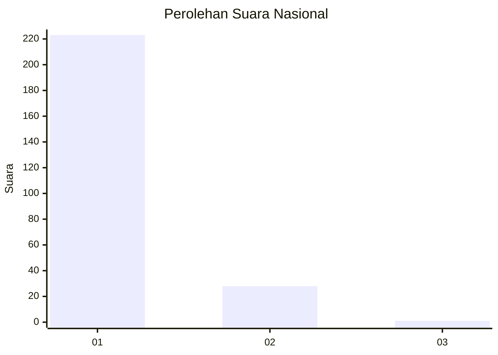
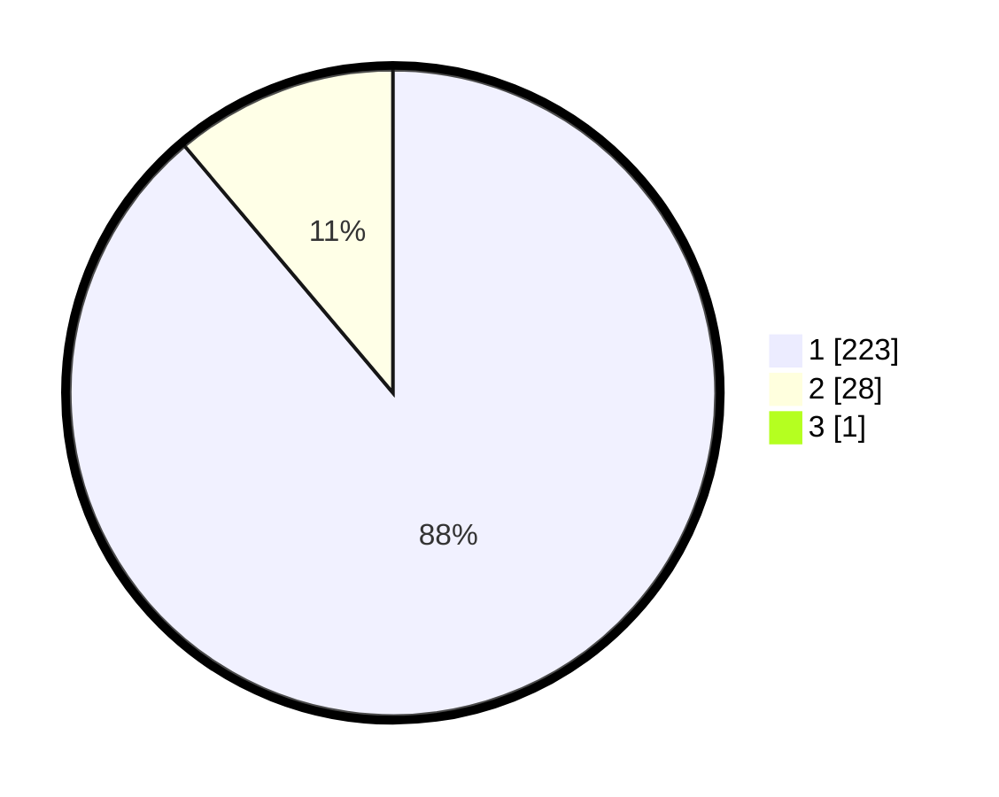

# Hasil

## Grafik

## Tabel

| No. | Nama Paslon    | Suara | Suara (raw) | Persentase |
|:--- |:-------------- | -----:| -----------:| ----------:|
| 1   | ANIES MUHAIMIN | 223   | [223][p-1]  | 88,49      |
| 2   | PRABOWO GIBRAN | 28    | [28][p-2]   | 11,11      |
| 3   | GANJAR MAHFUD  | 1     | [1][p-3]    | 0,40       |

[p-1]: https://github.com/gigit-pemilu/pemilu-2024/blob/main/pilpres/hitung-suara/sub/11-aceh/sub/06-aceh-besar/sub/21-krueng-barona-jaya/sub/2001-meunasah-papeun/sub/004-tps/sub/paslon-1.txt
[p-2]: https://github.com/gigit-pemilu/pemilu-2024/blob/main/pilpres/hitung-suara/sub/11-aceh/sub/06-aceh-besar/sub/21-krueng-barona-jaya/sub/2001-meunasah-papeun/sub/004-tps/sub/paslon-2.txt
[p-3]: https://github.com/gigit-pemilu/pemilu-2024/blob/main/pilpres/hitung-suara/sub/11-aceh/sub/06-aceh-besar/sub/21-krueng-barona-jaya/sub/2001-meunasah-papeun/sub/004-tps/sub/paslon-3.txt

## Foto C Plano

https://sirekap-obj-formc.kpu.go.id/32de/pemilu/ppwp/11/06/21/20/01/1106212001004-20240215-204812--ee10b24b-2074-47c5-a979-a9af05443ccd.jpg

https://sirekap-obj-formc.kpu.go.id/32de/pemilu/ppwp/11/06/21/20/01/1106212001004-20240214-194938--dbd98aba-5cf6-4194-8d62-339d917da2ee.jpg

https://sirekap-obj-formc.kpu.go.id/32de/pemilu/ppwp/11/06/21/20/01/1106212001004-20240214-193842--fad3f0d2-7e4a-40c5-9993-21822324a92e.jpg

## Metadata

| Key        | Value               |
| ---------- | ------------------- |
| Time Stamp | 2024-02-15 21:01:18 |

## DATA PEMILIH TETAP

Jumlah pemilih dalam DPT: **299**.
 * L: **150**.
 * P: **149**.

## DATA PENGGUNA HAK PILIH

Jumlah pengguna hak pilih dalam DPT: **250**.
 * L: **123**.
 * P: **127**.

Jumlah pengguna hak pilih dalam DPTb: **0**.
 * L: **0**.
 * P: **0**.

Jumlah pengguna hak pilih dalam DPK: **6**.
 * L: **4**.
 * P: **2**.

Jumlah pengguna hak pilih: **256**.
 * L: **127**.
 * P: **129**.

## JUMLAH SUARA SAH DAN TIDAK SAH

JUMLAH SELURUH SUARA SAH: **252**.

JUMLAH SUARA TIDAK SAH: **4**.

JUMLAH SELURUH SUARA SAH DAN SUARA TIDAK SAH: **256**.

