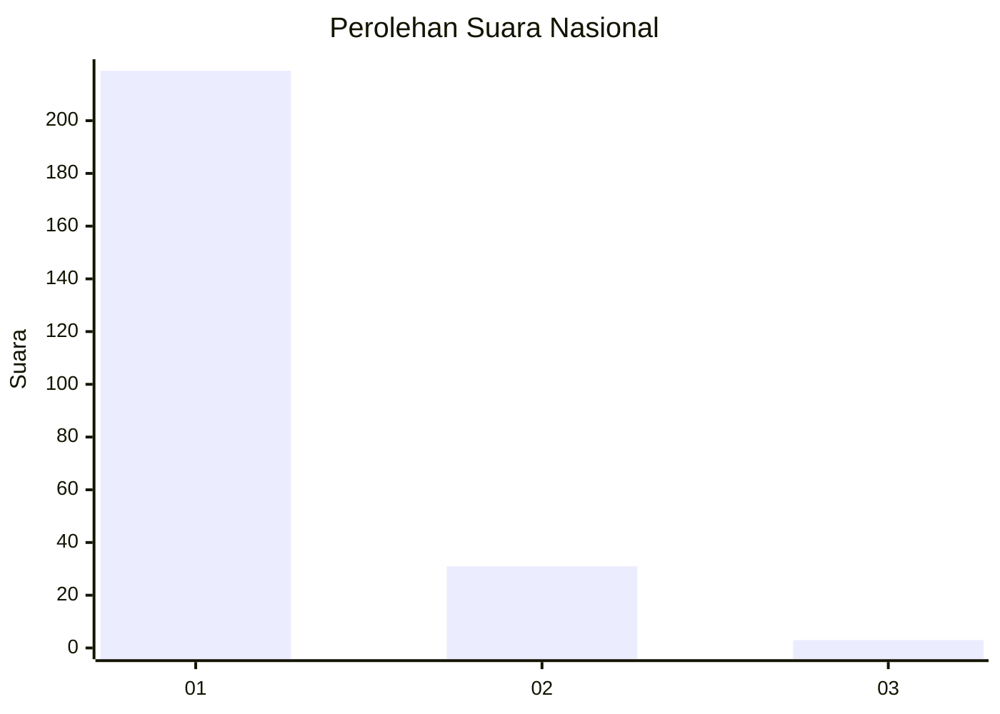
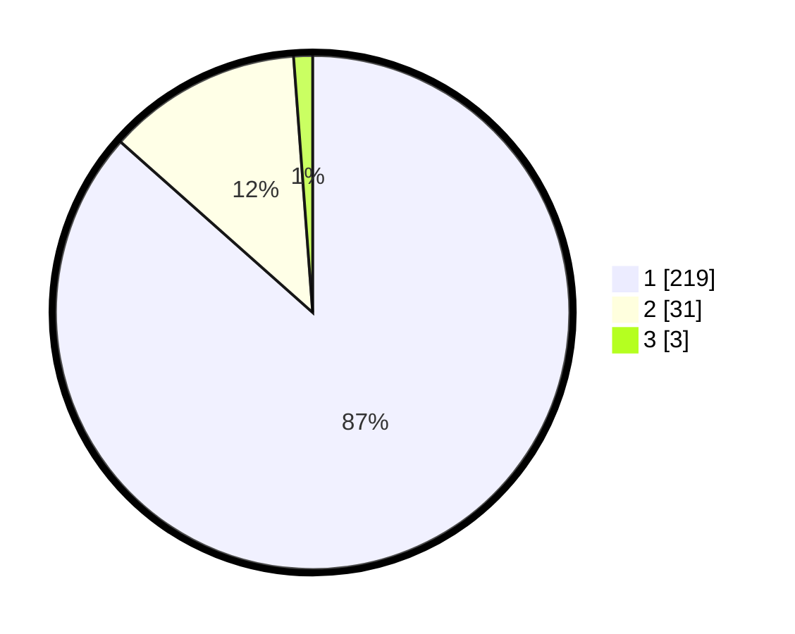

# Hasil

## Grafik

## Tabel

| No. | Nama Paslon    | Suara | Suara (raw) | Persentase |
|:--- |:-------------- | -----:| -----------:| ----------:|
| 1   | ANIES MUHAIMIN | 219   | [219][p-1]  | 86,56      |
| 2   | PRABOWO GIBRAN | 31    | [31][p-2]   | 12,25      |
| 3   | GANJAR MAHFUD  | 3     | [3][p-3]    | 1,19       |

[p-1]: https://github.com/gigit-pemilu/pemilu-2024/blob/main/pilpres/hitung-suara/sub/11-aceh/sub/06-aceh-besar/sub/21-krueng-barona-jaya/sub/2001-meunasah-papeun/sub/005-tps/sub/paslon-1.txt
[p-2]: https://github.com/gigit-pemilu/pemilu-2024/blob/main/pilpres/hitung-suara/sub/11-aceh/sub/06-aceh-besar/sub/21-krueng-barona-jaya/sub/2001-meunasah-papeun/sub/005-tps/sub/paslon-2.txt
[p-3]: https://github.com/gigit-pemilu/pemilu-2024/blob/main/pilpres/hitung-suara/sub/11-aceh/sub/06-aceh-besar/sub/21-krueng-barona-jaya/sub/2001-meunasah-papeun/sub/005-tps/sub/paslon-3.txt

## Foto C Plano

https://sirekap-obj-formc.kpu.go.id/0296/pemilu/ppwp/11/06/21/20/01/1106212001005-20240215-093347--04f7dd80-9328-468a-8cce-8746c6aea57c.jpg

https://sirekap-obj-formc.kpu.go.id/0296/pemilu/ppwp/11/06/21/20/01/1106212001005-20240215-093416--3a12cc0b-4e33-4b70-a9d9-a02decb532b9.jpg

https://sirekap-obj-formc.kpu.go.id/0296/pemilu/ppwp/11/06/21/20/01/1106212001005-20240215-082516--d4035003-fbfe-4b6c-a520-e085b80b2b83.jpg

## Metadata

| Key        | Value               |
| ---------- | ------------------- |
| Time Stamp | 2024-02-16 00:30:27 |

