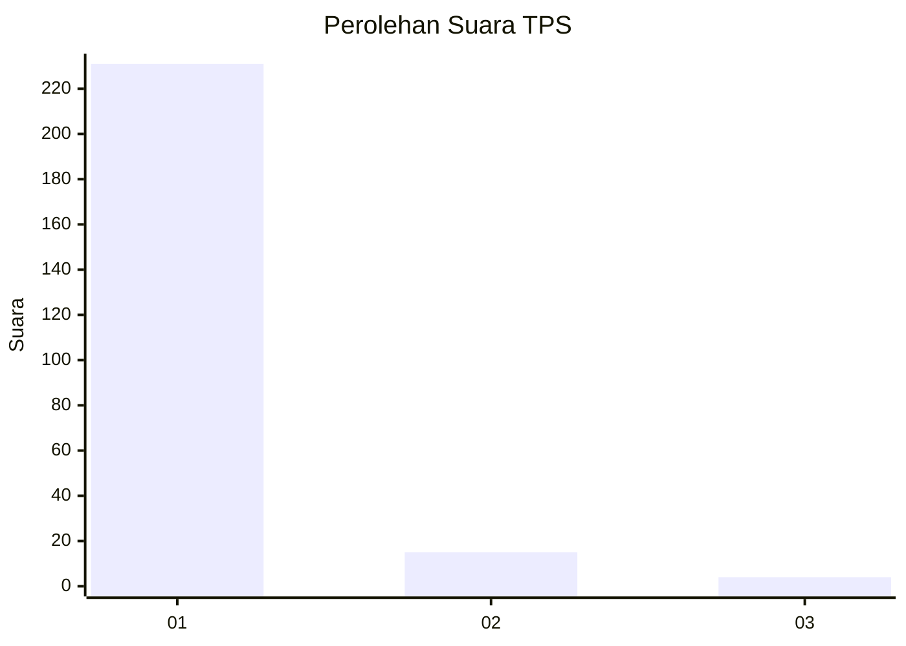
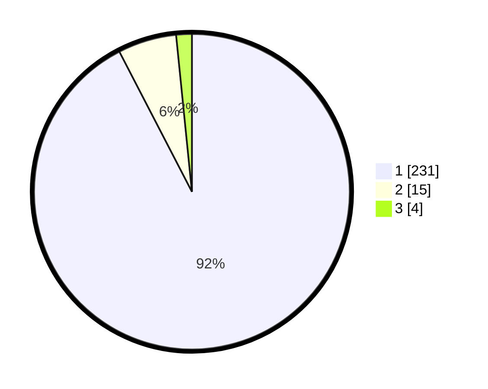

# Hasil

## Grafik

## Tabel

| No. | Nama Paslon    | Suara | Suara (raw) | Persentase |
|:--- |:-------------- | -----:| -----------:| ----------:|
| 1   | ANIES MUHAIMIN | 231   | [231][p-1]  | 92,40      |
| 2   | PRABOWO GIBRAN | 15    | [15][p-2]   | 6,00       |
| 3   | GANJAR MAHFUD  | 4     | [4][p-3]    | 1,60       |

[p-1]: https://github.com/gigit-pemilu/pemilu-2024-11-aceh/blob/main/pilpres/hitung-suara/sub/11-aceh/sub/06-aceh-besar/sub/21-krueng-barona-jaya/sub/2001-meunasah-papeun/sub/008-tps/sub/paslon-1.txt
[p-2]: https://github.com/gigit-pemilu/pemilu-2024-11-aceh/blob/main/pilpres/hitung-suara/sub/11-aceh/sub/06-aceh-besar/sub/21-krueng-barona-jaya/sub/2001-meunasah-papeun/sub/008-tps/sub/paslon-2.txt
[p-3]: https://github.com/gigit-pemilu/pemilu-2024-11-aceh/blob/main/pilpres/hitung-suara/sub/11-aceh/sub/06-aceh-besar/sub/21-krueng-barona-jaya/sub/2001-meunasah-papeun/sub/008-tps/sub/paslon-3.txt

## Foto C Plano

https://sirekap-obj-formc.kpu.go.id/ad6b/pemilu/ppwp/11/06/21/20/01/1106212001008-20240214-221308--5b276f96-dc6a-4a45-bba2-5fc9611c37ed.jpg

https://sirekap-obj-formc.kpu.go.id/ad6b/pemilu/ppwp/11/06/21/20/01/1106212001008-20240214-222236--b786c755-f024-4612-a312-6c35de92d448.jpg

https://sirekap-obj-formc.kpu.go.id/ad6b/pemilu/ppwp/11/06/21/20/01/1106212001008-20240214-222327--8351f259-9bc7-48e6-a78c-efa015d23333.jpg

## Metadata

| Key        | Value               |
| ---------- | ------------------- |
| Time Stamp | 2024-02-16 01:00:27 |

