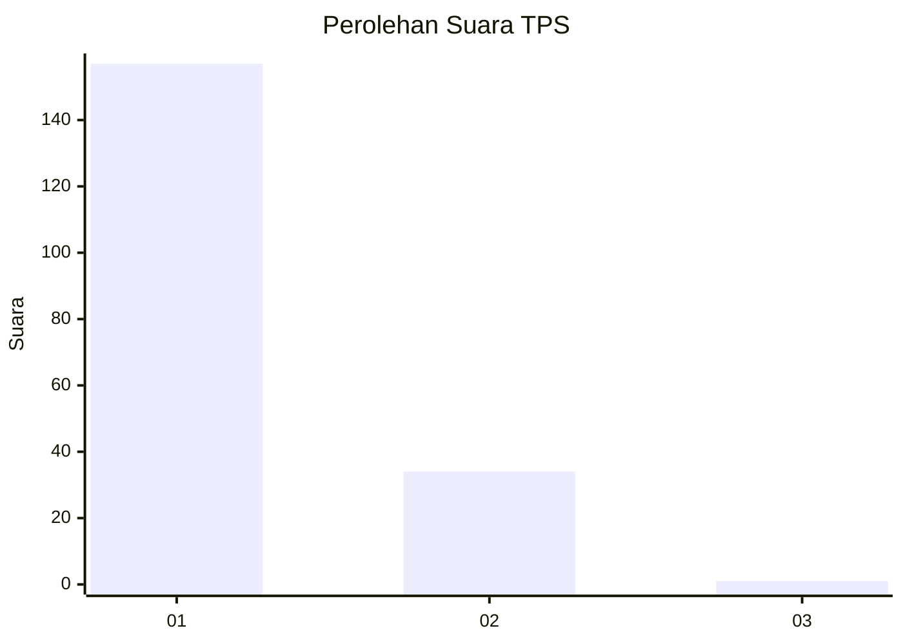
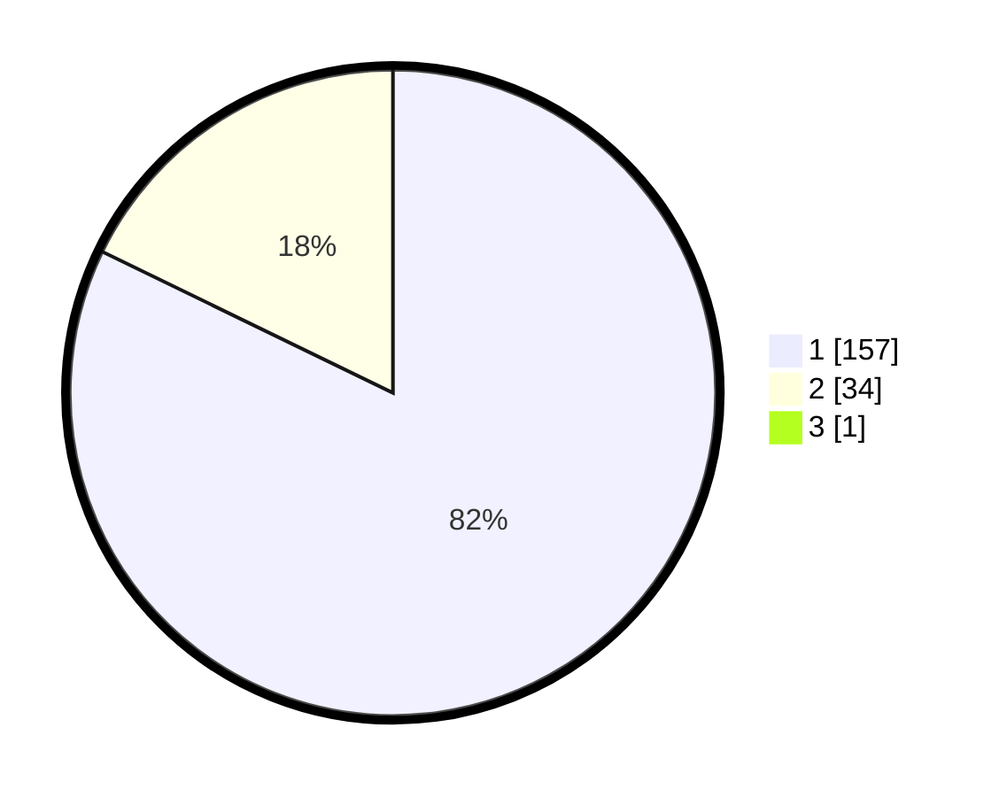

# Hasil

## Grafik

## Tabel

| No. | Nama Paslon    | Suara | Suara (raw) | Persentase |
|:--- |:-------------- | -----:| -----------:| ----------:|
| 1   | ANIES MUHAIMIN | 157   | [157][p-1]  | 81,77      |
| 2   | PRABOWO GIBRAN | 34    | [34][p-2]   | 17,71      |
| 3   | GANJAR MAHFUD  | 1     | [1][p-3]    | 0,52       |

[p-1]: https://github.com/gigit-pemilu/pemilu-2024-11-aceh/blob/main/pilpres/hitung-suara/sub/11-aceh/sub/06-aceh-besar/sub/21-krueng-barona-jaya/sub/2002-meunasah-baktrieng/sub/001-tps/sub/paslon-1.txt
[p-2]: https://github.com/gigit-pemilu/pemilu-2024-11-aceh/blob/main/pilpres/hitung-suara/sub/11-aceh/sub/06-aceh-besar/sub/21-krueng-barona-jaya/sub/2002-meunasah-baktrieng/sub/001-tps/sub/paslon-2.txt
[p-3]: https://github.com/gigit-pemilu/pemilu-2024-11-aceh/blob/main/pilpres/hitung-suara/sub/11-aceh/sub/06-aceh-besar/sub/21-krueng-barona-jaya/sub/2002-meunasah-baktrieng/sub/001-tps/sub/paslon-3.txt

## Foto C Plano

https://sirekap-obj-formc.kpu.go.id/5b4a/pemilu/ppwp/11/06/21/20/02/1106212002001-20240215-012507--7b9f5919-bccc-4589-a981-7d83882d2656.jpg

https://sirekap-obj-formc.kpu.go.id/5b4a/pemilu/ppwp/11/06/21/20/02/1106212002001-20240215-012635--9ba2a359-bf83-4b07-964f-17f08ca4e21a.jpg

https://sirekap-obj-formc.kpu.go.id/5b4a/pemilu/ppwp/11/06/21/20/02/1106212002001-20240215-012740--109fafb0-bb69-45cb-aacb-2876958ae9fd.jpg

## Metadata

| Key        | Value               |
| ---------- | ------------------- |
| Time Stamp | 2024-02-15 15:00:29 |

