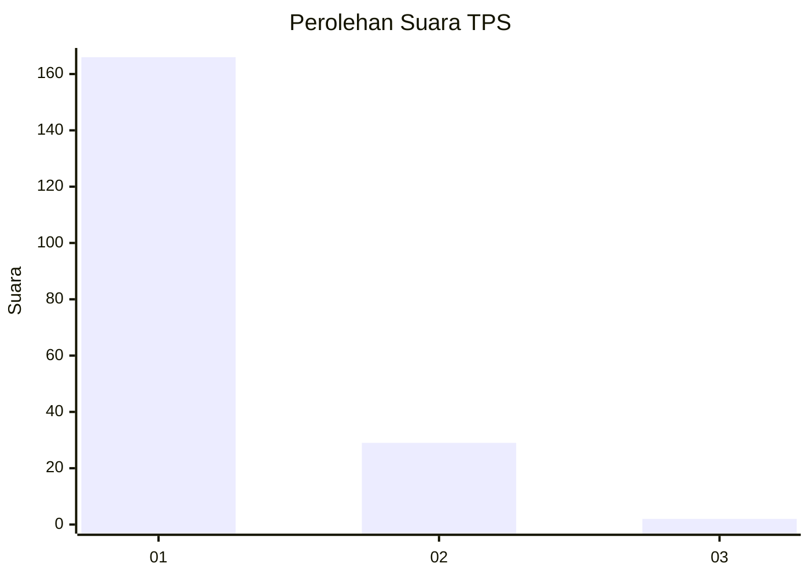
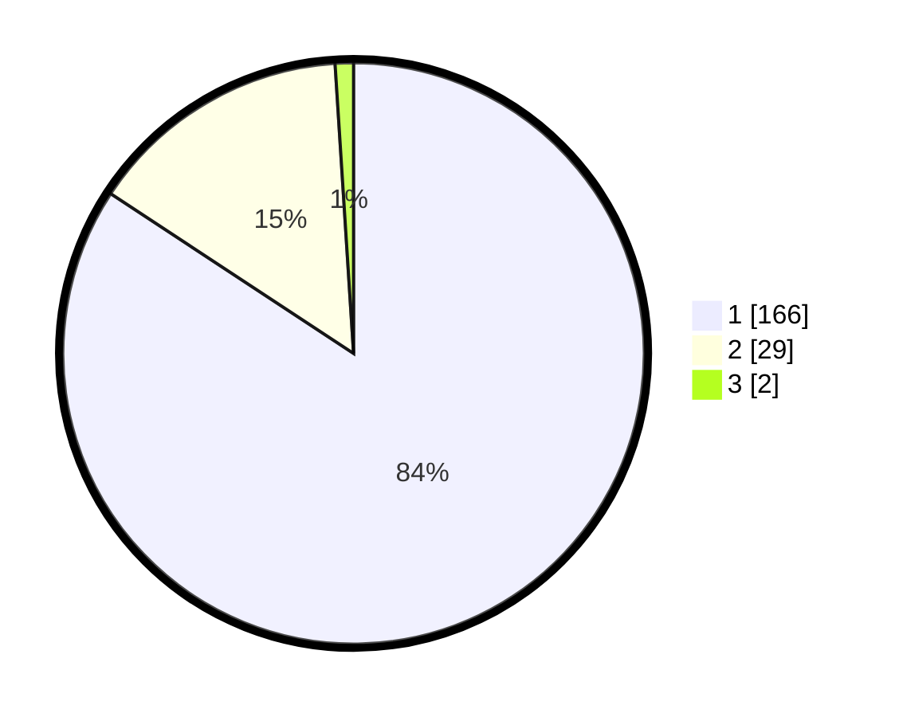

# Hasil

## Grafik

## Tabel

| No. | Nama Paslon    | Suara | Suara (raw) | Persentase |
|:--- |:-------------- | -----:| -----------:| ----------:|
| 1   | ANIES MUHAIMIN | 166   | [166][p-1]  | 84,26      |
| 2   | PRABOWO GIBRAN | 29    | [29][p-2]   | 14,72      |
| 3   | GANJAR MAHFUD  | 2     | [2][p-3]    | 1,02       |

[p-1]: https://github.com/gigit-pemilu/pemilu-2024-11-aceh/blob/main/pilpres/hitung-suara/sub/11-aceh/sub/06-aceh-besar/sub/21-krueng-barona-jaya/sub/2002-meunasah-baktrieng/sub/002-tps/sub/paslon-1.txt
[p-2]: https://github.com/gigit-pemilu/pemilu-2024-11-aceh/blob/main/pilpres/hitung-suara/sub/11-aceh/sub/06-aceh-besar/sub/21-krueng-barona-jaya/sub/2002-meunasah-baktrieng/sub/002-tps/sub/paslon-2.txt
[p-3]: https://github.com/gigit-pemilu/pemilu-2024-11-aceh/blob/main/pilpres/hitung-suara/sub/11-aceh/sub/06-aceh-besar/sub/21-krueng-barona-jaya/sub/2002-meunasah-baktrieng/sub/002-tps/sub/paslon-3.txt

## Foto C Plano

https://sirekap-obj-formc.kpu.go.id/59de/pemilu/ppwp/11/06/21/20/02/1106212002002-20240219-100914--b9cfd0f2-2948-40c2-8e8f-fffe90cdb454.jpg

https://sirekap-obj-formc.kpu.go.id/59de/pemilu/ppwp/11/06/21/20/02/1106212002002-20240219-101155--00927e77-04d0-4842-b970-ef5e62ff4f7e.jpg

https://sirekap-obj-formc.kpu.go.id/59de/pemilu/ppwp/11/06/21/20/02/1106212002002-20240219-101335--68e5fef1-1dd2-49e5-86a7-5d5cf9ec5cda.jpg

## Metadata

| Key        | Value               |
| ---------- | ------------------- |
| Time Stamp | 2024-02-19 21:00:00 |

