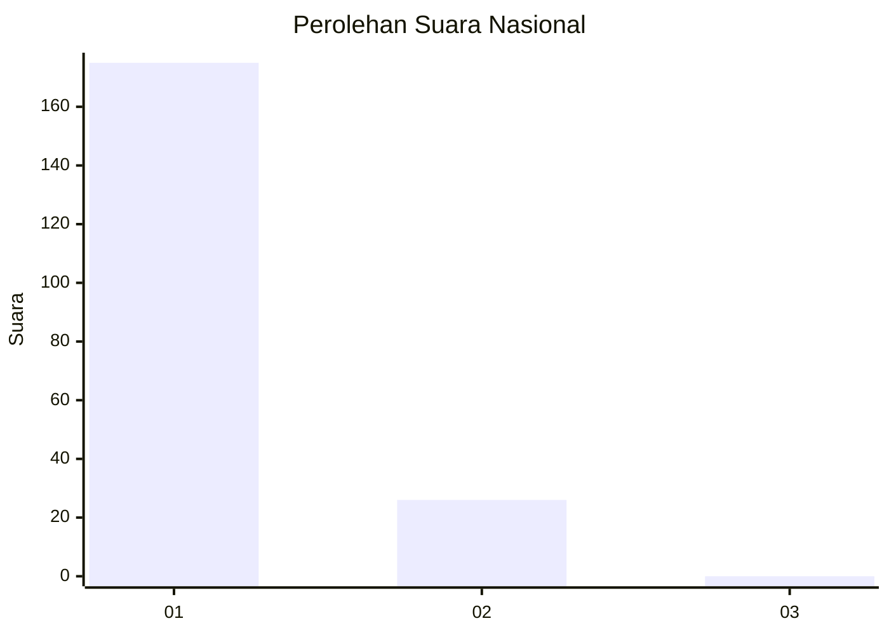
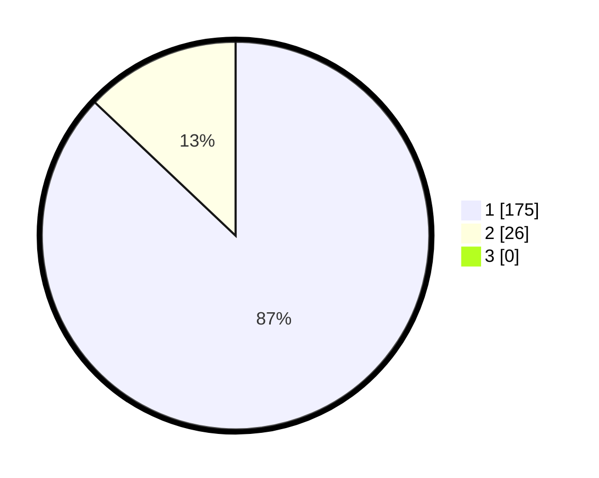

# Hasil

## Grafik

## Tabel

| No. | Nama Paslon    | Suara | Suara (raw) | Persentase |
|:--- |:-------------- | -----:| -----------:| ----------:|
| 1   | ANIES MUHAIMIN | 175   | [175][p-1]  | 87,06      |
| 2   | PRABOWO GIBRAN | 26    | [26][p-2]   | 12,94      |
| 3   | GANJAR MAHFUD  | 0     | [0][p-3]    | 0,00       |

[p-1]: https://github.com/gigit-pemilu/pemilu-2024/blob/main/pilpres/hitung-suara/sub/11-aceh/sub/06-aceh-besar/sub/21-krueng-barona-jaya/sub/2002-meunasah-baktrieng/sub/003-tps/sub/paslon-1.txt
[p-2]: https://github.com/gigit-pemilu/pemilu-2024/blob/main/pilpres/hitung-suara/sub/11-aceh/sub/06-aceh-besar/sub/21-krueng-barona-jaya/sub/2002-meunasah-baktrieng/sub/003-tps/sub/paslon-2.txt
[p-3]: https://github.com/gigit-pemilu/pemilu-2024/blob/main/pilpres/hitung-suara/sub/11-aceh/sub/06-aceh-besar/sub/21-krueng-barona-jaya/sub/2002-meunasah-baktrieng/sub/003-tps/sub/paslon-3.txt

## Foto C Plano

https://sirekap-obj-formc.kpu.go.id/f3c7/pemilu/ppwp/11/06/21/20/02/1106212002003-20240215-000928--85219154-01a6-4e4f-88f2-b96bff696aa4.jpg

https://sirekap-obj-formc.kpu.go.id/f3c7/pemilu/ppwp/11/06/21/20/02/1106212002003-20240215-000820--8144eb8b-891a-404b-b4b4-b16c236c875c.jpg

https://sirekap-obj-formc.kpu.go.id/f3c7/pemilu/ppwp/11/06/21/20/02/1106212002003-20240215-001055--465c1374-8ada-4e37-91d9-a08c16ae7cb7.jpg

## Metadata

| Key        | Value               |
| ---------- | ------------------- |
| Time Stamp | 2024-02-16 01:00:27 |

