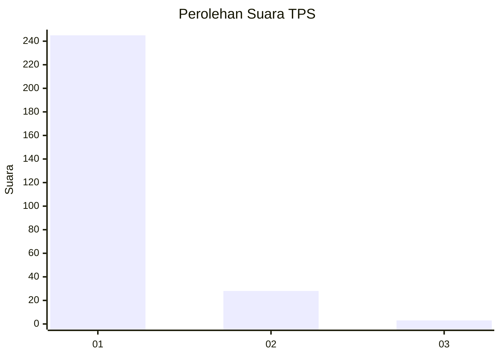
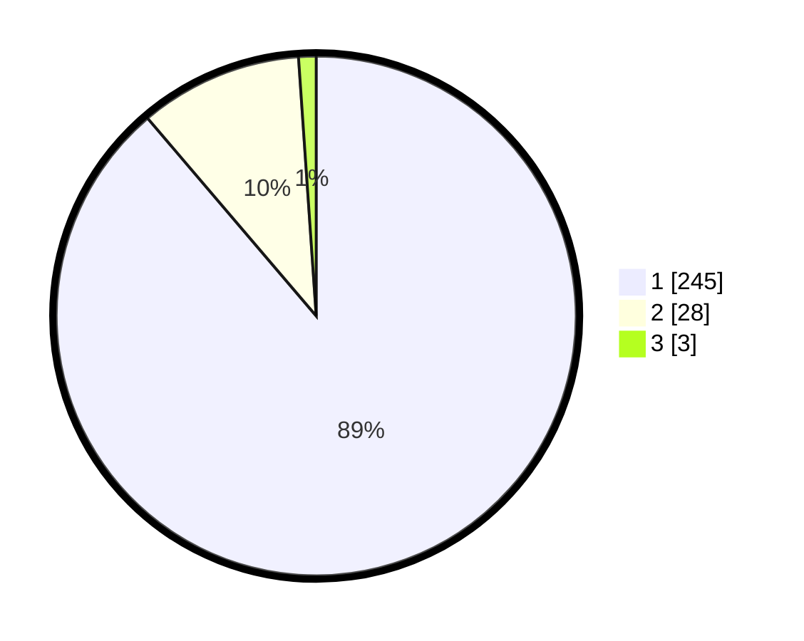

# Hasil

## Grafik

## Tabel

| No. | Nama Paslon    | Suara | Suara (raw) | Persentase |
|:--- |:-------------- | -----:| -----------:| ----------:|
| 1   | ANIES MUHAIMIN | 245   | [245][p-1]  | 88,77      |
| 2   | PRABOWO GIBRAN | 28    | [28][p-2]   | 10,14      |
| 3   | GANJAR MAHFUD  | 3     | [3][p-3]    | 1,09       |

[p-1]: https://github.com/gigit-pemilu/pemilu-2024-11-aceh/blob/main/pilpres/hitung-suara/sub/11-aceh/sub/06-aceh-besar/sub/21-krueng-barona-jaya/sub/2006-miruk/sub/001-tps/sub/paslon-1.txt
[p-2]: https://github.com/gigit-pemilu/pemilu-2024-11-aceh/blob/main/pilpres/hitung-suara/sub/11-aceh/sub/06-aceh-besar/sub/21-krueng-barona-jaya/sub/2006-miruk/sub/001-tps/sub/paslon-2.txt
[p-3]: https://github.com/gigit-pemilu/pemilu-2024-11-aceh/blob/main/pilpres/hitung-suara/sub/11-aceh/sub/06-aceh-besar/sub/21-krueng-barona-jaya/sub/2006-miruk/sub/001-tps/sub/paslon-3.txt

## Foto C Plano

https://sirekap-obj-formc.kpu.go.id/4cad/pemilu/ppwp/11/06/21/20/06/1106212006001-20240221-101453--f7b0cfe4-0369-46ac-820c-ac314301b5df.jpg

https://sirekap-obj-formc.kpu.go.id/4cad/pemilu/ppwp/11/06/21/20/06/1106212006001-20240221-101705--448a1601-2703-4b48-9995-a2e5d29ffc80.jpg

https://sirekap-obj-formc.kpu.go.id/4cad/pemilu/ppwp/11/06/21/20/06/1106212006001-20240221-101843--afeaf46e-85b8-4ba0-adb9-aa8f0b5ebad5.jpg

## Metadata

| Key        | Value               |
| ---------- | ------------------- |
| Time Stamp | 2024-02-24 22:31:28 |

