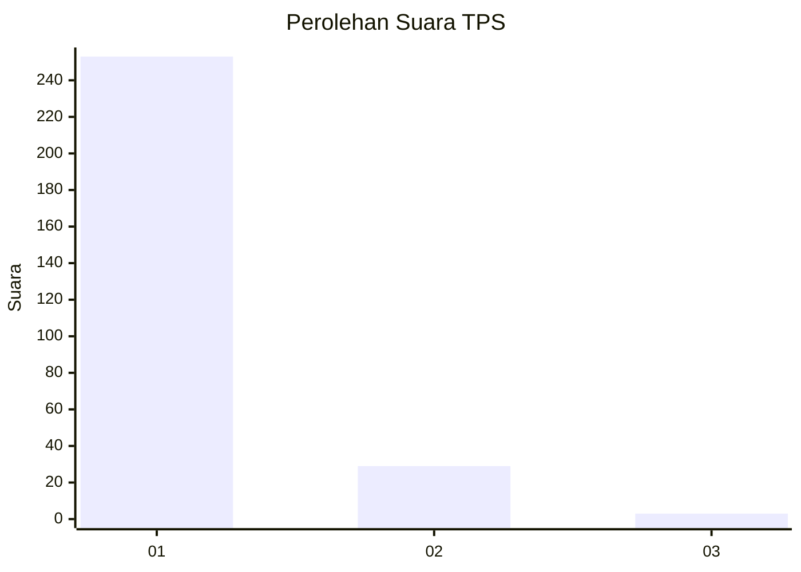
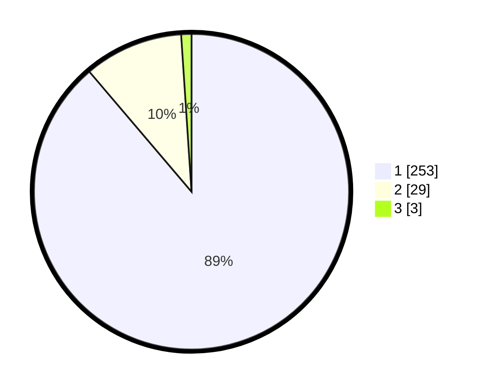

# Hasil

## Grafik

## Tabel

| No. | Nama Paslon    | Suara | Suara (raw) | Persentase |
|:--- |:-------------- | -----:| -----------:| ----------:|
| 1   | ANIES MUHAIMIN | 253   | [253][p-1]  | 88,77      |
| 2   | PRABOWO GIBRAN | 29    | [29][p-2]   | 10,18      |
| 3   | GANJAR MAHFUD  | 3     | [3][p-3]    | 1,05       |

[p-1]: https://github.com/gigit-pemilu/pemilu-2024-11-aceh/blob/main/pilpres/hitung-suara/sub/11-aceh/sub/06-aceh-besar/sub/21-krueng-barona-jaya/sub/2006-miruk/sub/002-tps/sub/paslon-1.txt
[p-2]: https://github.com/gigit-pemilu/pemilu-2024-11-aceh/blob/main/pilpres/hitung-suara/sub/11-aceh/sub/06-aceh-besar/sub/21-krueng-barona-jaya/sub/2006-miruk/sub/002-tps/sub/paslon-2.txt
[p-3]: https://github.com/gigit-pemilu/pemilu-2024-11-aceh/blob/main/pilpres/hitung-suara/sub/11-aceh/sub/06-aceh-besar/sub/21-krueng-barona-jaya/sub/2006-miruk/sub/002-tps/sub/paslon-3.txt

## Foto C Plano

https://sirekap-obj-formc.kpu.go.id/d22e/pemilu/ppwp/11/06/21/20/06/1106212006002-20240215-014928--89cfb4b0-dafa-42f8-b5d4-14fbbc67031a.jpg

https://sirekap-obj-formc.kpu.go.id/d22e/pemilu/ppwp/11/06/21/20/06/1106212006002-20240215-015320--1c2722af-83f6-46eb-8ccc-5488a0058281.jpg

https://sirekap-obj-formc.kpu.go.id/d22e/pemilu/ppwp/11/06/21/20/06/1106212006002-20240215-015445--454a8ff2-ada3-41c9-b43b-08b31bf48619.jpg

## Metadata

| Key        | Value               |
| ---------- | ------------------- |
| Time Stamp | 2024-02-16 01:00:27 |

