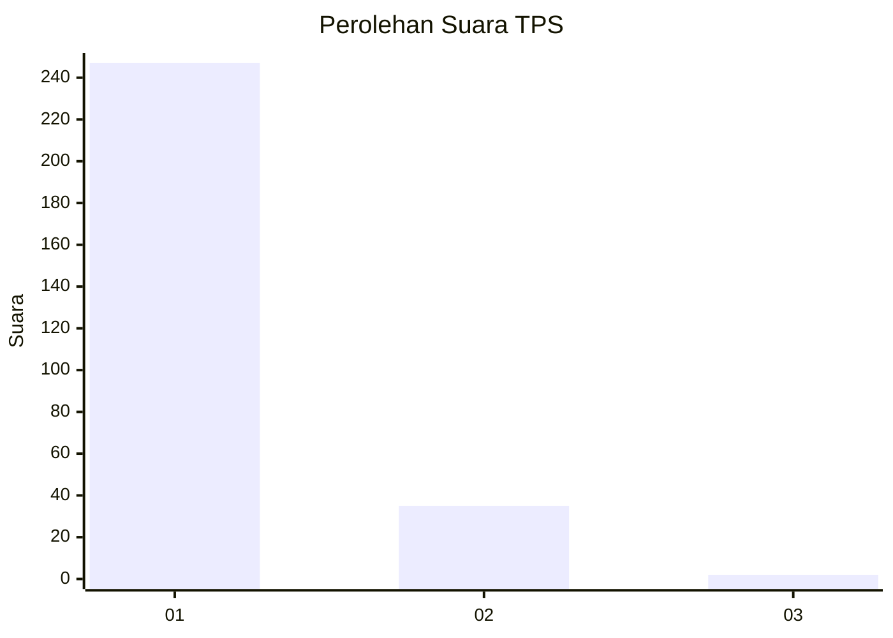
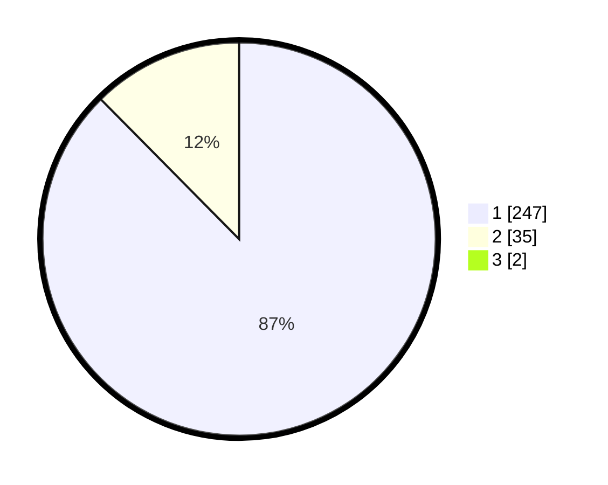

# Hasil

## Grafik

## Tabel

| No. | Nama Paslon    | Suara | Suara (raw) | Persentase |
|:--- |:-------------- | -----:| -----------:| ----------:|
| 1   | ANIES MUHAIMIN | 247   | [247][p-1]  | 86,97      |
| 2   | PRABOWO GIBRAN | 35    | [35][p-2]   | 12,32      |
| 3   | GANJAR MAHFUD  | 2     | [2][p-3]    | 0,70       |

[p-1]: https://github.com/gigit-pemilu/pemilu-2024-11-aceh/blob/main/pilpres/hitung-suara/sub/11-aceh/sub/06-aceh-besar/sub/21-krueng-barona-jaya/sub/2006-miruk/sub/003-tps/sub/paslon-1.txt
[p-2]: https://github.com/gigit-pemilu/pemilu-2024-11-aceh/blob/main/pilpres/hitung-suara/sub/11-aceh/sub/06-aceh-besar/sub/21-krueng-barona-jaya/sub/2006-miruk/sub/003-tps/sub/paslon-2.txt
[p-3]: https://github.com/gigit-pemilu/pemilu-2024-11-aceh/blob/main/pilpres/hitung-suara/sub/11-aceh/sub/06-aceh-besar/sub/21-krueng-barona-jaya/sub/2006-miruk/sub/003-tps/sub/paslon-3.txt

## Foto C Plano

https://sirekap-obj-formc.kpu.go.id/bdf7/pemilu/ppwp/11/06/21/20/06/1106212006003-20240215-074205--1124488b-306e-42c2-8a80-474f85c492a3.jpg

https://sirekap-obj-formc.kpu.go.id/bdf7/pemilu/ppwp/11/06/21/20/06/1106212006003-20240214-211825--de164482-e1d7-4efe-a9e0-e6c6bddc6c2c.jpg

https://sirekap-obj-formc.kpu.go.id/bdf7/pemilu/ppwp/11/06/21/20/06/1106212006003-20240215-012239--541728e2-6cda-4a9e-b3e2-72fc0334810a.jpg

## Metadata

| Key        | Value               |
| ---------- | ------------------- |
| Time Stamp | 2024-02-15 15:00:29 |

