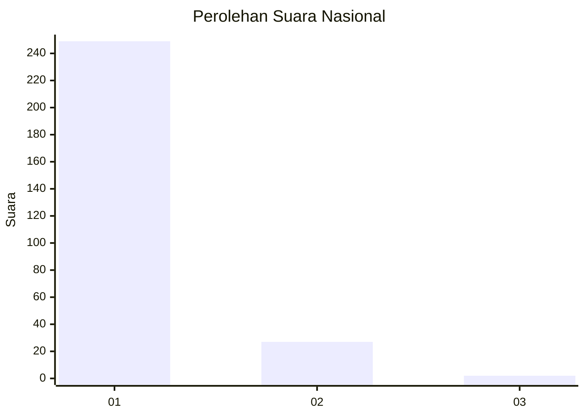
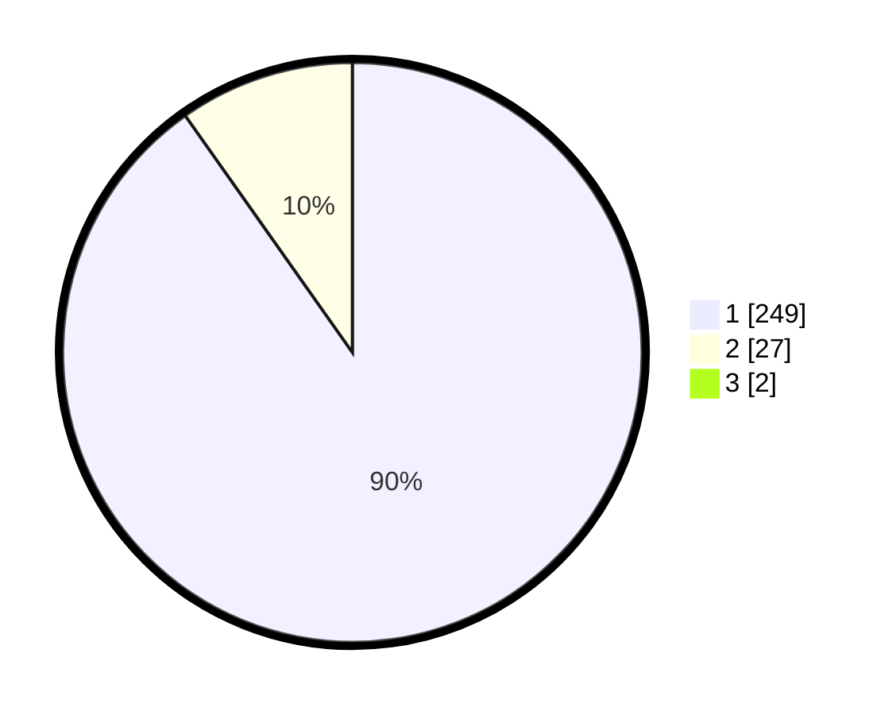

# Hasil

## Grafik

## Tabel

| No. | Nama Paslon    | Suara | Suara (raw) | Persentase |
|:--- |:-------------- | -----:| -----------:| ----------:|
| 1   | ANIES MUHAIMIN | 249   | [249][p-1]  | 89,57      |
| 2   | PRABOWO GIBRAN | 27    | [27][p-2]   | 9,71       |
| 3   | GANJAR MAHFUD  | 2     | [2][p-3]    | 0,72       |

[p-1]: https://github.com/gigit-pemilu/pemilu-2024/blob/main/pilpres/hitung-suara/sub/11-aceh/sub/06-aceh-besar/sub/21-krueng-barona-jaya/sub/2006-miruk/sub/004-tps/sub/paslon-1.txt
[p-2]: https://github.com/gigit-pemilu/pemilu-2024/blob/main/pilpres/hitung-suara/sub/11-aceh/sub/06-aceh-besar/sub/21-krueng-barona-jaya/sub/2006-miruk/sub/004-tps/sub/paslon-2.txt
[p-3]: https://github.com/gigit-pemilu/pemilu-2024/blob/main/pilpres/hitung-suara/sub/11-aceh/sub/06-aceh-besar/sub/21-krueng-barona-jaya/sub/2006-miruk/sub/004-tps/sub/paslon-3.txt

## Foto C Plano

https://sirekap-obj-formc.kpu.go.id/5a0a/pemilu/ppwp/11/06/21/20/06/1106212006004-20240221-114045--a0b2842f-a100-424c-9e22-0fa61d75e49e.jpg

https://sirekap-obj-formc.kpu.go.id/5a0a/pemilu/ppwp/11/06/21/20/06/1106212006004-20240221-114144--4c1bc0ad-4920-4aaf-be21-e0db6387a1bf.jpg

https://sirekap-obj-formc.kpu.go.id/5a0a/pemilu/ppwp/11/06/21/20/06/1106212006004-20240221-114440--fd3f86c7-132d-4bb2-aab4-d622db6cdd88.jpg

## Metadata

| Key        | Value               |
| ---------- | ------------------- |
| Time Stamp | 2024-02-24 22:31:28 |

