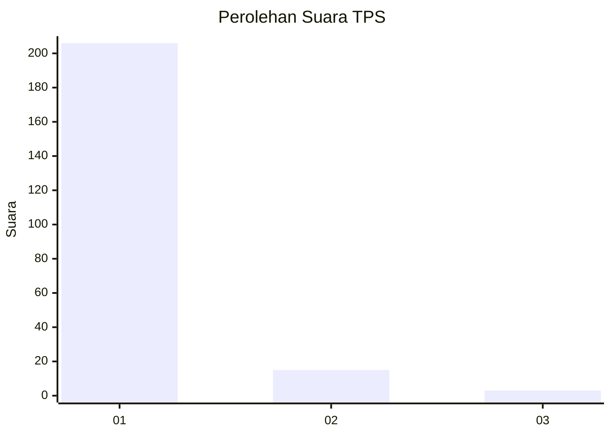
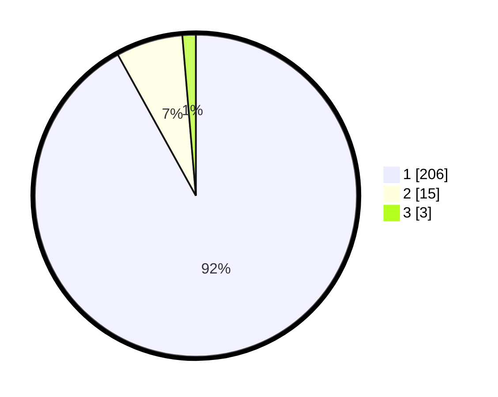

# Hasil

## Grafik

## Tabel

| No. | Nama Paslon    | Suara | Suara (raw) | Persentase |
|:--- |:-------------- | -----:| -----------:| ----------:|
| 1   | ANIES MUHAIMIN | 206   | [206][p-1]  | 91,96      |
| 2   | PRABOWO GIBRAN | 15    | [15][p-2]   | 6,70       |
| 3   | GANJAR MAHFUD  | 3     | [3][p-3]    | 1,34       |

[p-1]: https://github.com/gigit-pemilu/pemilu-2024-11-aceh/blob/main/pilpres/hitung-suara/sub/11-aceh/sub/06-aceh-besar/sub/21-krueng-barona-jaya/sub/2007-lam-gapang/sub/003-tps/sub/paslon-1.txt
[p-2]: https://github.com/gigit-pemilu/pemilu-2024-11-aceh/blob/main/pilpres/hitung-suara/sub/11-aceh/sub/06-aceh-besar/sub/21-krueng-barona-jaya/sub/2007-lam-gapang/sub/003-tps/sub/paslon-2.txt
[p-3]: https://github.com/gigit-pemilu/pemilu-2024-11-aceh/blob/main/pilpres/hitung-suara/sub/11-aceh/sub/06-aceh-besar/sub/21-krueng-barona-jaya/sub/2007-lam-gapang/sub/003-tps/sub/paslon-3.txt

## Foto C Plano

https://sirekap-obj-formc.kpu.go.id/2e91/pemilu/ppwp/11/06/21/20/07/1106212007003-20240214-203042--0ed7c678-d9be-45ca-a989-bbde0a049fa3.jpg

https://sirekap-obj-formc.kpu.go.id/2e91/pemilu/ppwp/11/06/21/20/07/1106212007003-20240214-203220--880c64a5-44cd-45f3-b7d6-1c26cec2c7ae.jpg

https://sirekap-obj-formc.kpu.go.id/2e91/pemilu/ppwp/11/06/21/20/07/1106212007003-20240214-203332--c9aeb210-260f-4a3c-980b-e5a125ccb4d2.jpg

## Metadata

| Key        | Value               |
| ---------- | ------------------- |
| Time Stamp | 2024-02-16 01:00:27 |

