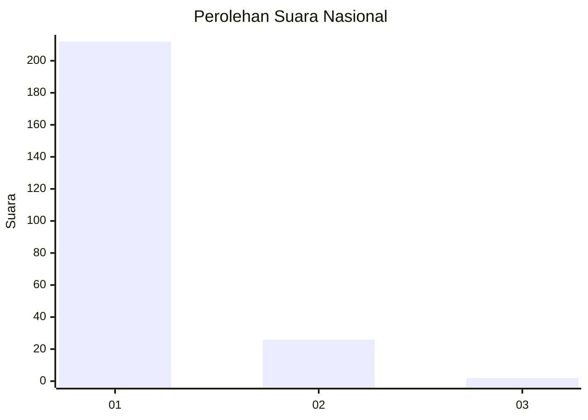
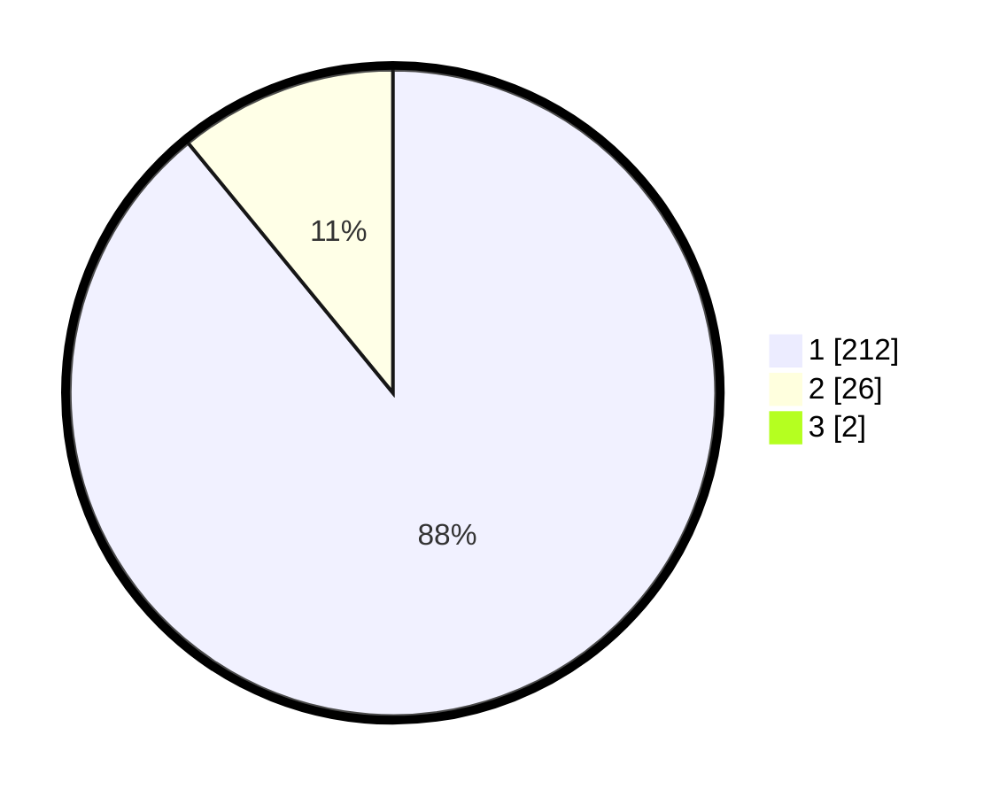

# Hasil

## Grafik

## Tabel

| No. | Nama Paslon    | Suara | Suara (raw) | Persentase |
|:--- |:-------------- | -----:| -----------:| ----------:|
| 1   | ANIES MUHAIMIN | 212   | [212][p-1]  | 88,33      |
| 2   | PRABOWO GIBRAN | 26    | [26][p-2]   | 10,83      |
| 3   | GANJAR MAHFUD  | 2     | [2][p-3]    | 0,83       |

[p-1]: https://github.com/gigit-pemilu/pemilu-2024/blob/main/pilpres/hitung-suara/sub/11-aceh/sub/06-aceh-besar/sub/21-krueng-barona-jaya/sub/2007-lam-gapang/sub/004-tps/sub/paslon-1.txt
[p-2]: https://github.com/gigit-pemilu/pemilu-2024/blob/main/pilpres/hitung-suara/sub/11-aceh/sub/06-aceh-besar/sub/21-krueng-barona-jaya/sub/2007-lam-gapang/sub/004-tps/sub/paslon-2.txt
[p-3]: https://github.com/gigit-pemilu/pemilu-2024/blob/main/pilpres/hitung-suara/sub/11-aceh/sub/06-aceh-besar/sub/21-krueng-barona-jaya/sub/2007-lam-gapang/sub/004-tps/sub/paslon-3.txt

## Foto C Plano

https://sirekap-obj-formc.kpu.go.id/1378/pemilu/ppwp/11/06/21/20/07/1106212007004-20240215-012552--a07af46a-be62-41a4-ae40-09811afc6f23.jpg

https://sirekap-obj-formc.kpu.go.id/1378/pemilu/ppwp/11/06/21/20/07/1106212007004-20240215-012814--41125433-0cf3-4d96-8ef9-de285be0a292.jpg

https://sirekap-obj-formc.kpu.go.id/1378/pemilu/ppwp/11/06/21/20/07/1106212007004-20240215-012943--372fab13-4ed8-4574-8e6c-ad570d8ec8d3.jpg

## Metadata

| Key        | Value               |
| ---------- | ------------------- |
| Time Stamp | 2024-02-15 15:00:29 |

