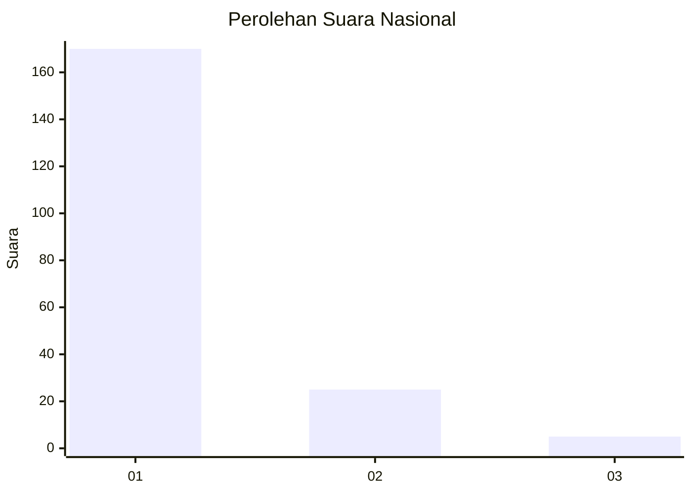
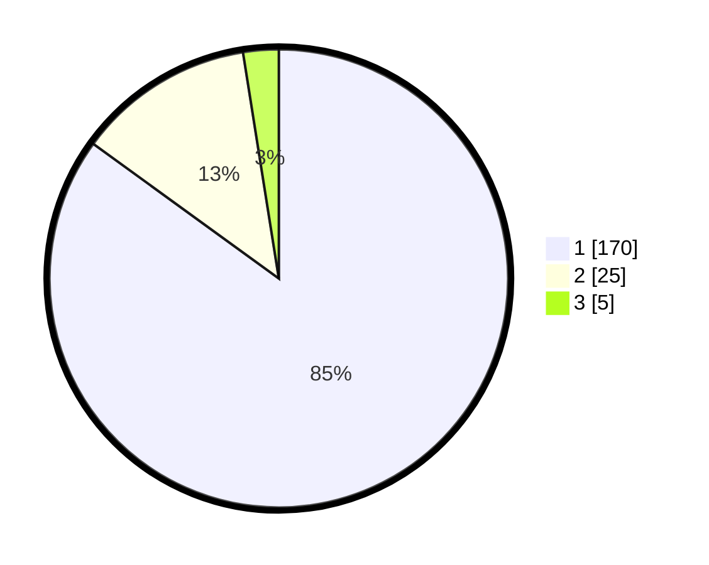

# Hasil

## Grafik

## Tabel

| No. | Nama Paslon    | Suara | Suara (raw) | Persentase |
|:--- |:-------------- | -----:| -----------:| ----------:|
| 1   | ANIES MUHAIMIN | 170   | [170][p-1]  | 85,00      |
| 2   | PRABOWO GIBRAN | 25    | [25][p-2]   | 12,50      |
| 3   | GANJAR MAHFUD  | 5     | [5][p-3]    | 2,50       |

[p-1]: https://github.com/gigit-pemilu/pemilu-2024/blob/main/pilpres/hitung-suara/sub/11-aceh/sub/06-aceh-besar/sub/21-krueng-barona-jaya/sub/2008-meunasah-manyang/sub/001-tps/sub/paslon-1.txt
[p-2]: https://github.com/gigit-pemilu/pemilu-2024/blob/main/pilpres/hitung-suara/sub/11-aceh/sub/06-aceh-besar/sub/21-krueng-barona-jaya/sub/2008-meunasah-manyang/sub/001-tps/sub/paslon-2.txt
[p-3]: https://github.com/gigit-pemilu/pemilu-2024/blob/main/pilpres/hitung-suara/sub/11-aceh/sub/06-aceh-besar/sub/21-krueng-barona-jaya/sub/2008-meunasah-manyang/sub/001-tps/sub/paslon-3.txt

## Foto C Plano

https://sirekap-obj-formc.kpu.go.id/53f4/pemilu/ppwp/11/06/21/20/08/1106212008001-20240215-023142--670e93d0-8cfe-43a3-bb70-fabfc39089f1.jpg

https://sirekap-obj-formc.kpu.go.id/53f4/pemilu/ppwp/11/06/21/20/08/1106212008001-20240215-023245--66035cee-5218-439e-8c06-9dbdb588f54f.jpg

https://sirekap-obj-formc.kpu.go.id/53f4/pemilu/ppwp/11/06/21/20/08/1106212008001-20240215-023404--965af1d8-cb1c-481c-bf35-7f7c2b7acaf4.jpg

## Metadata

| Key        | Value               |
| ---------- | ------------------- |
| Time Stamp | 2024-02-16 01:00:27 |

