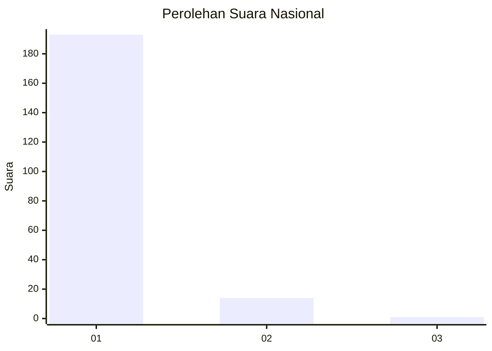
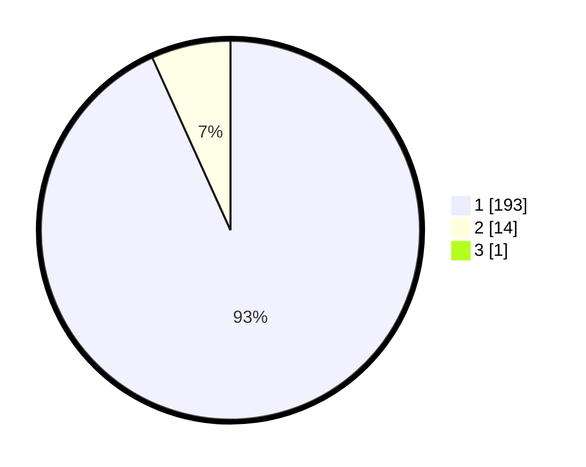

# Hasil

## Grafik

## Tabel

| No. | Nama Paslon    | Suara | Suara (raw) | Persentase |
|:--- |:-------------- | -----:| -----------:| ----------:|
| 1   | ANIES MUHAIMIN | 193   | [193][p-1]  | 92,79      |
| 2   | PRABOWO GIBRAN | 14    | [14][p-2]   | 6,73       |
| 3   | GANJAR MAHFUD  | 1     | [1][p-3]    | 0,48       |

[p-1]: https://github.com/gigit-pemilu/pemilu-2024/blob/main/pilpres/hitung-suara/sub/11-aceh/sub/06-aceh-besar/sub/21-krueng-barona-jaya/sub/2008-meunasah-manyang/sub/002-tps/sub/paslon-1.txt
[p-2]: https://github.com/gigit-pemilu/pemilu-2024/blob/main/pilpres/hitung-suara/sub/11-aceh/sub/06-aceh-besar/sub/21-krueng-barona-jaya/sub/2008-meunasah-manyang/sub/002-tps/sub/paslon-2.txt
[p-3]: https://github.com/gigit-pemilu/pemilu-2024/blob/main/pilpres/hitung-suara/sub/11-aceh/sub/06-aceh-besar/sub/21-krueng-barona-jaya/sub/2008-meunasah-manyang/sub/002-tps/sub/paslon-3.txt

## Foto C Plano

https://sirekap-obj-formc.kpu.go.id/ece8/pemilu/ppwp/11/06/21/20/08/1106212008002-20240215-030748--8d2b0060-5dec-40e4-82f0-7a04a685528b.jpg

https://sirekap-obj-formc.kpu.go.id/ece8/pemilu/ppwp/11/06/21/20/08/1106212008002-20240215-030738--ee076dd1-48c1-40ee-9e89-8e00d45ffcc0.jpg

https://sirekap-obj-formc.kpu.go.id/ece8/pemilu/ppwp/11/06/21/20/08/1106212008002-20240215-030739--1475af08-acaa-4538-a16e-fdc40819071e.jpg

## Metadata

| Key        | Value               |
| ---------- | ------------------- |
| Time Stamp | 2024-02-15 15:00:29 |

