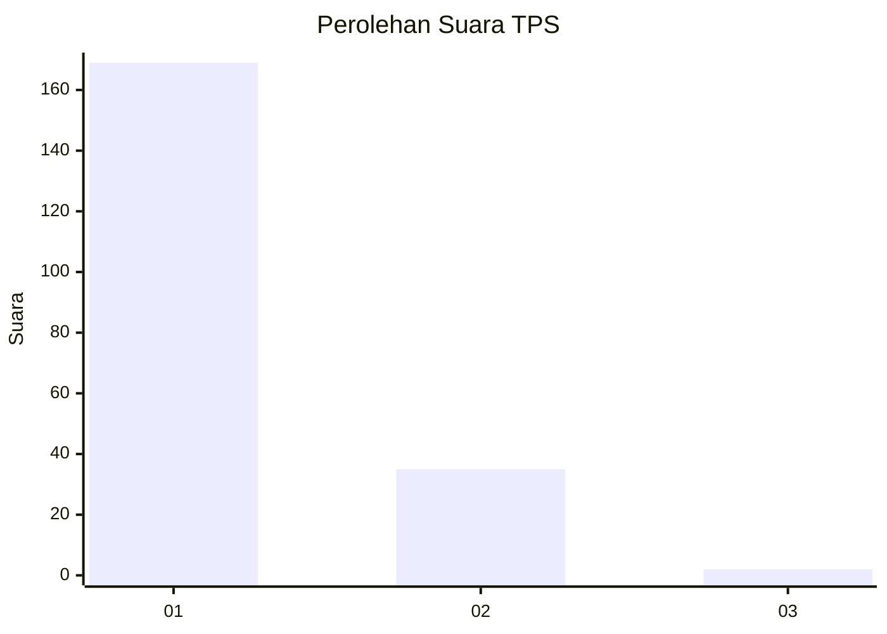
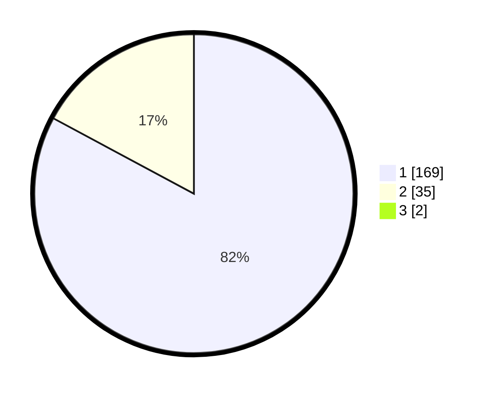

# Hasil

## Grafik

## Tabel

| No. | Nama Paslon    | Suara | Suara (raw) | Persentase |
|:--- |:-------------- | -----:| -----------:| ----------:|
| 1   | ANIES MUHAIMIN | 169   | [169][p-1]  | 82,04      |
| 2   | PRABOWO GIBRAN | 35    | [35][p-2]   | 16,99      |
| 3   | GANJAR MAHFUD  | 2     | [2][p-3]    | 0,97       |

[p-1]: https://github.com/gigit-pemilu/pemilu-2024-11-aceh/blob/main/pilpres/hitung-suara/sub/11-aceh/sub/06-aceh-besar/sub/21-krueng-barona-jaya/sub/2008-meunasah-manyang/sub/003-tps/sub/paslon-1.txt
[p-2]: https://github.com/gigit-pemilu/pemilu-2024-11-aceh/blob/main/pilpres/hitung-suara/sub/11-aceh/sub/06-aceh-besar/sub/21-krueng-barona-jaya/sub/2008-meunasah-manyang/sub/003-tps/sub/paslon-2.txt
[p-3]: https://github.com/gigit-pemilu/pemilu-2024-11-aceh/blob/main/pilpres/hitung-suara/sub/11-aceh/sub/06-aceh-besar/sub/21-krueng-barona-jaya/sub/2008-meunasah-manyang/sub/003-tps/sub/paslon-3.txt

## Foto C Plano

https://sirekap-obj-formc.kpu.go.id/6113/pemilu/ppwp/11/06/21/20/08/1106212008003-20240218-144718--4be67bb7-7c7e-4c8d-b505-83ed29d4218c.jpg

https://sirekap-obj-formc.kpu.go.id/6113/pemilu/ppwp/11/06/21/20/08/1106212008003-20240218-144843--044924e3-1f01-4690-a7af-514efdc047ab.jpg

https://sirekap-obj-formc.kpu.go.id/6113/pemilu/ppwp/11/06/21/20/08/1106212008003-20240218-144945--b3e95d6e-c8e2-4093-a9ad-c914416c1396.jpg

## Metadata

| Key        | Value               |
| ---------- | ------------------- |
| Time Stamp | 2024-02-19 22:00:00 |

