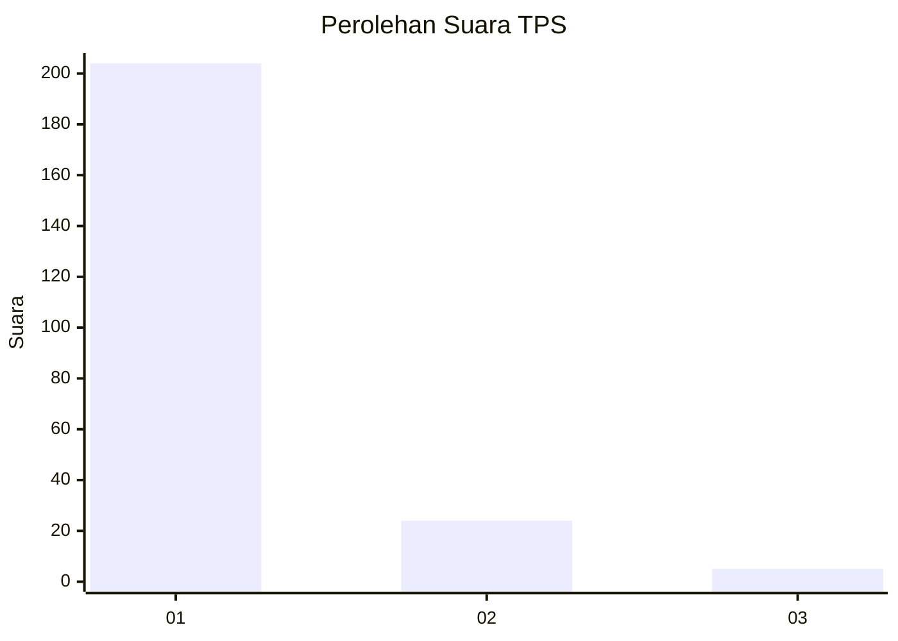
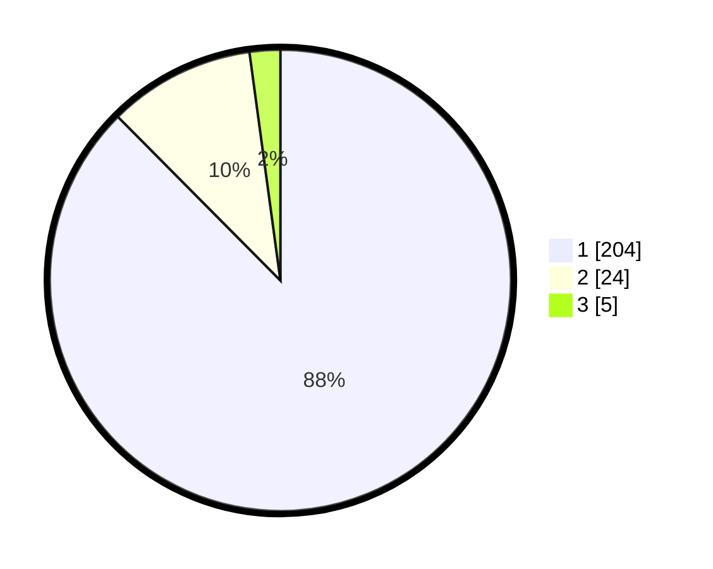

# Hasil

## Grafik

## Tabel

| No. | Nama Paslon    | Suara | Suara (raw) | Persentase |
|:--- |:-------------- | -----:| -----------:| ----------:|
| 1   | ANIES MUHAIMIN | 204   | [204][p-1]  | 87,55      |
| 2   | PRABOWO GIBRAN | 24    | [24][p-2]   | 10,30      |
| 3   | GANJAR MAHFUD  | 5     | [5][p-3]    | 2,15       |

[p-1]: https://github.com/gigit-pemilu/pemilu-2024-11-aceh/blob/main/pilpres/hitung-suara/sub/11-aceh/sub/06-aceh-besar/sub/21-krueng-barona-jaya/sub/2010-meunasah-intan/sub/002-tps/sub/paslon-1.txt
[p-2]: https://github.com/gigit-pemilu/pemilu-2024-11-aceh/blob/main/pilpres/hitung-suara/sub/11-aceh/sub/06-aceh-besar/sub/21-krueng-barona-jaya/sub/2010-meunasah-intan/sub/002-tps/sub/paslon-2.txt
[p-3]: https://github.com/gigit-pemilu/pemilu-2024-11-aceh/blob/main/pilpres/hitung-suara/sub/11-aceh/sub/06-aceh-besar/sub/21-krueng-barona-jaya/sub/2010-meunasah-intan/sub/002-tps/sub/paslon-3.txt

## Foto C Plano

https://sirekap-obj-formc.kpu.go.id/35bc/pemilu/ppwp/11/06/21/20/10/1106212010002-20240215-053147--dad854e1-9005-4c99-b774-57ae643d29e2.jpg

https://sirekap-obj-formc.kpu.go.id/35bc/pemilu/ppwp/11/06/21/20/10/1106212010002-20240215-071409--dbc91a2a-eb02-4932-8cb5-b770f63d8876.jpg

https://sirekap-obj-formc.kpu.go.id/35bc/pemilu/ppwp/11/06/21/20/10/1106212010002-20240215-071540--18196e19-706b-4d86-baeb-4fd3d1541c3c.jpg

## Metadata

| Key        | Value               |
| ---------- | ------------------- |
| Time Stamp | 2024-02-16 01:00:27 |

