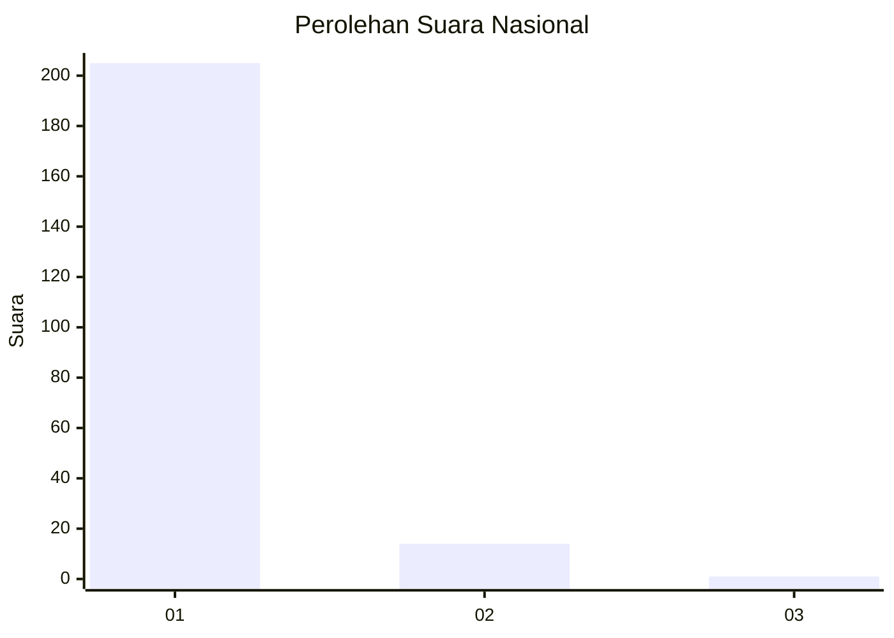
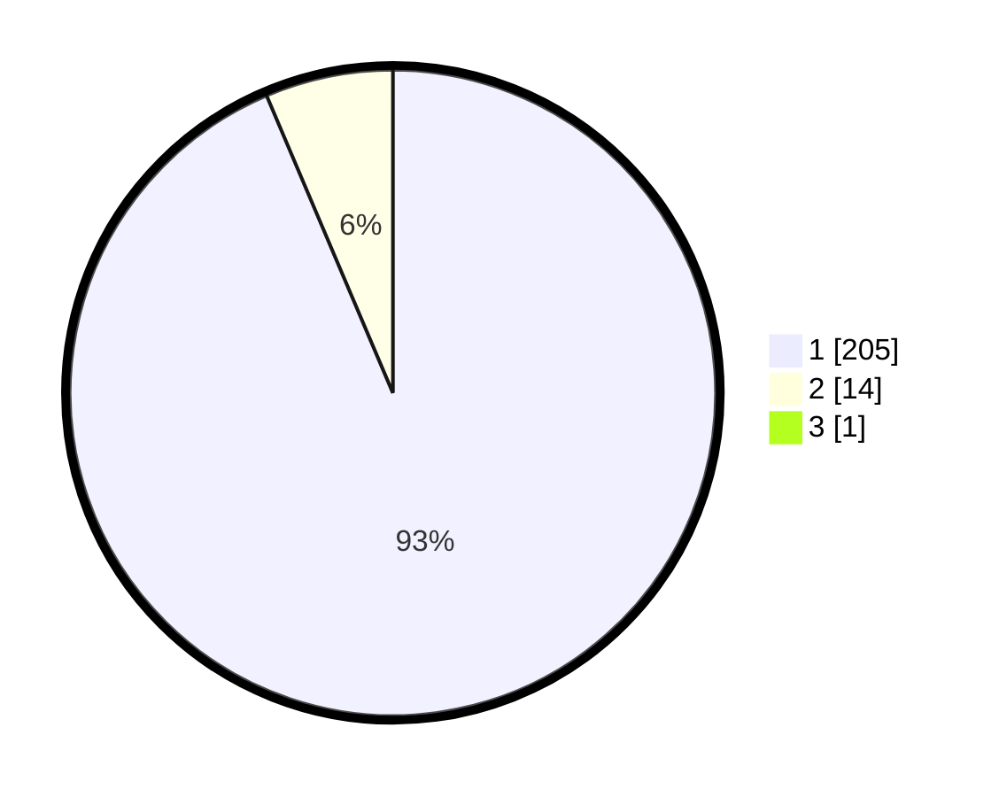

# Hasil

## Grafik

## Tabel

| No. | Nama Paslon    | Suara | Suara (raw) | Persentase |
|:--- |:-------------- | -----:| -----------:| ----------:|
| 1   | ANIES MUHAIMIN | 205   | [205][p-1]  | 93,18      |
| 2   | PRABOWO GIBRAN | 14    | [14][p-2]   | 6,36       |
| 3   | GANJAR MAHFUD  | 1     | [1][p-3]    | 0,45       |

[p-1]: https://github.com/gigit-pemilu/pemilu-2024/blob/main/pilpres/hitung-suara/sub/11-aceh/sub/06-aceh-besar/sub/21-krueng-barona-jaya/sub/2012-gla-meunasah-baro/sub/002-tps/sub/paslon-1.txt
[p-2]: https://github.com/gigit-pemilu/pemilu-2024/blob/main/pilpres/hitung-suara/sub/11-aceh/sub/06-aceh-besar/sub/21-krueng-barona-jaya/sub/2012-gla-meunasah-baro/sub/002-tps/sub/paslon-2.txt
[p-3]: https://github.com/gigit-pemilu/pemilu-2024/blob/main/pilpres/hitung-suara/sub/11-aceh/sub/06-aceh-besar/sub/21-krueng-barona-jaya/sub/2012-gla-meunasah-baro/sub/002-tps/sub/paslon-3.txt

## Foto C Plano

https://sirekap-obj-formc.kpu.go.id/0d8c/pemilu/ppwp/11/06/21/20/12/1106212012002-20240215-060350--84dda78a-0bee-46af-ab3a-a0d28b329eb8.jpg

https://sirekap-obj-formc.kpu.go.id/0d8c/pemilu/ppwp/11/06/21/20/12/1106212012002-20240215-060206--4dc2c7a6-abf9-4462-a135-9abb9f96a03b.jpg

https://sirekap-obj-formc.kpu.go.id/0d8c/pemilu/ppwp/11/06/21/20/12/1106212012002-20240215-060334--f65ea9cf-0d50-4b26-9ce0-780e54b5f7d4.jpg

## Metadata

| Key        | Value               |
| ---------- | ------------------- |
| Time Stamp | 2024-02-16 01:00:27 |

