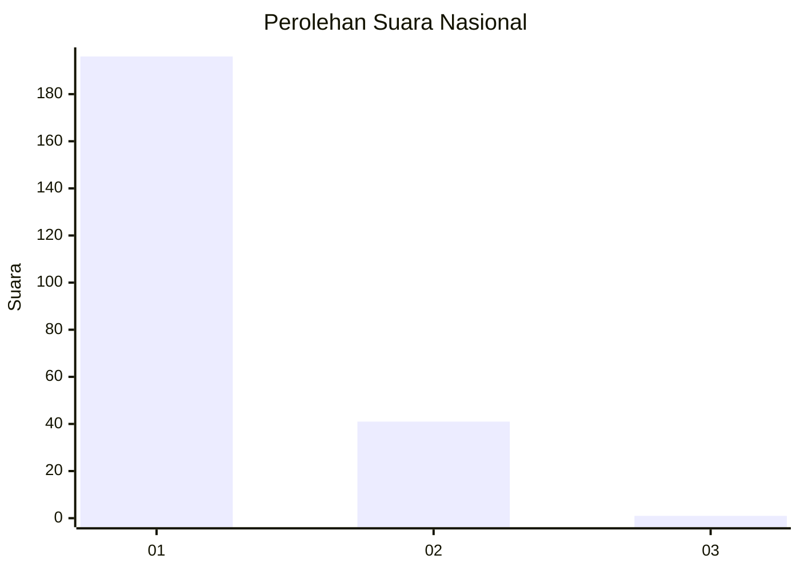
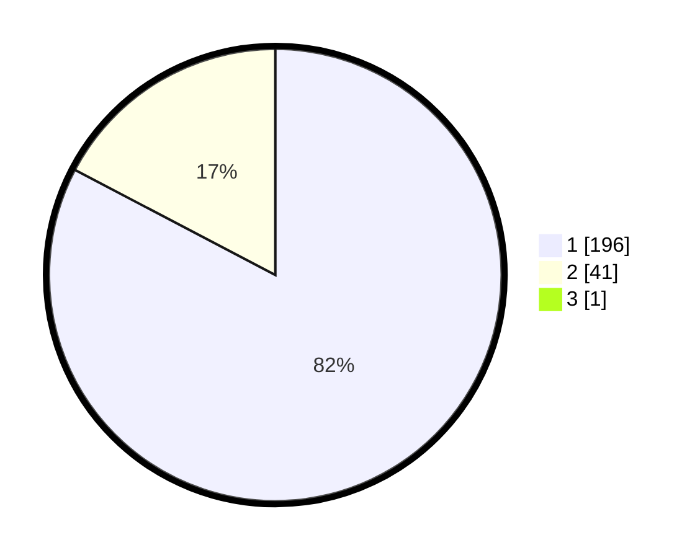

# Hasil

## Grafik

## Tabel

| No. | Nama Paslon    | Suara | Suara (raw) | Persentase |
|:--- |:-------------- | -----:| -----------:| ----------:|
| 1   | ANIES MUHAIMIN | 196   | [196][p-1]  | 82,35      |
| 2   | PRABOWO GIBRAN | 41    | [41][p-2]   | 17,23      |
| 3   | GANJAR MAHFUD  | 1     | [1][p-3]    | 0,42       |

[p-1]: https://github.com/gigit-pemilu/pemilu-2024/blob/main/pilpres/hitung-suara/sub/11-aceh/sub/06-aceh-besar/sub/21-krueng-barona-jaya/sub/2012-gla-meunasah-baro/sub/003-tps/sub/paslon-1.txt
[p-2]: https://github.com/gigit-pemilu/pemilu-2024/blob/main/pilpres/hitung-suara/sub/11-aceh/sub/06-aceh-besar/sub/21-krueng-barona-jaya/sub/2012-gla-meunasah-baro/sub/003-tps/sub/paslon-2.txt
[p-3]: https://github.com/gigit-pemilu/pemilu-2024/blob/main/pilpres/hitung-suara/sub/11-aceh/sub/06-aceh-besar/sub/21-krueng-barona-jaya/sub/2012-gla-meunasah-baro/sub/003-tps/sub/paslon-3.txt

## Foto C Plano

https://sirekap-obj-formc.kpu.go.id/1f67/pemilu/ppwp/11/06/21/20/12/1106212012003-20240215-062754--92f14a05-93cb-4d8b-a13b-60a5e87f4633.jpg

https://sirekap-obj-formc.kpu.go.id/1f67/pemilu/ppwp/11/06/21/20/12/1106212012003-20240215-062859--50324f3b-2b88-4372-8ed9-1374ceb98838.jpg

https://sirekap-obj-formc.kpu.go.id/1f67/pemilu/ppwp/11/06/21/20/12/1106212012003-20240215-063056--178d608e-d47d-4987-ad22-b19f3f7902b3.jpg

## Metadata

| Key        | Value               |
| ---------- | ------------------- |
| Time Stamp | 2024-02-15 15:00:29 |

