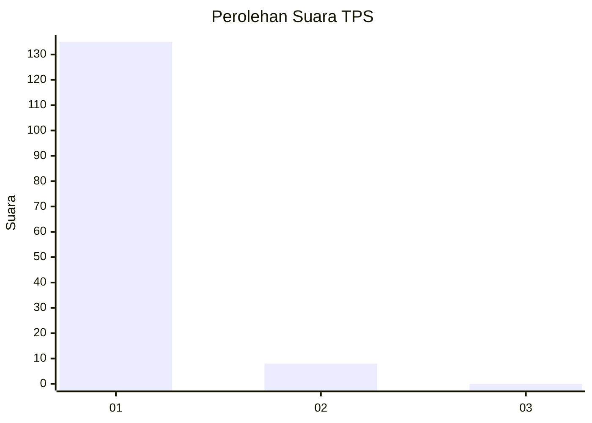
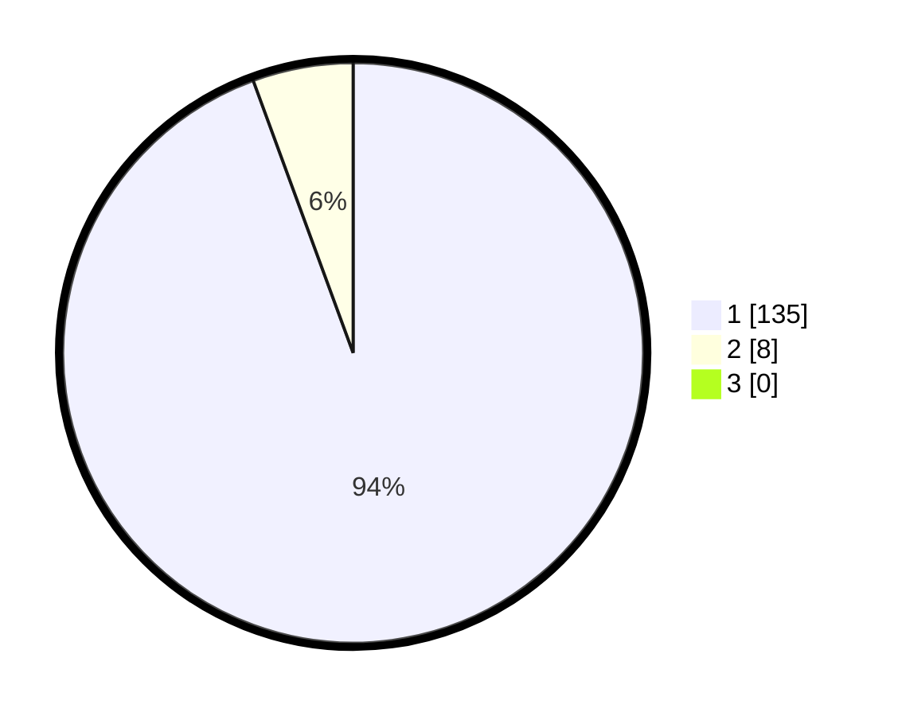

# Hasil

## Grafik

## Tabel

| No. | Nama Paslon    | Suara | Suara (raw) | Persentase |
|:--- |:-------------- | -----:| -----------:| ----------:|
| 1   | ANIES MUHAIMIN | 135   | [135][p-1]  | 94,41      |
| 2   | PRABOWO GIBRAN | 8     | [8][p-2]    | 5,59       |
| 3   | GANJAR MAHFUD  | 0     | [0][p-3]    | 0,00       |

[p-1]: https://github.com/gigit-pemilu/pemilu-2024-11-aceh/blob/main/pilpres/hitung-suara/sub/11-aceh/sub/06-aceh-besar/sub/23-blang-bintang/sub/2001-cot-puklat/sub/002-tps/sub/paslon-1.txt
[p-2]: https://github.com/gigit-pemilu/pemilu-2024-11-aceh/blob/main/pilpres/hitung-suara/sub/11-aceh/sub/06-aceh-besar/sub/23-blang-bintang/sub/2001-cot-puklat/sub/002-tps/sub/paslon-2.txt
[p-3]: https://github.com/gigit-pemilu/pemilu-2024-11-aceh/blob/main/pilpres/hitung-suara/sub/11-aceh/sub/06-aceh-besar/sub/23-blang-bintang/sub/2001-cot-puklat/sub/002-tps/sub/paslon-3.txt

## Foto C Plano

https://sirekap-obj-formc.kpu.go.id/e7a7/pemilu/ppwp/11/06/23/20/01/1106232001002-20240214-220002--def4c0c8-4d55-405f-ba7a-8979ae8183f4.jpg

https://sirekap-obj-formc.kpu.go.id/e7a7/pemilu/ppwp/11/06/23/20/01/1106232001002-20240214-220156--29bab367-e900-4e00-a3f9-4b42145b02e6.jpg

https://sirekap-obj-formc.kpu.go.id/e7a7/pemilu/ppwp/11/06/23/20/01/1106232001002-20240214-220308--2e66a084-ad4f-4681-92f8-56977919a5a8.jpg

## Metadata

| Key        | Value               |
| ---------- | ------------------- |
| Time Stamp | 2024-02-15 15:00:29 |

