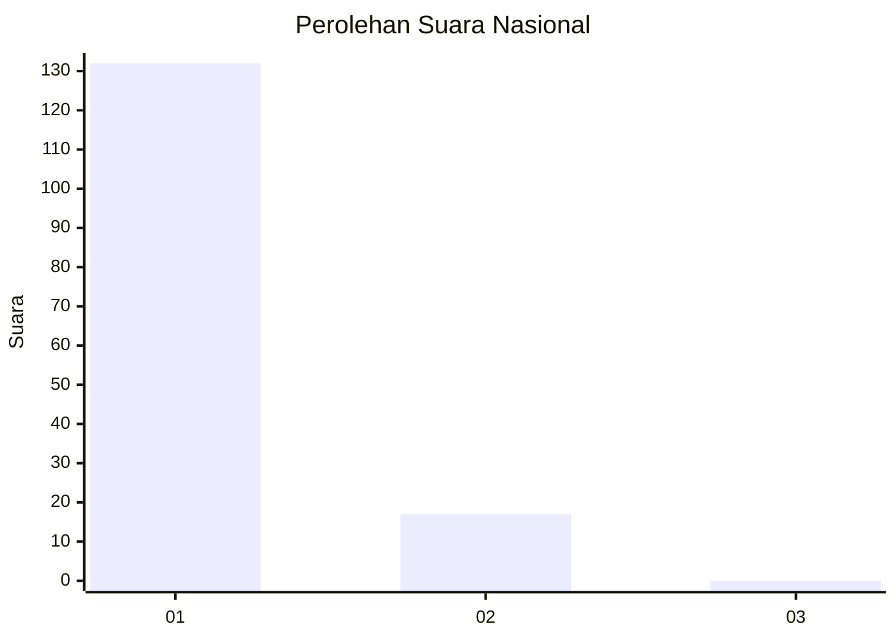
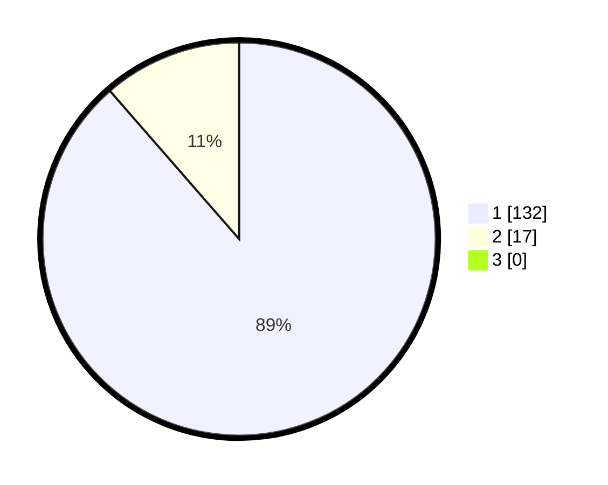

# Hasil

## Grafik

## Tabel

| No. | Nama Paslon    | Suara | Suara (raw) | Persentase |
|:--- |:-------------- | -----:| -----------:| ----------:|
| 1   | ANIES MUHAIMIN | 132   | [132][p-1]  | 88,59      |
| 2   | PRABOWO GIBRAN | 17    | [17][p-2]   | 11,41      |
| 3   | GANJAR MAHFUD  | 0     | [0][p-3]    | 0,00       |

[p-1]: https://github.com/gigit-pemilu/pemilu-2024/blob/main/pilpres/hitung-suara/sub/11-aceh/sub/06-aceh-besar/sub/23-blang-bintang/sub/2002-lamme/sub/001-tps/sub/paslon-1.txt
[p-2]: https://github.com/gigit-pemilu/pemilu-2024/blob/main/pilpres/hitung-suara/sub/11-aceh/sub/06-aceh-besar/sub/23-blang-bintang/sub/2002-lamme/sub/001-tps/sub/paslon-2.txt
[p-3]: https://github.com/gigit-pemilu/pemilu-2024/blob/main/pilpres/hitung-suara/sub/11-aceh/sub/06-aceh-besar/sub/23-blang-bintang/sub/2002-lamme/sub/001-tps/sub/paslon-3.txt

## Foto C Plano

https://sirekap-obj-formc.kpu.go.id/01c5/pemilu/ppwp/11/06/23/20/02/1106232002001-20240214-201733--2f397e42-3bbc-4cfc-b640-36315f2f3aeb.jpg

https://sirekap-obj-formc.kpu.go.id/01c5/pemilu/ppwp/11/06/23/20/02/1106232002001-20240214-201837--ed985403-2801-4c86-a023-d5983bcead55.jpg

## Metadata

| Key        | Value               |
| ---------- | ------------------- |
| Time Stamp | 2024-02-15 20:30:46 |

