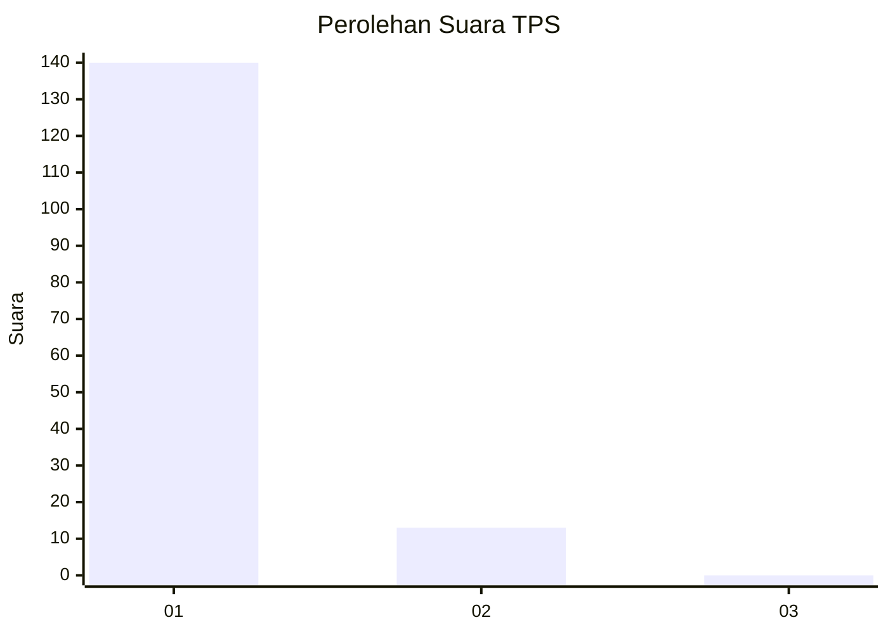
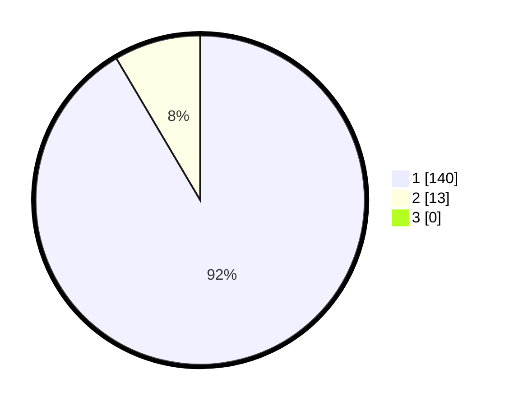

# Hasil

## Grafik

## Tabel

| No. | Nama Paslon    | Suara | Suara (raw) | Persentase |
|:--- |:-------------- | -----:| -----------:| ----------:|
| 1   | ANIES MUHAIMIN | 140   | [140][p-1]  | 91,50      |
| 2   | PRABOWO GIBRAN | 13    | [13][p-2]   | 8,50       |
| 3   | GANJAR MAHFUD  | 0     | [0][p-3]    | 0,00       |

[p-1]: https://github.com/gigit-pemilu/pemilu-2024-11-aceh/blob/main/pilpres/hitung-suara/sub/11-aceh/sub/06-aceh-besar/sub/23-blang-bintang/sub/2002-lamme/sub/002-tps/sub/paslon-1.txt
[p-2]: https://github.com/gigit-pemilu/pemilu-2024-11-aceh/blob/main/pilpres/hitung-suara/sub/11-aceh/sub/06-aceh-besar/sub/23-blang-bintang/sub/2002-lamme/sub/002-tps/sub/paslon-2.txt
[p-3]: https://github.com/gigit-pemilu/pemilu-2024-11-aceh/blob/main/pilpres/hitung-suara/sub/11-aceh/sub/06-aceh-besar/sub/23-blang-bintang/sub/2002-lamme/sub/002-tps/sub/paslon-3.txt

## Foto C Plano

https://sirekap-obj-formc.kpu.go.id/bf7d/pemilu/ppwp/11/06/23/20/02/1106232002002-20240217-000820--3ab96531-20ad-4ba6-85e0-9431dc13593b.jpg

https://sirekap-obj-formc.kpu.go.id/bf7d/pemilu/ppwp/11/06/23/20/02/1106232002002-20240217-000946--33f86124-93ca-4adf-b289-c3e54cb7aea6.jpg

## Metadata

| Key        | Value               |
| ---------- | ------------------- |
| Time Stamp | 2024-02-17 00:28:35 |

