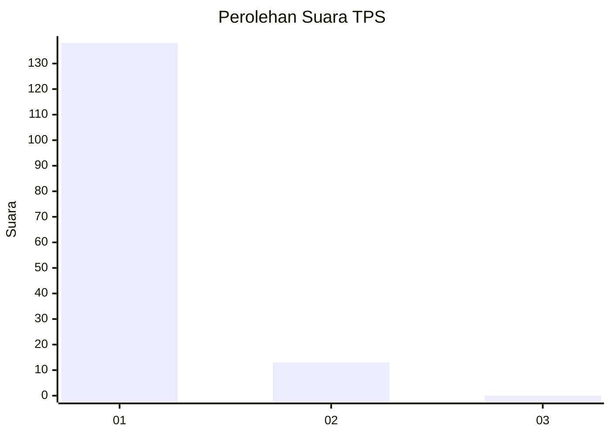
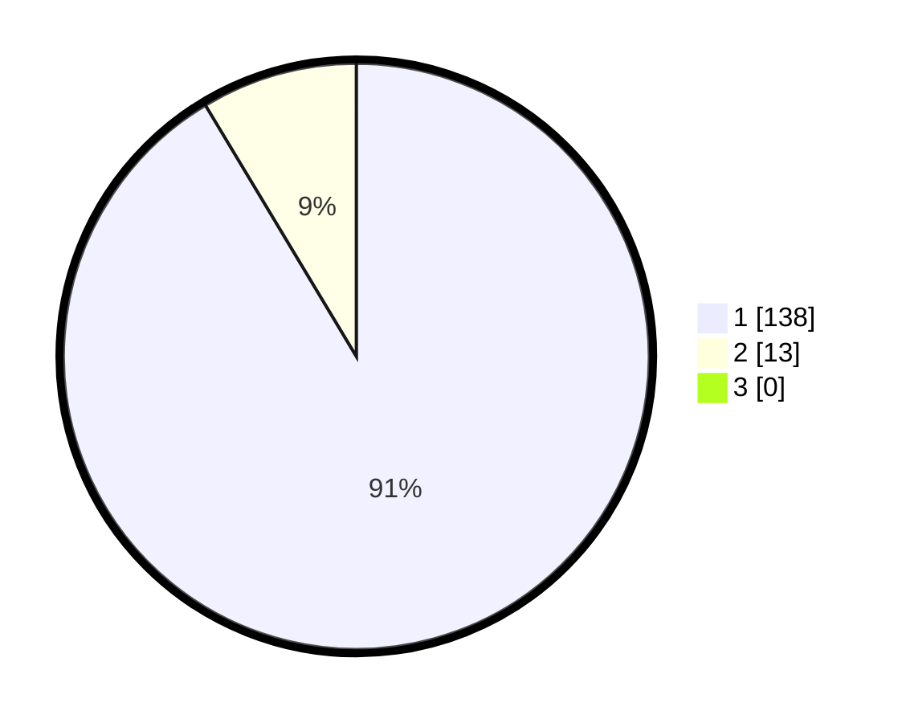

# Hasil

## Grafik

## Tabel

| No. | Nama Paslon    | Suara | Suara (raw) | Persentase |
|:--- |:-------------- | -----:| -----------:| ----------:|
| 1   | ANIES MUHAIMIN | 138   | [138][p-1]  | 91,39      |
| 2   | PRABOWO GIBRAN | 13    | [13][p-2]   | 8,61       |
| 3   | GANJAR MAHFUD  | 0     | [0][p-3]    | 0,00       |

[p-1]: https://github.com/gigit-pemilu/pemilu-2024-11-aceh/blob/main/pilpres/hitung-suara/sub/11-aceh/sub/06-aceh-besar/sub/23-blang-bintang/sub/2004-lam-siem/sub/001-tps/sub/paslon-1.txt
[p-2]: https://github.com/gigit-pemilu/pemilu-2024-11-aceh/blob/main/pilpres/hitung-suara/sub/11-aceh/sub/06-aceh-besar/sub/23-blang-bintang/sub/2004-lam-siem/sub/001-tps/sub/paslon-2.txt
[p-3]: https://github.com/gigit-pemilu/pemilu-2024-11-aceh/blob/main/pilpres/hitung-suara/sub/11-aceh/sub/06-aceh-besar/sub/23-blang-bintang/sub/2004-lam-siem/sub/001-tps/sub/paslon-3.txt

## Foto C Plano

https://sirekap-obj-formc.kpu.go.id/72d1/pemilu/ppwp/11/06/23/20/04/1106232004001-20240215-210201--2d7a88ac-2fdb-40b2-af4a-e4bc7038e592.jpg

https://sirekap-obj-formc.kpu.go.id/72d1/pemilu/ppwp/11/06/23/20/04/1106232004001-20240215-210226--cc22e406-5123-467d-a18a-5090249f2f46.jpg

https://sirekap-obj-formc.kpu.go.id/72d1/pemilu/ppwp/11/06/23/20/04/1106232004001-20240215-210248--bab389f4-21ab-4500-a05a-3b6ab0ecad85.jpg

## Metadata

| Key        | Value               |
| ---------- | ------------------- |
| Time Stamp | 2024-02-20 02:00:00 |

