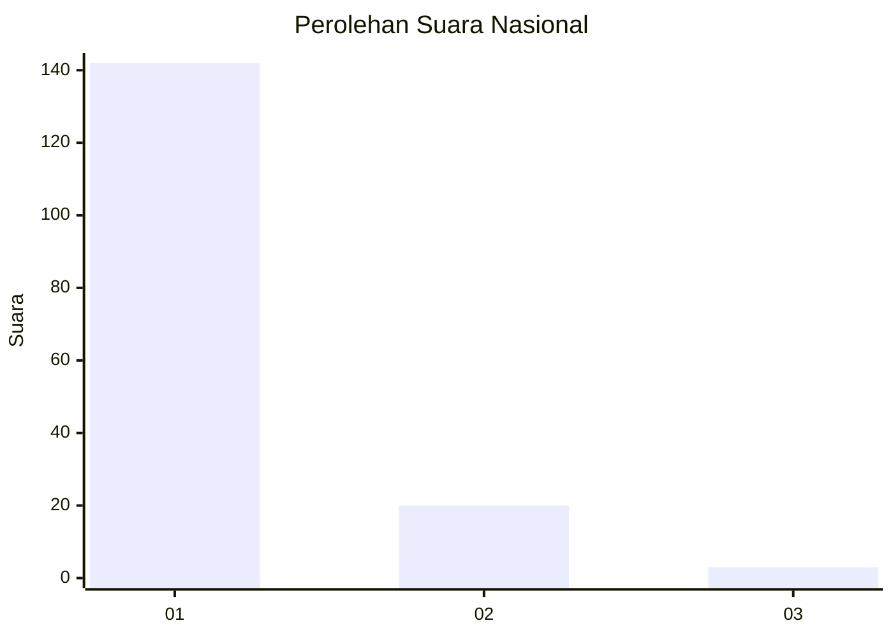
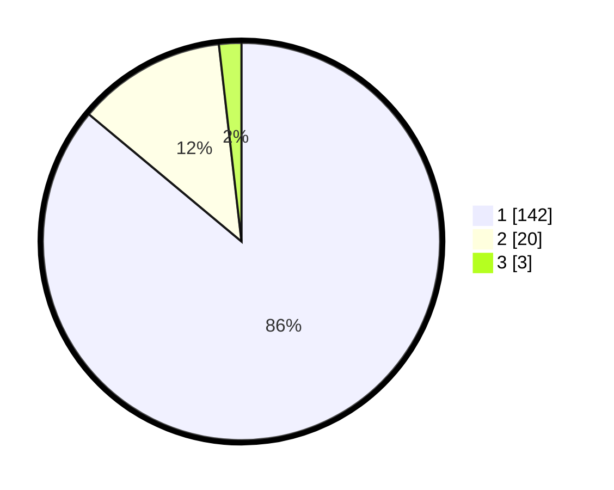

# Hasil

## Grafik

## Tabel

| No. | Nama Paslon    | Suara | Suara (raw) | Persentase |
|:--- |:-------------- | -----:| -----------:| ----------:|
| 1   | ANIES MUHAIMIN | 142   | [142][p-1]  | 86,06      |
| 2   | PRABOWO GIBRAN | 20    | [20][p-2]   | 12,12      |
| 3   | GANJAR MAHFUD  | 3     | [3][p-3]    | 1,82       |

[p-1]: https://github.com/gigit-pemilu/pemilu-2024/blob/main/pilpres/hitung-suara/sub/11-aceh/sub/06-aceh-besar/sub/23-blang-bintang/sub/2004-lam-siem/sub/002-tps/sub/paslon-1.txt
[p-2]: https://github.com/gigit-pemilu/pemilu-2024/blob/main/pilpres/hitung-suara/sub/11-aceh/sub/06-aceh-besar/sub/23-blang-bintang/sub/2004-lam-siem/sub/002-tps/sub/paslon-2.txt
[p-3]: https://github.com/gigit-pemilu/pemilu-2024/blob/main/pilpres/hitung-suara/sub/11-aceh/sub/06-aceh-besar/sub/23-blang-bintang/sub/2004-lam-siem/sub/002-tps/sub/paslon-3.txt

## Foto C Plano

https://sirekap-obj-formc.kpu.go.id/92e3/pemilu/ppwp/11/06/23/20/04/1106232004002-20240215-211247--369bba05-c36c-4e47-b2ef-a8337eb5ef11.jpg

https://sirekap-obj-formc.kpu.go.id/92e3/pemilu/ppwp/11/06/23/20/04/1106232004002-20240215-211308--d0f11423-c72f-4db1-8141-6307cb05c005.jpg

https://sirekap-obj-formc.kpu.go.id/92e3/pemilu/ppwp/11/06/23/20/04/1106232004002-20240215-211327--1f984621-0da4-42ac-9c70-ea7d5ae9e554.jpg

## Metadata

| Key        | Value               |
| ---------- | ------------------- |
| Time Stamp | 2024-02-16 00:00:26 |

