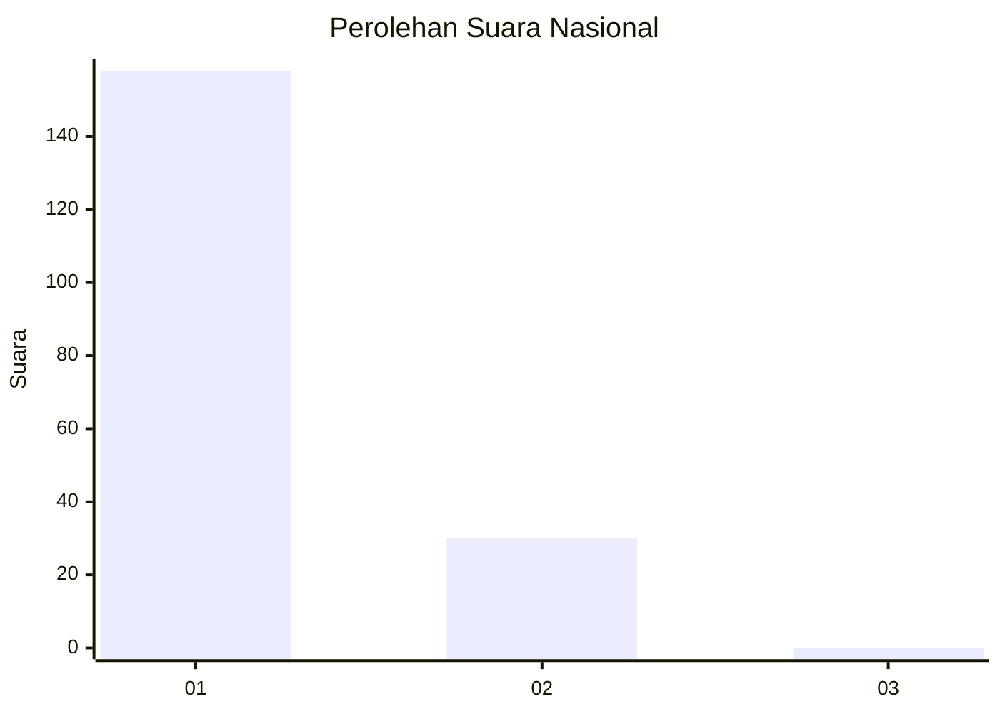
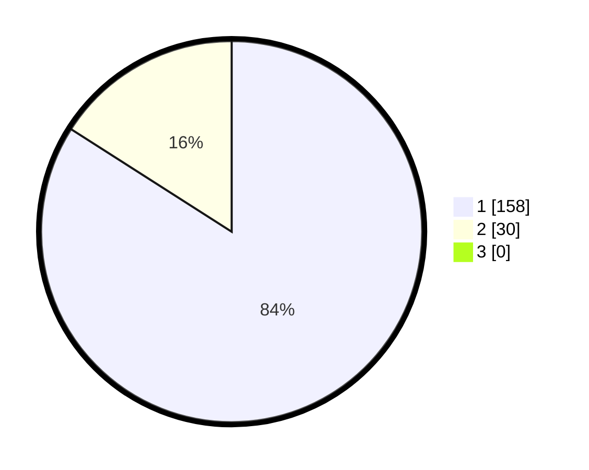

# Hasil

## Grafik

## Tabel

| No. | Nama Paslon    | Suara | Suara (raw) | Persentase |
|:--- |:-------------- | -----:| -----------:| ----------:|
| 1   | ANIES MUHAIMIN | 158   | [158][p-1]  | 84,04      |
| 2   | PRABOWO GIBRAN | 30    | [30][p-2]   | 15,96      |
| 3   | GANJAR MAHFUD  | 0     | [0][p-3]    | 0,00       |

[p-1]: https://github.com/gigit-pemilu/pemilu-2024/blob/main/pilpres/hitung-suara/sub/11-aceh/sub/06-aceh-besar/sub/23-blang-bintang/sub/2005-cot-geundreut/sub/002-tps/sub/paslon-1.txt
[p-2]: https://github.com/gigit-pemilu/pemilu-2024/blob/main/pilpres/hitung-suara/sub/11-aceh/sub/06-aceh-besar/sub/23-blang-bintang/sub/2005-cot-geundreut/sub/002-tps/sub/paslon-2.txt
[p-3]: https://github.com/gigit-pemilu/pemilu-2024/blob/main/pilpres/hitung-suara/sub/11-aceh/sub/06-aceh-besar/sub/23-blang-bintang/sub/2005-cot-geundreut/sub/002-tps/sub/paslon-3.txt

## Foto C Plano

https://sirekap-obj-formc.kpu.go.id/2fa4/pemilu/ppwp/11/06/23/20/05/1106232005002-20240215-113739--6b787328-26e6-403c-8733-335f1b8195d4.jpg

https://sirekap-obj-formc.kpu.go.id/2fa4/pemilu/ppwp/11/06/23/20/05/1106232005002-20240215-113917--04b8fda9-1500-4929-9626-cd8e806ce76e.jpg

https://sirekap-obj-formc.kpu.go.id/2fa4/pemilu/ppwp/11/06/23/20/05/1106232005002-20240215-114028--125043e9-d884-4486-ba81-7e1d92bc1f8d.jpg

## Metadata

| Key        | Value               |
| ---------- | ------------------- |
| Time Stamp | 2024-02-15 21:30:27 |

