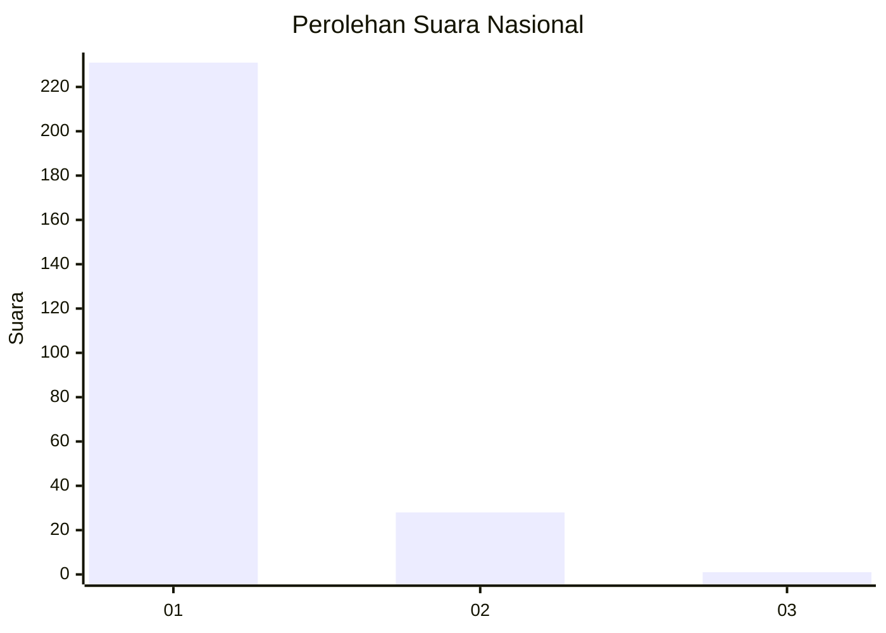
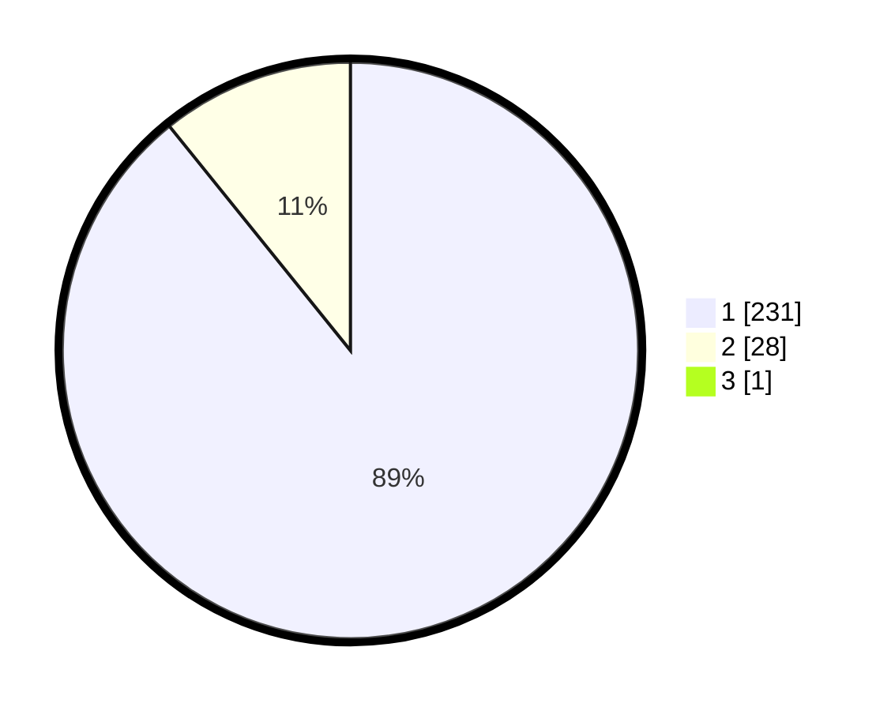

# Hasil

## Grafik

## Tabel

| No. | Nama Paslon    | Suara | Suara (raw) | Persentase |
|:--- |:-------------- | -----:| -----------:| ----------:|
| 1   | ANIES MUHAIMIN | 231   | [231][p-1]  | 88,85      |
| 2   | PRABOWO GIBRAN | 28    | [28][p-2]   | 10,77      |
| 3   | GANJAR MAHFUD  | 1     | [1][p-3]    | 0,38       |

[p-1]: https://github.com/gigit-pemilu/pemilu-2024/blob/main/pilpres/hitung-suara/sub/11-aceh/sub/06-aceh-besar/sub/23-blang-bintang/sub/2007-cot-mon-raya/sub/001-tps/sub/paslon-1.txt
[p-2]: https://github.com/gigit-pemilu/pemilu-2024/blob/main/pilpres/hitung-suara/sub/11-aceh/sub/06-aceh-besar/sub/23-blang-bintang/sub/2007-cot-mon-raya/sub/001-tps/sub/paslon-2.txt
[p-3]: https://github.com/gigit-pemilu/pemilu-2024/blob/main/pilpres/hitung-suara/sub/11-aceh/sub/06-aceh-besar/sub/23-blang-bintang/sub/2007-cot-mon-raya/sub/001-tps/sub/paslon-3.txt

## Foto C Plano

https://sirekap-obj-formc.kpu.go.id/c2b3/pemilu/ppwp/11/06/23/20/07/1106232007001-20240214-215429--ca98db62-50c1-4d4b-b9b5-d63815cd9cc4.jpg

https://sirekap-obj-formc.kpu.go.id/c2b3/pemilu/ppwp/11/06/23/20/07/1106232007001-20240214-220443--3dfa39c4-2edb-443e-a2ff-433ef28b326c.jpg

https://sirekap-obj-formc.kpu.go.id/c2b3/pemilu/ppwp/11/06/23/20/07/1106232007001-20240214-220828--fb41389b-235a-4858-ae2a-a260fede26ff.jpg

## Metadata

| Key        | Value               |
| ---------- | ------------------- |
| Time Stamp | 2024-02-16 00:00:26 |

