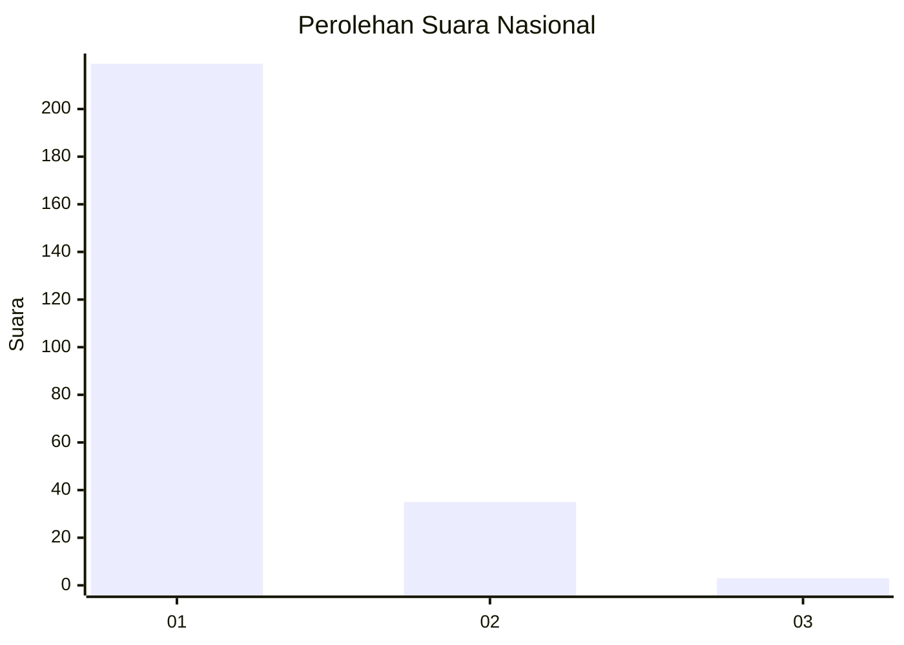
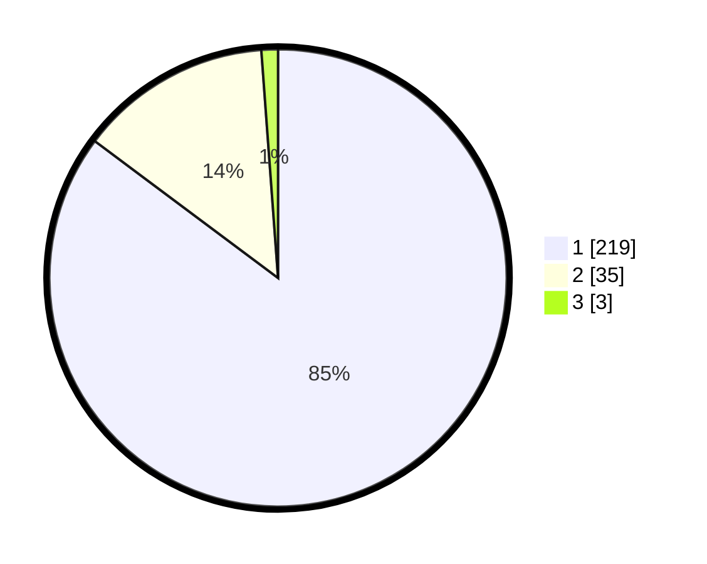

# Hasil

## Grafik

## Tabel

| No. | Nama Paslon    | Suara | Suara (raw) | Persentase |
|:--- |:-------------- | -----:| -----------:| ----------:|
| 1   | ANIES MUHAIMIN | 219   | [219][p-1]  | 85,21      |
| 2   | PRABOWO GIBRAN | 35    | [35][p-2]   | 13,62      |
| 3   | GANJAR MAHFUD  | 3     | [3][p-3]    | 1,17       |

[p-1]: https://github.com/gigit-pemilu/pemilu-2024/blob/main/pilpres/hitung-suara/sub/11-aceh/sub/06-aceh-besar/sub/23-blang-bintang/sub/2009-cot-madhi/sub/001-tps/sub/paslon-1.txt
[p-2]: https://github.com/gigit-pemilu/pemilu-2024/blob/main/pilpres/hitung-suara/sub/11-aceh/sub/06-aceh-besar/sub/23-blang-bintang/sub/2009-cot-madhi/sub/001-tps/sub/paslon-2.txt
[p-3]: https://github.com/gigit-pemilu/pemilu-2024/blob/main/pilpres/hitung-suara/sub/11-aceh/sub/06-aceh-besar/sub/23-blang-bintang/sub/2009-cot-madhi/sub/001-tps/sub/paslon-3.txt

## Foto C Plano

https://sirekap-obj-formc.kpu.go.id/ac0c/pemilu/ppwp/11/06/23/20/09/1106232009001-20240214-222249--51ec6916-c263-4ed6-a119-cf2107dbeaed.jpg

https://sirekap-obj-formc.kpu.go.id/ac0c/pemilu/ppwp/11/06/23/20/09/1106232009001-20240214-205532--bb885f09-3d97-422a-9a17-01645a42f464.jpg

https://sirekap-obj-formc.kpu.go.id/ac0c/pemilu/ppwp/11/06/23/20/09/1106232009001-20240214-230623--a635034e-f2bf-4f58-85c4-58d27781cad3.jpg

## Metadata

| Key        | Value               |
| ---------- | ------------------- |
| Time Stamp | 2024-02-16 00:00:26 |

