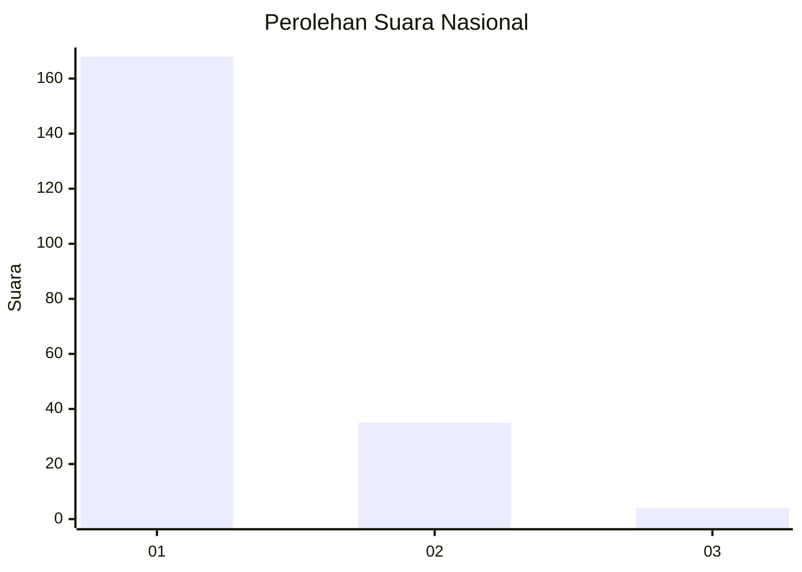
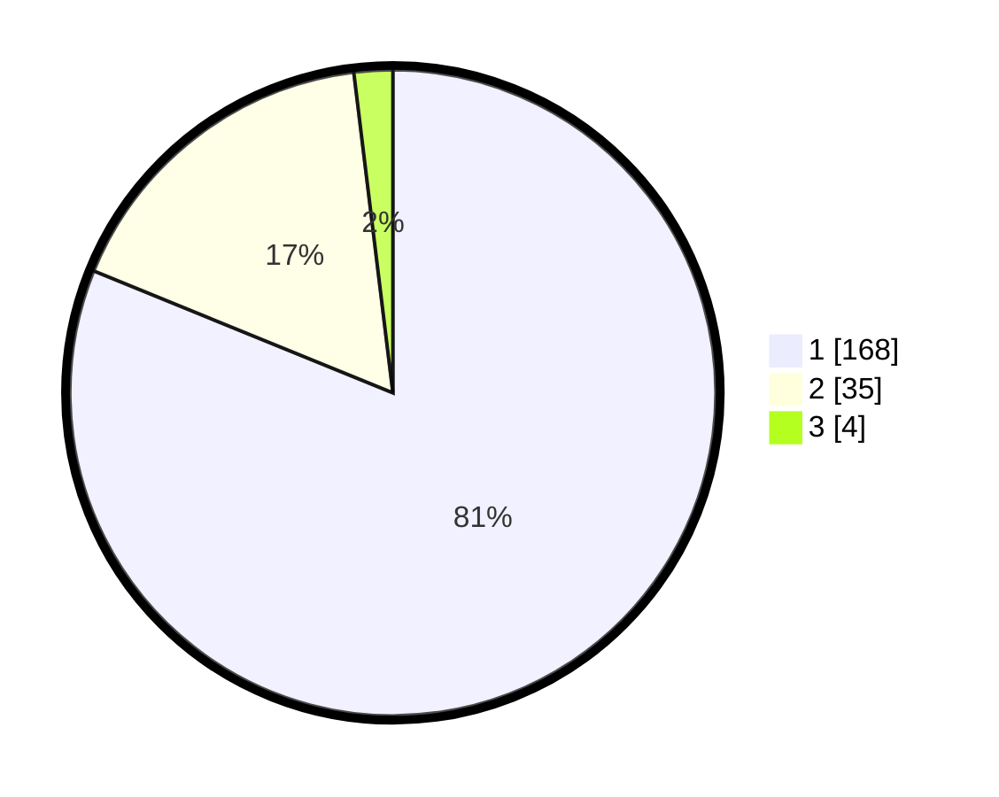

# Hasil

## Grafik

## Tabel

| No. | Nama Paslon    | Suara | Suara (raw) | Persentase |
|:--- |:-------------- | -----:| -----------:| ----------:|
| 1   | ANIES MUHAIMIN | 168   | [168][p-1]  | 81,16      |
| 2   | PRABOWO GIBRAN | 35    | [35][p-2]   | 16,91      |
| 3   | GANJAR MAHFUD  | 4     | [4][p-3]    | 1,93       |

[p-1]: https://github.com/gigit-pemilu/pemilu-2024/blob/main/pilpres/hitung-suara/sub/11-aceh/sub/06-aceh-besar/sub/23-blang-bintang/sub/2011-cot-karieng/sub/002-tps/sub/paslon-1.txt
[p-2]: https://github.com/gigit-pemilu/pemilu-2024/blob/main/pilpres/hitung-suara/sub/11-aceh/sub/06-aceh-besar/sub/23-blang-bintang/sub/2011-cot-karieng/sub/002-tps/sub/paslon-2.txt
[p-3]: https://github.com/gigit-pemilu/pemilu-2024/blob/main/pilpres/hitung-suara/sub/11-aceh/sub/06-aceh-besar/sub/23-blang-bintang/sub/2011-cot-karieng/sub/002-tps/sub/paslon-3.txt

## Foto C Plano

https://sirekap-obj-formc.kpu.go.id/9545/pemilu/ppwp/11/06/23/20/11/1106232011002-20240216-082924--667ef3b9-4c12-46ac-9c20-d969918d7afc.jpg

https://sirekap-obj-formc.kpu.go.id/9545/pemilu/ppwp/11/06/23/20/11/1106232011002-20240215-024608--5726a4f2-07ff-4811-a0d1-aff5dcd72816.jpg

https://sirekap-obj-formc.kpu.go.id/9545/pemilu/ppwp/11/06/23/20/11/1106232011002-20240215-024646--5de5bbde-d799-4de3-8b2d-89162e6be7ed.jpg

## Metadata

| Key        | Value               |
| ---------- | ------------------- |
| Time Stamp | 2024-02-16 08:30:27 |

