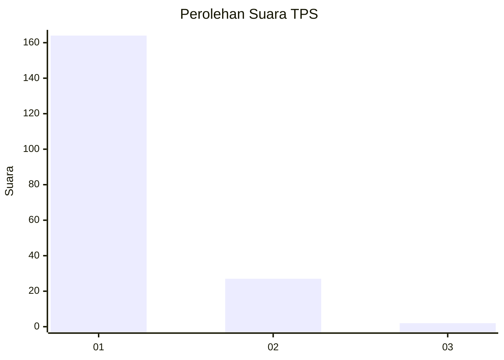
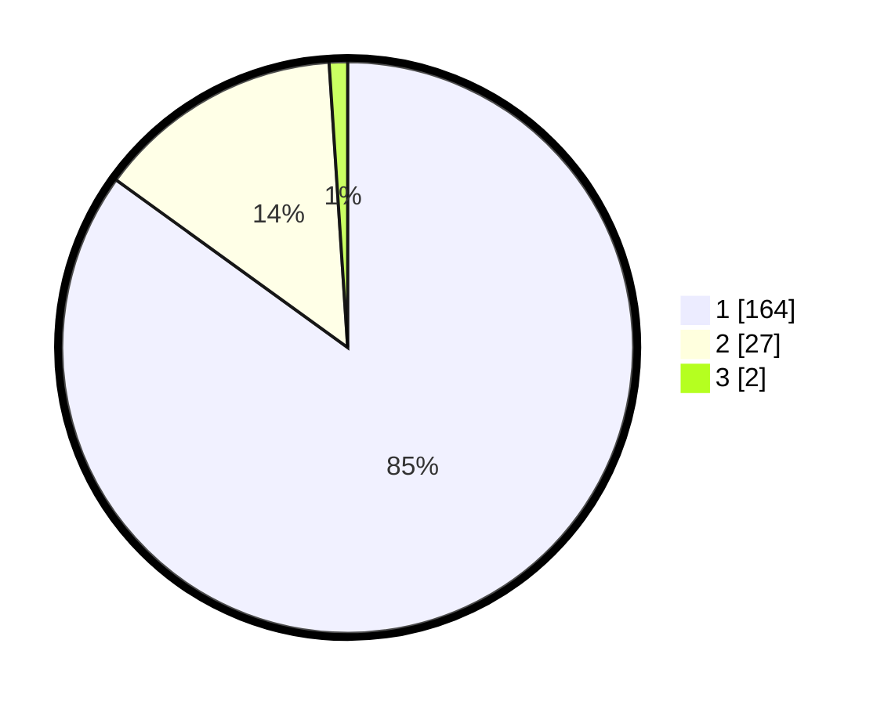

# Hasil

## Grafik

## Tabel

| No. | Nama Paslon    | Suara | Suara (raw) | Persentase |
|:--- |:-------------- | -----:| -----------:| ----------:|
| 1   | ANIES MUHAIMIN | 164   | [164][p-1]  | 84,97      |
| 2   | PRABOWO GIBRAN | 27    | [27][p-2]   | 13,99      |
| 3   | GANJAR MAHFUD  | 2     | [2][p-3]    | 1,04       |

[p-1]: https://github.com/gigit-pemilu/pemilu-2024-11-aceh/blob/main/pilpres/hitung-suara/sub/11-aceh/sub/06-aceh-besar/sub/23-blang-bintang/sub/2012-kampung-blang/sub/002-tps/sub/paslon-1.txt
[p-2]: https://github.com/gigit-pemilu/pemilu-2024-11-aceh/blob/main/pilpres/hitung-suara/sub/11-aceh/sub/06-aceh-besar/sub/23-blang-bintang/sub/2012-kampung-blang/sub/002-tps/sub/paslon-2.txt
[p-3]: https://github.com/gigit-pemilu/pemilu-2024-11-aceh/blob/main/pilpres/hitung-suara/sub/11-aceh/sub/06-aceh-besar/sub/23-blang-bintang/sub/2012-kampung-blang/sub/002-tps/sub/paslon-3.txt

## Foto C Plano

https://sirekap-obj-formc.kpu.go.id/254a/pemilu/ppwp/11/06/23/20/12/1106232012002-20240214-221619--bd23bd0b-01f5-4075-8ede-be115ded2862.jpg

https://sirekap-obj-formc.kpu.go.id/254a/pemilu/ppwp/11/06/23/20/12/1106232012002-20240214-221723--f4d1803e-2b42-4249-8255-f6a0704b2c2f.jpg

https://sirekap-obj-formc.kpu.go.id/254a/pemilu/ppwp/11/06/23/20/12/1106232012002-20240214-221842--83ef05cf-3a96-4abc-8945-6895214941c9.jpg

## Metadata

| Key        | Value               |
| ---------- | ------------------- |
| Time Stamp | 2024-02-15 23:29:50 |

