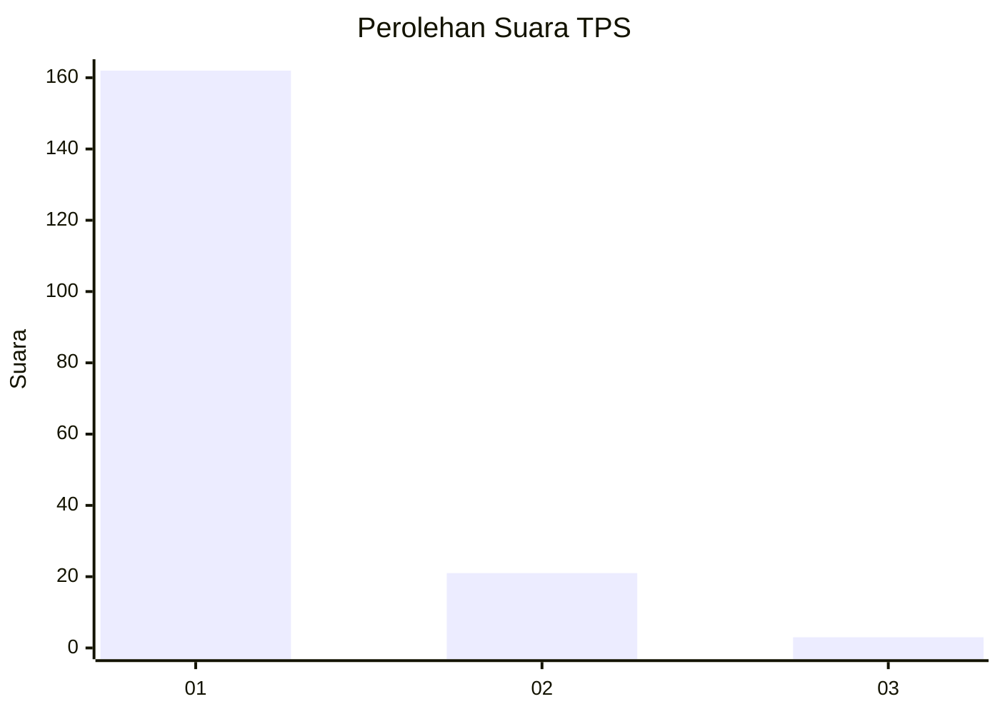
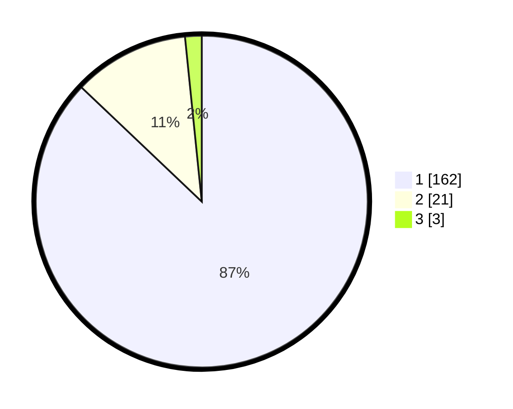

# Hasil

## Grafik

## Tabel

| No. | Nama Paslon    | Suara | Suara (raw) | Persentase |
|:--- |:-------------- | -----:| -----------:| ----------:|
| 1   | ANIES MUHAIMIN | 162   | [162][p-1]  | 87,10      |
| 2   | PRABOWO GIBRAN | 21    | [21][p-2]   | 11,29      |
| 3   | GANJAR MAHFUD  | 3     | [3][p-3]    | 1,61       |

[p-1]: https://github.com/gigit-pemilu/pemilu-2024-11-aceh/blob/main/pilpres/hitung-suara/sub/11-aceh/sub/06-aceh-besar/sub/23-blang-bintang/sub/2013-cot-malem/sub/001-tps/sub/paslon-1.txt
[p-2]: https://github.com/gigit-pemilu/pemilu-2024-11-aceh/blob/main/pilpres/hitung-suara/sub/11-aceh/sub/06-aceh-besar/sub/23-blang-bintang/sub/2013-cot-malem/sub/001-tps/sub/paslon-2.txt
[p-3]: https://github.com/gigit-pemilu/pemilu-2024-11-aceh/blob/main/pilpres/hitung-suara/sub/11-aceh/sub/06-aceh-besar/sub/23-blang-bintang/sub/2013-cot-malem/sub/001-tps/sub/paslon-3.txt

## Foto C Plano

https://sirekap-obj-formc.kpu.go.id/f6cc/pemilu/ppwp/11/06/23/20/13/1106232013001-20240215-205246--06b26f16-0601-4c4f-bfc7-037927cb7ea5.jpg

https://sirekap-obj-formc.kpu.go.id/f6cc/pemilu/ppwp/11/06/23/20/13/1106232013001-20240215-205313--61e791ed-37b6-4c1a-a126-0e775c98617b.jpg

https://sirekap-obj-formc.kpu.go.id/f6cc/pemilu/ppwp/11/06/23/20/13/1106232013001-20240215-205526--106274a0-7c74-40bc-9762-9a3cf5a64eda.jpg

## Metadata

| Key        | Value               |
| ---------- | ------------------- |
| Time Stamp | 2024-02-15 22:40:13 |

