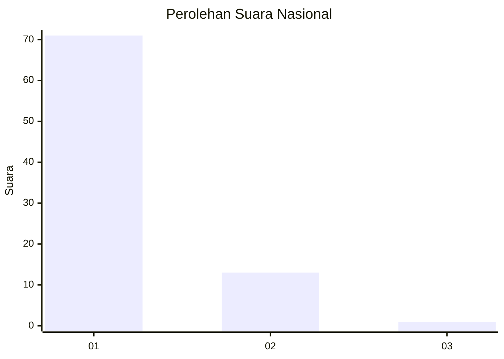
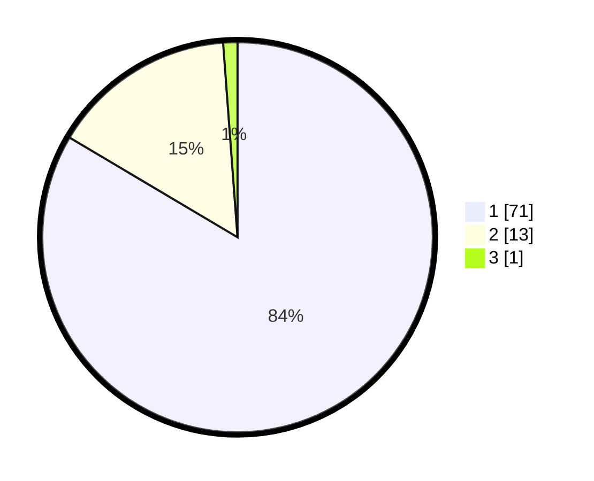

# Hasil

## Grafik

## Tabel

| No. | Nama Paslon    | Suara | Suara (raw) | Persentase |
|:--- |:-------------- | -----:| -----------:| ----------:|
| 1   | ANIES MUHAIMIN | 71    | [71][p-1]   | 83,53      |
| 2   | PRABOWO GIBRAN | 13    | [13][p-2]   | 15,29      |
| 3   | GANJAR MAHFUD  | 1     | [1][p-3]    | 1,18       |

[p-1]: https://github.com/gigit-pemilu/pemilu-2024/blob/main/pilpres/hitung-suara/sub/11-aceh/sub/06-aceh-besar/sub/23-blang-bintang/sub/2015-cot-hoho/sub/001-tps/sub/paslon-1.txt
[p-2]: https://github.com/gigit-pemilu/pemilu-2024/blob/main/pilpres/hitung-suara/sub/11-aceh/sub/06-aceh-besar/sub/23-blang-bintang/sub/2015-cot-hoho/sub/001-tps/sub/paslon-2.txt
[p-3]: https://github.com/gigit-pemilu/pemilu-2024/blob/main/pilpres/hitung-suara/sub/11-aceh/sub/06-aceh-besar/sub/23-blang-bintang/sub/2015-cot-hoho/sub/001-tps/sub/paslon-3.txt

## Foto C Plano

https://sirekap-obj-formc.kpu.go.id/3383/pemilu/ppwp/11/06/23/20/15/1106232015001-20240214-204417--091c5450-f765-4427-beb9-f62a05af9bbb.jpg

https://sirekap-obj-formc.kpu.go.id/3383/pemilu/ppwp/11/06/23/20/15/1106232015001-20240214-204531--83b5b80c-9156-4159-b5e4-f11177c64c5f.jpg

https://sirekap-obj-formc.kpu.go.id/3383/pemilu/ppwp/11/06/23/20/15/1106232015001-20240214-204548--149b1098-0cd2-4146-a6a4-049937a8ab59.jpg

## Metadata

| Key        | Value               |
| ---------- | ------------------- |
| Time Stamp | 2024-02-15 00:41:44 |

## DATA PEMILIH TETAP

Jumlah pemilih dalam DPT: **89**.
 * L: **42**.
 * P: **47**.

## DATA PENGGUNA HAK PILIH

Jumlah pengguna hak pilih dalam DPT: **84**.
 * L: **39**.
 * P: **45**.

Jumlah pengguna hak pilih dalam DPTb: **0**.
 * L: **0**.
 * P: **0**.

Jumlah pengguna hak pilih dalam DPK: **2**.
 * L: **1**.
 * P: **1**.

Jumlah pengguna hak pilih: **86**.
 * L: **40**.
 * P: **46**.

## JUMLAH SUARA SAH DAN TIDAK SAH

JUMLAH SELURUH SUARA SAH: **85**.

JUMLAH SUARA TIDAK SAH: **1**.

JUMLAH SELURUH SUARA SAH DAN SUARA TIDAK SAH: **86**.

